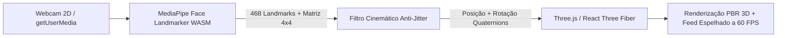

# VOID Spatial Optics — Prova Virtual 3D Facial (Try-On no Navegador)

> **Projeto Conceitual para Fins de Estudo e Treinamento Técnico**  
> Este repositório é um experimento educacional de engenharia de software, computação gráfica na web e design de interfaces. **Não é um produto comercial e não está à venda.** O projeto conta com inspirações nas linguagens visuais da **Apple** e nas técnicas de animação e motion do **Shopify Editions (Winter 2026)**.

---

## 🎯 Sobre o Projeto

O **VOID Spatial Optics** é uma aplicação web moderna que permite aos usuários experimentar armações de óculos e visores em **3D de alta fidelidade ancorados diretamente no rosto em tempo real** através da webcam do próprio dispositivo.

Diferente de aplicativos nativos pesados ou filtros de redes sociais fechadas, a experiência roda **100% no navegador**, sem necessidade de instalação, cadastro ou sessão em headset físico (conforme registrado no pivô de escopo em [ADR-0003](docs/vault/07-Decisoes/ADR-0003-Feature-Try-On-Facial.md)).



---

## ✨ Principais Funcionalidades

### 1. 🕶️ Try-On Facial 3D em Tempo Real
- **Mapeamento Anatômico**: Detecção de 468 landmarks faciais via `@mediapipe/tasks-vision` executado em WebAssembly + SIMD acelerado por hardware.
- **Ancoragem Precisa**: Utilização direta das `facialTransformationMatrixes` decompostas em posição e rotação (quaternions), com ajuste vertical anatômico para o nível dos olhos.
- **Filtro Anti-Jitter**: Algoritmo de suavização temporal (SLERP/LERP) com tolerância a oclusão transitória (*hold* de 400ms e *fade-out* suave).
- **Espelhamento Selfie Pixel-a-Pixel**: Vídeo e Canvas 3D unificados com `transform: scaleX(-1)` mantendo controles sobrepostos e textos legíveis.
- **Privacidade On-Device (LGPD/GDPR)**: Processamento estritamente local na memória RAM da máquina do usuário. **Zero frames ou dados biométricos enviados para servidores**.

### 2. 🎨 Design System Apple: Branco-Nuvem & Azul Midnight
- **Modo Claro (Branco-Nuvem)**: Base em branco puro (`#fbfbfd`) e alabastro (`#f5f5f7`), cartões em vidro fosco translúcido (*frosted glass* com `backdrop-filter: blur(28px)`), tipografia em grafite profundo (`#1d1d1f`) e acentos em Azul Apple (`#0071e3`).
- **Modo Escuro (Azul Midnight)**: Fundo em azul meia-noite oceânico (`#070b14`), superfícies em `#0d1527` e `#111c34`, texto em branco-gelo (`#f8fafc`) e acentos em Azul Safira Elétrico (`#38bdf8`).
- **Moldura Hardware Studio Display**: O palco de prova virtual é emoldurado como um display industrial de alta precisão com acabamento em titânio.

### 3. ♿ Painel Completo de Acessibilidade
- **Ajuste de Tamanho de Fonte**: Controle de escala dinâmica (`A−`, `100%`, `A+`) baseado na variável relativa `--font-scale` (de 88% a 138%), preservando a proporção de todos os elementos.
- **Alternador de Temas**: Troca rápida entre Branco-Nuvem e Azul Midnight com persistência no `localStorage`.
- **Preferências Extras**: Toggles dedicados para **Reduzir Movimento** (`prefers-reduced-motion`) e **Alto Contraste**.
- **Navegação Acessível**: Padrão WAI-ARIA com suporte completo a teclado (`Escape`, foco visível, `role="dialog"` e `role="radiogroup"`).

### 4. 🎬 Animações Inspiradas no Shopify Editions (Winter 2026)
- **Kinetic Text Reveal**: Efeito de revelação de texto palavra por palavra iluminado suavemente pelo progresso do scroll do usuário (`KineticText.tsx`).
- **3D Perspective Tilt com Spotlight Glare**: Cartões com rotação tridimensional e reflexo de holofote dinâmico acompanhando a posição do cursor (`InteractiveTiltCard.tsx`).
- **Editions Floating Navigation Dock**: Pílula de navegação flutuante inferior com índice de capítulos (`[01/06] Try-On Spatial`), marcadores em pontos, ondas de imersão e porcentagem de rolagem (`EditionsDock.tsx`).
- **Contagem Cinética de Métricas**: Números do Hero HUD (468 pontos, ~12ms, 60 FPS) animados via interpolação quártica suave (`useCounterAnimation.ts`).
- **Sticky Storyboard**: Painel visual de simulação óptica fixo que reage e ilustra as 3 etapas de funcionamento da tecnologia (`ComoFunciona.tsx`).

### 5. 🕶️✨ Óculos 3D Ambiente (Three.js pela Landing Page Inteira)
- **Camada Ambiente Persistente**: Um único `<Canvas>` R3F fixo cobrindo o viewport (`AmbientCanvas.tsx`), atrás do conteúdo e sem capturar clique/scroll — o Three.js deixa de existir só dentro do palco de prova virtual e passa a fazer parte da atmosfera da página toda.
- **Óculos Reais Flutuando**: Até 8 instâncias (adaptado por hardware via `usePerfProfile`) clonadas dos mesmos GLBs otimizados do seletor de modelos, recoloridas em runtime para a paleta Branco-Nuvem/Azul Midnight — sem duplicar assets nem editar os arquivos `.glb` (`AmbientGlasses.tsx`).
- **Movimento Fluido e Parallax de Scroll**: Drift orgânico (seno/cosseno) somado a um parallax vertical "enrolado" (`wrap`) — cada instância entra em quadro perto de um ponto de rolagem específico e sai suavemente, num campo infinito sem nenhuma instância presa fora da tela.
- **Zero Alocação no Loop e Respeito a `prefers-reduced-motion`**: Todo o cálculo por frame reaproveita objetos fora do `useFrame`; a camada inteira é omitida quando o usuário prefere movimento reduzido ou o hardware não aguenta 3D.

### 6. 📸 Lookbook & Campanha Editorial
- **Galeria Editorial em Bento Grid**: Seção com 6 fotos reais de modelos usando as armações, em grade assimétrica estilo revista (`Campanha.tsx`) posicionada entre as Especificações Técnicas e o Manifesto.
- **Cards com Tilt 3D e CTA Direto**: Cada foto usa `InteractiveTiltCard` e um botão "Experimentar no Rosto" que seleciona o modelo correspondente e rola até o palco de prova virtual.
- **Performance**: imagens com `loading="lazy"`, `width`/`height` explícitos (sem *layout shift*) e ~40-68 kB cada.

---

## 🛠️ Stack Tecnológica

| Camada | Tecnologia | Propósito |
|---|---|---|
| **Linguagem** | TypeScript 7.0 | Tipagem estática rigorosa e contratos de dados |
| **Build & Dev Server** | Vite 8.2 | HMR ultrarrápido e bundling otimizado |
| **Biblioteca de UI** | React 19 | Renderização declarativa e hooks modernos |
| **Motor 3D** | Three.js (v0.185) | Shaders PBR, matrizes de transformação e iluminação de estúdio |
| **Integração 3D ↔ React** | @react-three/fiber & @react-three/drei | Composição reativa da cena 3D e controles de órbita |
| **Visão Computacional** | @mediapipe/tasks-vision (v1.0) | Face Landmarker executado em WebAssembly e SIMD local |
| **Estilização** | Vanilla CSS + Tailwind CSS | Design tokens, glassmorphism, keyframes e responsividade |
| **Validação de Formulários** | Zod (v4) | Validação segura no cliente para o acesso antecipado |
| **Pipeline de Assets** | @gltf-transform + Draco + Meshopt | Compressão de modelos GLB para < 15 kB |

---

## 📁 Estrutura de Pastas

```
LP-with-VR/
├── docs/                     # Documentação viva do projeto (Vault Obsidian)
│   └── vault/
│       ├── 01-Visao-Geral/   # Escopo, requisitos e público-alvo
│       ├── 02-Arquitetura/   # Stack técnica e estrutura de dados
│       ├── 04-Design-e-UX/   # Identidade visual e acessibilidade
│       ├── 05-VR-e-3D/       # Pipeline de assets 3D e orçamento de performance
│       ├── 06-Analytics-e-Tracking/  # Telemetria e conformidade LGPD
│       └── 07-Decisoes/      # Registros de decisões arquiteturais (ADRs)
├── public/
│   ├── mediapipe/            # Modelos e binários WASM do MediaPipe
│   ├── models/               # Modelos 3D (.glb) otimizados para runtime
│   ├── imgs/                 # Fotos editoriais da seção Lookbook & Campanha
│   └── draco/                # Decoders Draco WebAssembly
├── scripts/                  # Scripts de automação e otimização de assets
│   ├── generate-placeholder-glasses.mjs  # Gerador procedural de armações GLB
│   └── optimize-glb.mjs                  # Pipeline de compressão glTF-Transform
├── src/
│   ├── components/           # Componentes de UI 2D reutilizáveis
│   │   ├── AccessibilityWidget.tsx  # Modal de controle de fonte e tema
│   │   ├── CameraPermissionGate.tsx # Gate de privacidade e permissão
│   │   ├── EditionsDock.tsx         # Dock de navegação flutuante por capítulos
│   │   ├── InteractiveTiltCard.tsx  # Card com inclinação 3D e spotlight
│   │   ├── KineticText.tsx          # Texto iluminado por scroll
│   │   ├── ModelSelector.tsx        # Seletor WAI-ARIA de armações
│   │   ├── Nav.tsx                  # Header em vidro fosco com barra de progresso
│   │   ├── TryOnStage.tsx           # Palco unificado de vídeo + canvas 3D
│   │   └── Footer.tsx               # Rodapé com nota educacional
│   ├── hooks/                # Hooks customizados
│   │   ├── useAccessibility.ts      # Estado de tema, fonte e preferências
│   │   ├── useCamera.ts             # Ciclo de vida do getUserMedia e erros
│   │   ├── useCounterAnimation.ts   # Interpolação cinética de números
│   │   ├── useFaceLandmarker.ts     # Wrapper do runtime MediaPipe Vision
│   │   ├── useFaceTracking.ts       # Ponte global da matriz 4x4
│   │   ├── useModelSelection.ts     # Catálogo e store externa de modelos
│   │   ├── usePerfProfile.ts        # Adaptação de qualidade por hardware
│   │   └── useScrollAnimations.ts   # Progresso de rolagem e seções ativas
│   ├── lib/                  # Utilitários e algoritmos matemáticos
│   │   ├── facePoseSmoother.ts      # Suavizador cinemático anti-jitter
│   │   └── gltfLoader.ts            # Carregador GLB com decoders integrados
│   ├── scene/                # Cena Three.js / React Three Fiber
│   │   ├── Scene.tsx                # Setup de câmeras, luzes studio e canvas (palco de prova)
│   │   ├── AmbientCanvas.tsx        # Canvas ambiente fixo (óculos flutuando pela LP inteira)
│   │   └── objects/
│   │       ├── AnchoredGlasses.tsx  # Ancoragem do modelo 3D no rosto
│   │       ├── AmbientGlasses.tsx   # Instâncias decorativas com drift + parallax de scroll
│   │       └── GlassesModel.tsx     # Gerenciamento de memória GPU do GLB
│   ├── sections/             # Dobras principais da landing page
│   │   ├── Hero.tsx                 # Dobra de entrada e palco de prova
│   │   ├── Showcase.tsx             # Vitrine da Coleção Urbana com specs
│   │   ├── ComoFunciona.tsx         # Storyboard interativo em 3 etapas
│   │   ├── Beneficios.tsx           # Bento grid de engenharia
│   │   ├── TechSpecs.tsx            # Tabela comparativa de tecnologias
│   │   ├── Campanha.tsx             # Lookbook editorial com fotos reais
│   │   ├── Filosofia.tsx            # Manifesto editorial com KineticText
│   │   └── Cta.tsx                  # Convite para acesso antecipado
│   └── styles/
│       ├── index.css                # Diretivas Tailwind e importações
│       └── site.css                 # Design System completo (Claro / Midnight)
├── index.html                # Ponto de entrada HTML com fontes Google
├── package.json              # Dependências e scripts npm
├── tailwind.config.ts        # Configuração de temas e tokens
├── tsconfig.json             # Configuração TypeScript
└── vite.config.ts            # Configuração do bundler Vite
```

---

## 🚀 Como Rodar o Projeto

### Pré-requisitos
- **Node.js** (versão 18.x ou superior)
- **NPM** (versão 9.x ou superior)
- Navegador moderno com suporte a WebGL 2.0 e webcam

### Instalação e Execução

```bash
# 1. Clone o repositório
git clone https://github.com/rafafrd/LP-with-VR.git
cd LP-with-VR

# 2. Instale as dependências
npm install

# 3. Inicie o servidor de desenvolvimento
npm run dev
```

Abra seu navegador no endereço indicado (geralmente `http://localhost:5173`).

### Scripts Disponíveis

| Comando | Descrição |
|---|---|
| `npm run dev` | Inicia o servidor Vite para desenvolvimento local com HMR |
| `npm run build` | Executa o typecheck do TypeScript e compila o bundle de produção em `dist/` |
| `npm run typecheck` | Valida todos os tipos TypeScript sem gerar arquivos |
| `npm run preview` | Executa o servidor local contra a pasta `dist/` compilada |
| `npm run assets:generate-placeholder-glasses` | Gera proceduralmente os 3 modelos GLB e aplica otimização Draco |
| `npm run assets:optimize` | Otimiza um arquivo GLB bruto reduzindo peso e aplicando compressão |
| `npm run assets:sync-runtime-3d` | Copia os decoders/transcoders (Draco, Basis/KTX2) do `node_modules` para `public/` |
| `npm run assets:sync-mediapipe` | Baixa e sincroniza os binários WASM e o modelo do MediaPipe Face Landmarker em `public/mediapipe/` |
| `npm run assets:smoke-mediapipe` | Smoke test em Node do pipeline MediaPipe (carrega o runtime e roda uma inferência de teste) |

---

## 🔒 Privacidade e Segurança (LGPD & GDPR)

A feature de Try-On Facial foi concebida sob o princípio de **Privacy by Design**:
- A captura de vídeo da webcam permanece **exclusivamente na memória volátil do navegador**.
- O modelo de aprendizado de máquina (Face Landmarker) executa **localmente via WebAssembly**.
- Nenhum frame de imagem, dado biométrico ou identificador facial é persistido ou transmitido através da rede.
- Detalhes completos disponíveis em [LGPD e Consentimento](docs/vault/06-Analytics-e-Tracking/LGPD-e-Consentimento.md).

---

## 📚 Documentação Técnica (Obsidian Vault)

Para uma imersão técnica aprofundada nos documentos de arquitetura, leia os arquivos em [`docs/vault/`](docs/vault/Home.md):

- [🏠 Home do Vault](docs/vault/Home.md) — Índice e mapa de conteúdo geral
- [🎯 Escopo do Produto](docs/vault/01-Visao-Geral/Escopo.md) — Objetivos e limites da funcionalidade
- [📐 ADR-0003: Pivô para Try-On Facial](docs/vault/07-Decisoes/ADR-0003-Feature-Try-On-Facial.md) — Motivação da transição de WebXR para Visão Computacional no navegador
- [🎨 Identidade Visual](docs/vault/04-Design-e-UX/Identidade-Visual.md) — Paleta Branco-Nuvem, Azul Midnight e tipografia
- [📦 Pipeline de Assets 3D](docs/vault/05-VR-e-3D/Pipeline-de-Assets-3D.md) — Otimização glTF-Transform e compressão Draco
- [⚡ Orçamento de Performance](docs/vault/05-VR-e-3D/Orcamento-de-Performance.md) — Metas de FPS, draw calls e política de zero alocação no loop

---

## 📄 Nota Legal

Este projeto foi criado como um exercício de arquitetura frontend, computação gráfica com Three.js e visão computacional no navegador. Não possui associação comercial oficial com as marcas citadas como inspiração estética de design (Apple Inc. ou Shopify Inc.).
