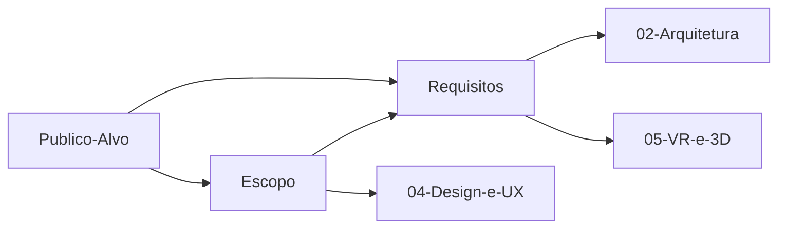

# 🎯 Visão Geral

Por que o projeto existe, para quem ele é e o que ele precisa entregar.

## Notas desta área

| Nota | Assunto |
| --- | --- |
| [[Escopo]] | O que entra e o que fica de fora |
| [[Publico-Alvo]] | Quem acessa a landing page e em que dispositivo |
| [[Requisitos]] | Funcionais e não funcionais |

## Resumo em uma frase

> Uma landing page que usa uma experiência 3D/VR no navegador para explicar o produto
> melhor do que texto e imagem conseguiriam — e converter mais por isso.

Essa frase é a régua: qualquer funcionalidade que não sirva a ela é candidata a corte.

## Como as notas se encadeiam

## Premissas em aberto

- [ ] Qual é o produto/serviço divulgado?
- [ ] Qual a ação de conversão — formulário, agendamento, compra?
- [ ] Existe prazo ou evento de lançamento?
- [ ] Há identidade visual pronta? Ver [[Identidade-Visual]]

⬅ [[Home]]
