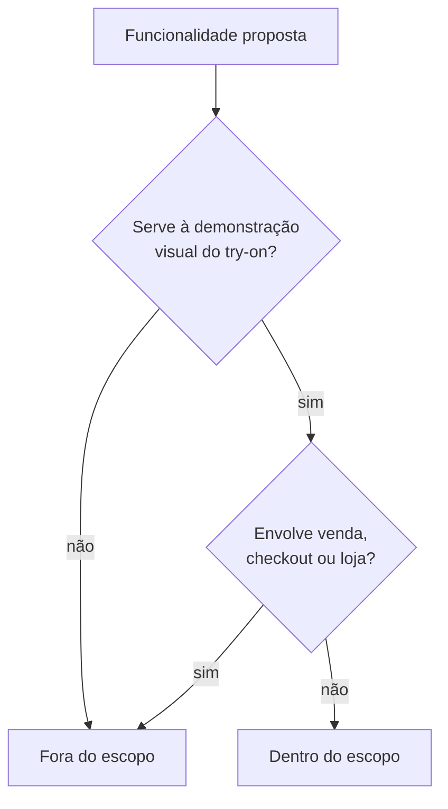

# Escopo

> Definido em [[ADR-0003-Feature-Try-On-Facial]] (2026-08-14). Substitui a versão em
> branco anterior, escrita quando o produto ainda era uma landing page com sessão
> `immersive-vr` — ver [[ADR-0002-Stack-Base]].

## Problema

Decidir se um óculos/headset físico combina com o próprio rosto é difícil sem
experimentar — e experimentar de verdade normalmente exige estar numa loja física, na
frente de um produto específico. A feature resolve a parte visual desse problema: deixa
a pessoa ver, no próprio navegador e em tempo real, como um modelo ficaria no rosto
dela, sem precisar sair de casa nem instalar nada.

## Objetivo

Sucesso é a pessoa ligar a câmera, escolher um modelo, e ver o modelo 3D ancorado no
rosto dela de forma estável — sem jitter perceptível, sem lag incômodo — e trocar entre
os modelos disponíveis sem fricção. Não há métrica de conversão/venda nesta fase: é uma
feature de demonstração isolada, não um funil.

## Dentro do escopo

- [x] Acesso à câmera do dispositivo (`getUserMedia`) com fluxo de erro tratado
      (permissão negada, sem câmera, contexto inseguro)
- [x] Detecção de landmarks faciais em tempo real no navegador
      (`@mediapipe/tasks-vision` — ver [[Stack-Tecnologica]])
- [x] Seletor de 2-3 modelos de óculos/headset (placeholder aceitável se não houver
      asset final — ver [[Pipeline-de-Assets-3D]])
- [x] Ancoragem do modelo 3D escolhido ao rosto (ponte do nariz + têmporas), seguindo a
      pose por frame
- [x] Composição correta do vídeo da câmera (espelhado, como selfie) com o overlay 3D
- [x] Fallback claro quando câmera/detecção facial/navegador não são suportados

## Fora do escopo

- Loja, catálogo de venda ou checkout — a feature não vende nada, só demonstra
- Sessão WebXR / headset físico — descontinuado por [[ADR-0003-Feature-Try-On-Facial]]
- Captura/gravação de foto ou vídeo da experiência (em aberto para uma v2, se pedido)
- Múltiplas pessoas detectadas simultaneamente na mesma câmera (em aberto)
- Envio de qualquer frame de vídeo ou landmark facial para servidor — ver
  [[LGPD-e-Consentimento]]

## Riscos conhecidos

| Risco | Impacto | Mitigação |
| --- | --- | --- |
| Jitter no tracking (a matriz de pose "treme" entre frames) | Alto — quebra a ilusão, a feature inteira depende disso parecer sólida | Usar `facialTransformationMatrixes` do Face Landmarker em vez de derivar pose de landmarks individuais; suavizar (interpolar/filtrar) entre frames — ver [[Stack-Tecnologica]] |
| Performance em dispositivo de entrada (câmera + MediaPipe + R3F rodando juntos) | Alto | Perfil de qualidade por dispositivo (já existe `usePerfProfile`), lazy-load do modelo MediaPipe, orçamento de draw calls do modelo GLB — ver [[Orcamento-de-Performance]] |
| Iluminação ruim degrada a detecção facial | Médio | Feedback visual claro quando o rosto não é detectado (não falhar silenciosamente) |
| Dado de câmera/rosto é sensível | Alto (privacidade/LGPD) | Processamento 100% local, nada sai do dispositivo — ver [[LGPD-e-Consentimento]] |
| Falta de asset 3D "bonito" atrasando a feature | Baixo | Placeholder em geometria primitiva é aceitável para validar a ancoragem antes de ter modelos finais |

## Fluxo de decisão de escopo

## Relacionados

- [[ADR-0003-Feature-Try-On-Facial]]
- [[Requisitos]]
- [[Publico-Alvo]]
- [[Stack-Tecnologica]]

⬅ [[01-Visao-Geral]]
