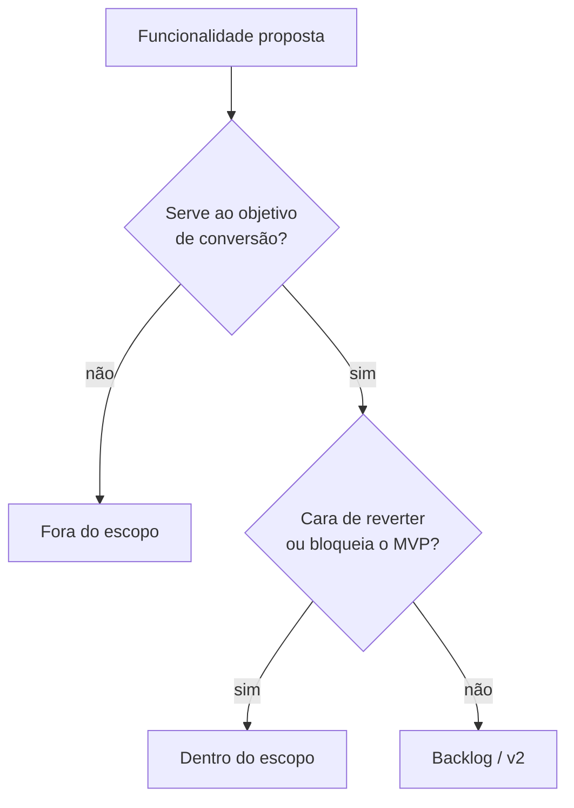

# Escopo

## Problema

_Que problema a landing page resolve?_

## Objetivo

_O que consideramos sucesso? (ex.: taxa de conversão, tempo na página, leads)_

## Dentro do escopo

- [ ] Landing page responsiva
- [ ] Experiência 3D / VR incorporada
- [ ] Fallback para dispositivos sem suporte a WebXR
- [ ] 

## Fora do escopo

- 

## Riscos conhecidos

| Risco | Impacto | Mitigação |
| --- | --- | --- |
| Performance em mobile com cena 3D | Alto | Níveis de detalhe + lazy loading |
|  |  |  |

## Fluxo de decisão de escopo

## Relacionados

- [[Requisitos]]
- [[Publico-Alvo]]
- [[05-VR-e-3D]]

⬅ [[01-Visao-Geral]]
