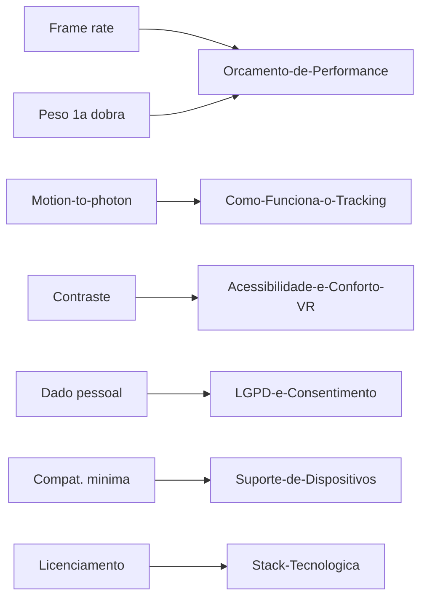

# Requisitos

## Funcionais (a definir com o negócio)

_O que a LP precisa fazer, do ponto de vista de quem usa. Depende do [[Escopo]] e do
[[Publico-Alvo]] ainda não fechados._

| # | Requisito | Prioridade |
| --- | --- | --- |
| RF-01 | Exibir CTA de conversão acima da dobra, funcionando sem o 3D carregado | Must |
| RF-02 | Oferecer experiência 3D interativa mesmo sem headset (órbita/scroll) | Must |
| RF-03 | Detectar suporte a WebXR e oferecer entrada em VR quando disponível | Must |
| RF-04 | Formulário de lead com validação client + server | Must |
| RF-05 |  |  |

## Não funcionais (derivados do que já foi pesquisado no vault)

| # | Requisito | Alvo | Origem |
| --- | --- | --- | --- |
| RNF-01 | Frame rate em VR | ≥ 72 fps sustentado, sem *stale frame* | [[Orcamento-de-Performance]] |
| RNF-02 | Peso da primeira dobra | ≤ 5 MB | [[Orcamento-de-Performance]] |
| RNF-03 | Motion-to-photon | < 20 ms | [[Como-Funciona-o-Tracking]] |
| RNF-04 | Lighthouse (fallback 3D) | > 90 em performance | [[ADR-0002-Stack-Base]] |
| RNF-05 | Contraste mínimo | AA (4.5:1), inclusive dentro do canvas | [[Acessibilidade-e-Conforto-VR]] |
| RNF-06 | Conexão segura | HTTPS obrigatório (exigência do WebXR) | [[Suporte-de-Dispositivos]] |
| RNF-07 | Dado pessoal coletado | Só o do formulário; nenhuma pose/tracking espacial sai do dispositivo | [[LGPD-e-Consentimento]] |
| RNF-08 | Compatibilidade mínima | Funciona (fallback estático) em qualquer navegador moderno sem WebXR | [[Suporte-de-Dispositivos]] |
| RNF-09 | Redução de movimento | Respeita `prefers-reduced-motion` | [[Acessibilidade-e-Conforto-VR]] |
| RNF-10 | Licenciamento | Toda dependência de produção é open source com licença permissiva (MIT/Apache-2.0) | [[Stack-Tecnologica]] |

## Fora de escopo por enquanto

- Internacionalização (i18n) — depende de [[Publico-Alvo]]
- CMS headless — só se o texto mudar com frequência (ver [[Stack-Tecnologica]] §5)

## Relacionados

- [[Escopo]]
- [[Publico-Alvo]]
- [[Fluxo-de-Dados]]

⬅ [[01-Visao-Geral]]
