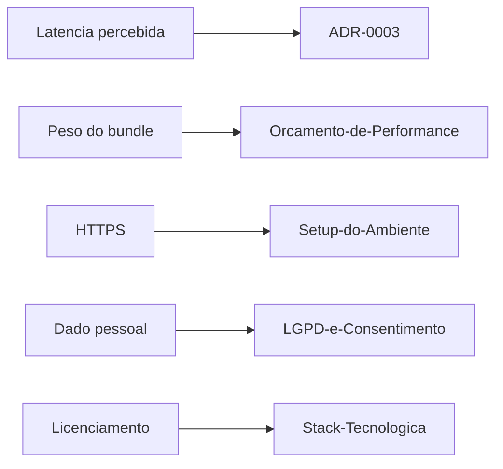

# Requisitos

> Reescrito em 2026-08-14 depois de [[ADR-0003-Feature-Try-On-Facial]]. A versão
> anterior (RF-01 a RF-04, RNF-01 a RNF-10) descrevia uma landing page com sessão
> `immersive-vr`; ver [[Suporte-de-Dispositivos]] e [[Como-Funciona-o-Tracking]] para o
> registro histórico dessa versão.

## Funcionais

| # | Requisito | Prioridade |
| --- | --- | --- |
| RF-01 | Solicitar permissão de câmera com fluxo de erro claro (negado, sem câmera, contexto inseguro) | Must |
| RF-02 | Detectar landmarks/pose facial em tempo real, no navegador, sem enviar vídeo para servidor | Must |
| RF-03 | Oferecer um seletor entre 2-3 modelos de óculos/headset | Must |
| RF-04 | Ancorar o modelo 3D escolhido ao rosto (ponte do nariz + têmporas), seguindo a pose por frame sem jitter perceptível | Must |
| RF-05 | Compor o vídeo da câmera (espelhado, como selfie) com o overlay 3D corretamente | Must |
| RF-06 | Trocar de modelo sem precisar reiniciar a detecção facial/câmera | Should |
| RF-07 | Avisar visivelmente quando o rosto não está sendo detectado (não falhar silenciosamente) | Should |

## Não funcionais

| # | Requisito | Alvo | Origem |
| --- | --- | --- | --- |
| RNF-01 | Latência percebida câmera→render do overlay | Meta inicial: sensação de tempo real, sem lag perceptível numa conversa casual (validar empiricamente — não há benchmark ainda; **não confundir com o alvo de <20ms de motion-to-photon do WebXR antigo**, que era outro contexto de hardware) | [[ADR-0003-Feature-Try-On-Facial]] |
| RNF-02 | Taxa de detecção facial | Acompanhar o frame rate do vídeo (tipicamente 24-30 fps de webcam); sem o alvo de 72-120 Hz de headset, que não se aplica mais | [[Orcamento-de-Performance]] (parcialmente superada — ver nota no topo do documento) |
| RNF-03 | Peso do bundle inicial (JS + modelo do MediaPipe) | ≤ 5 MB, com lazy-load do runtime de detecção fora do caminho crítico do primeiro paint — mesmo princípio de code-splitting já usado pro Portal 3D | [[Orcamento-de-Performance]] |
| RNF-04 | Compatibilidade mínima | Qualquer navegador moderno com `getUserMedia` + WebAssembly (Chrome, Edge, Firefox, Safari) — não depende mais de WebXR/headset | [[Stack-Tecnologica]] |
| RNF-05 | Contraste mínimo na UI (seletor de modelos, avisos de erro) | AA (4.5:1) | [[Acessibilidade-e-Conforto-VR]] (parte de UI DOM ainda vale; parte de locomoção/VR não) |
| RNF-06 | Conexão segura | HTTPS obrigatório — agora por exigência do `getUserMedia` em contexto não-`localhost`, não mais do WebXR | [[Setup-do-Ambiente]] |
| RNF-07 | Dado pessoal coletado | Vídeo da câmera e landmarks/pose facial nunca saem do dispositivo — processamento 100% local | [[LGPD-e-Consentimento]] |
| RNF-08 | Fallback sem câmera/detecção | Mensagem clara e acionável (não crash, não tela em branco) quando câmera é negada, inexistente, ou o navegador não suporta WASM/MediaPipe | [[Escopo]] |
| RNF-09 | Redução de movimento | Qualquer animação de UI (transições do seletor, etc.) respeita `prefers-reduced-motion`; não se aplica à pose do overlay 3D em si, que segue o rosto por definição | [[Acessibilidade-e-Conforto-VR]] |
| RNF-10 | Licenciamento | Toda dependência de produção é open source com licença permissiva (MIT/Apache-2.0) — `@mediapipe/tasks-vision` é Apache-2.0 | [[Stack-Tecnologica]] |

## Fora de escopo por enquanto

- Internacionalização (i18n)
- Loja/checkout/pagamento — nunca fez parte da feature (ver [[Escopo]])
- Validação server-side de qualquer dado — não há formulário nem backend nesta fase

## Relacionados

- [[Escopo]]
- [[Publico-Alvo]]
- [[ADR-0003-Feature-Try-On-Facial]]

⬅ [[01-Visao-Geral]]
