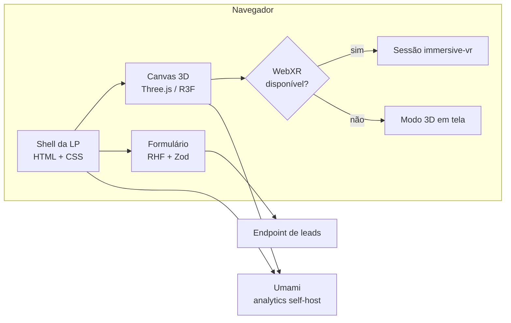

# 🏗 Arquitetura

Como o sistema é montado tecnicamente.

## Notas desta área

| Nota | Assunto |
| --- | --- |
| [[Stack-Tecnologica]] | Comparação de engines e stack proposta (open source) |
| [[Estrutura-de-Pastas]] | Organização do código-fonte |
| [[Fluxo-de-Dados]] | Do formulário ao destino final |

## Visão em uma imagem

## Decisões estruturais

1. **A LP é o produto; o 3D é um componente dela.** Não é uma aplicação WebXR com HTML
   em volta. Isso governa SEO, acessibilidade e carregamento.
2. **Site estático.** Sem servidor de aplicação; só um endpoint para leads. Reduz
   superfície de ataque e custo.
3. **O canvas 3D carrega tarde.** Import dinâmico depois do first paint — o texto da
   LP e o CTA não esperam por 3 MB de GLB.
4. **Nada de tracking de terceiros.** Analytics self-hosted, primeira parte — ver
   [[06-Analytics-e-Tracking]].

## Relacionados

- [[07-Decisoes]] — o registro do porquê de cada escolha
- [[Orcamento-de-Performance]] — limites que a arquitetura precisa respeitar

⬅ [[Home]]
