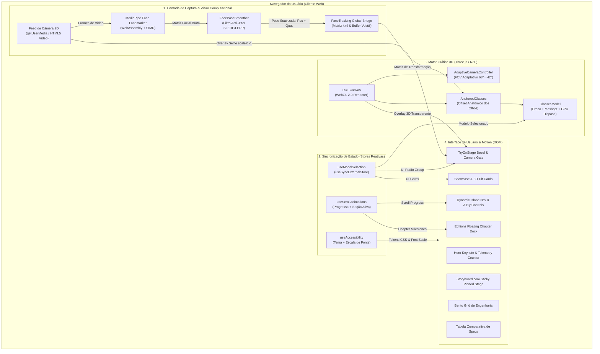
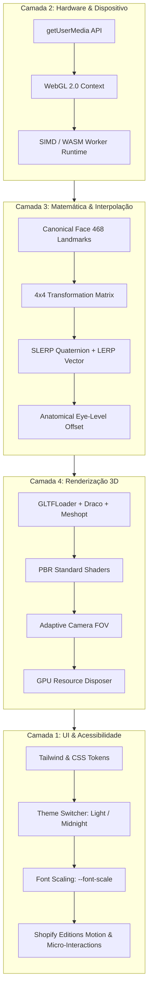

# 🏗 02 — Arquitetura de Sistema

Esta seção documenta a arquitetura técnica completa do **VOID Spatial Optics**, as decisões de design de software, os padrões de sincronização e a separação de responsabilidades entre as camadas da aplicação.

---

## 🗺️ Mapa de Documentos Desta Área

| Documento | Assunto |
| --- | --- |
| [[Stack-Tecnologica]] | Análise detalhada da stack, bibliotecas open source e justificativas técnicas |
| [[Estrutura-de-Pastas]] | Organização do código-fonte, convenções e isolamento de módulos |
| [[Fluxo-de-Dados]] | Ciclo de vida da câmera, pipelines de inferência neural, sincronização e acessibilidade |

---

## 🏛️ Topologia Geral do Sistema

A aplicação é executada **integralmente no navegador do cliente (100% On-Device / Zero-Cloud)**. Não há envio de frames de vídeo, coordenadas biométricas ou dados pessoais para servidores remotos.

---

## 💡 Por Que a Arquitetura Foi Desenhada Deste Jeito?

### 1. Separação de Reconcilers (React DOM vs React Three Fiber)
- **Problema**: O React Three Fiber roda em um reconciler próprio para manipular a árvore de grafos de cena do Three.js, enquanto o React DOM manipula o HTML da página. Tentar passar o estado do modelo selecionado ou da matriz de rastreamento via Context API padrão do React gera perda de contexto ou re-renders desnecessários de toda a árvore da página a cada frame (60 FPS).
- **Solução Arquitetural**:
  1. A matriz de pose facial é gravada em um buffer binário volátil de alta velocidade (`getGlobalFacialTransformationMatrix`), consumido sob demanda dentro do loop `useFrame` com **zero alocações de heap**.
  2. O modelo de óculos selecionado utiliza `useSyncExternalStore`, garantindo sincronização atômica instantânea entre o seletor DOM e o componente 3D sem pontes manuais frágeis.

### 2. Espelhamento Selfie CSS Unificado (`scaleX(-1)`)
- **Problema**: Câmeras frontais de celular e webcams funcionam como "espelhos" (selfie). Se o espelhamento for feito invertendo a escala no espaço 3D (`scale.x = -1`), os modelos 3D têm suas normais de iluminação invertidas (backface culling quebrado) e a matriz de rotação da cabeça precisa de transformações complexas de mão-esquerda para mão-direita.
- **Solução Arquitetural**: O espelhamento é aplicado no **container CSS comum** do `<video>` e do `<Canvas>` com `transform: scaleX(-1)`. O Three.js e a inferência do MediaPipe operam no espaço de coordenadas canônico positivo, mantendo o alinhamento pixel-a-pixel automático e materiais com iluminação perfeita.

### 3. Câmera Adaptativa com Compensação de `object-fit: cover`
- **Problema**: O feed de vídeo é cortado pelo CSS para preencher a moldura do display (`object-fit: cover`). Se o Canvas 3D usar um FOV fixo, haverá desalinhamento angular quando a janela for redimensionada.
- **Solução Arquitetural**: O componente `AdaptiveCameraController` calcula a relação de aspecto da janela versus a resolução nativa da webcam e ajusta o FOV vertical dinamicamente (de 63° canônico do MediaPipe a 42° de preview), preservando a escala métrica real (~14cm de largura dos óculos) em qualquer proporção de tela.

### 4. Filtro Cinemático Anti-Jitter com Tolerância a Oclusão
- **Problema**: Visão computacional baseada em câmera monocular 2D sofre com micro-tremores entre frames e perda momentânea de tracking ao virar a cabeça ou piscar.
- **Solução Arquitetural**: O `FacePoseSmoother` decompõe a matriz 4x4 em componentes vetoriais e aplica:
  - **SLERP (Spherical Linear Interpolation)** no quaternion de rotação (fator `0.35`).
  - **LERP (Linear Interpolation)** no vetor de posição.
  - **Janela de Retenção (Hold Duration)** de 400ms: se a detecção falhar em frames isolados, a armação permanece na última posição estável antes de iniciar o fade-out, evitando desaparecimentos abruptos.

### 5. Deslocamento Anatômico ao Nível dos Olhos (`eyeLevelOffsetM`)
- **Problema**: A origem canônica do modelo facial do MediaPipe fica localizada próxima à cartilagem nasal superior, enquanto os óculos reais se apoiam na ponte do nariz com hastes na altura das têmporas/olhos.
- **Solução Arquitetural**: Aplicação de um vetor de deslocamento local de `+2.2cm` (`EYE_LEVEL_OFFSET_M = 0.022`), rotacionado pelo quaternion atual da cabeça para acompanhar a inclinação tridimensional do usuário.

---

## 🔄 Visão em Camadas

---

## ⚡ Princípios Não-Negociáveis da Arquitetura

1. **Zero Alocações no Loop `useFrame`**: Nenhum `new THREE.Vector3()`, `new THREE.Quaternion()` ou criação de objetos no render loop. Todos os objetos de cálculo são instanciados como singletons fora do loop para evitar pausas de Garbage Collection (GC stutter).
2. **Descarte Ativo de Memória GPU (Dispose)**: Ao trocar de modelo no seletor, todas as geometrias, materiais e texturas anteriores são liberadas da VRAM explicitamente via `disposeSceneResources()`.
3. **Lazy-Loading de Chunks Pesados**: O bundle inicial não inclui o motor Three.js nem o runtime do MediaPipe. O carregamento ocorre sob demanda via `React.lazy()` e `Suspense`.

---

## 📚 Documentos Relacionados

- [[Stack-Tecnologica]] — Justificativa de cada dependência
- [[Fluxo-de-Dados]] — Diagramas de sequência e ciclo de vida
- [[Como-Funciona-o-Tracking]] — Matemática do tracking facial
- [[Orcamento-de-Performance]] — Métricas de draw calls, VRAM e FPS
- [[ADR-0003-Feature-Try-On-Facial]] — Registro formal do pivô técnico

⬅ [[Home]]
