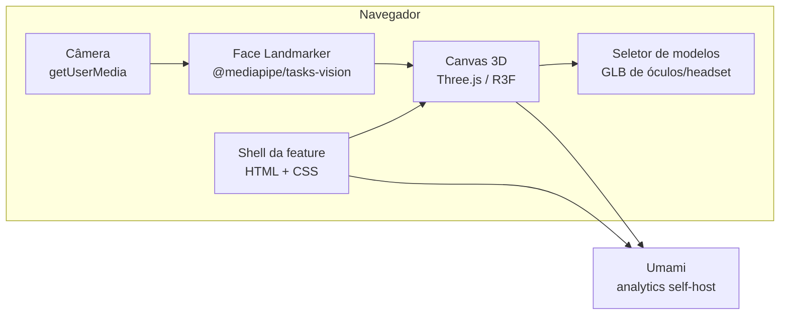
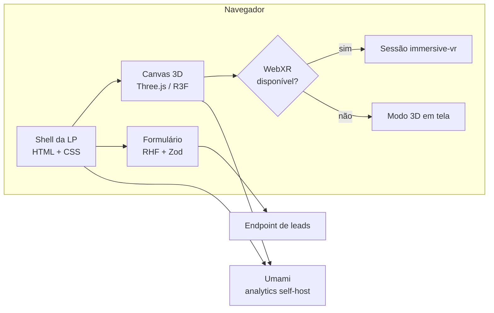

# 🏗 Arquitetura

Como o sistema é montado tecnicamente.

## Notas desta área

| Nota | Assunto |
| --- | --- |
| [[Stack-Tecnologica]] | Comparação de engines e stack proposta (open source) |
| [[Estrutura-de-Pastas]] | Organização do código-fonte |
| [[Fluxo-de-Dados]] | Do formulário ao destino final |

## Visão em uma imagem

> Atualizado por [[ADR-0003-Feature-Try-On-Facial]] (2026-08-14) — não há mais sessão
> `immersive-vr`. Diagrama anterior preservado logo abaixo, como histórico.

Diagrama anterior (histórico, pré-ADR-0003)

## Decisões estruturais

1. **A feature é o produto; o 3D ancora no rosto detectado pela câmera.** Não é mais
   uma landing page com HTML em volta de uma sessão WebXR — é um overlay 3D sobre vídeo.
   Isso governa privacidade (processamento 100% local — ver [[LGPD-e-Consentimento]]),
   acessibilidade e carregamento.
2. **Site estático, sem servidor de aplicação.** Nenhum frame de vídeo ou dado de rosto
   é enviado para fora do dispositivo. Reduz superfície de ataque e custo, e evita
   tratar dado biométrico no servidor.
3. **O canvas 3D e o runtime de detecção facial carregam tarde.** Import dinâmico depois
   do first paint — a UI de permissão de câmera não espera pelo modelo do MediaPipe nem
   pelos GLBs.
4. **Nada de tracking de terceiros.** Analytics self-hosted, primeira parte — ver
   [[06-Analytics-e-Tracking]].

## Relacionados

- [[07-Decisoes]] — o registro do porquê de cada escolha
- [[Orcamento-de-Performance]] — limites que a arquitetura precisa respeitar

⬅ [[Home]]
