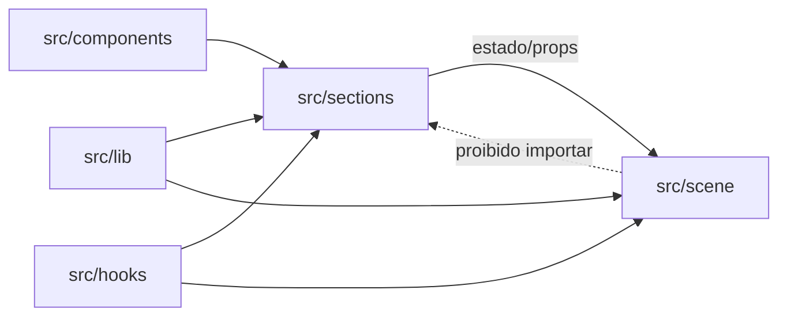

# Estrutura de Pastas

Proposta a ser criada junto com o scaffold. Ainda **não existe** no repositório.

```
LP-with-VR/
├── docs/
│   └── vault/                  # esta documentação (Obsidian)
├── public/
│   ├── models/                 # .glb já otimizados
│   ├── textures/               # .ktx2
│   └── basis/                  # transcoder do KTX2 (obrigatório em runtime)
├── src/
│   ├── main.tsx
│   ├── App.tsx
│   ├── sections/               # dobras da LP: Hero, Beneficios, CTA, Faq
│   ├── scene/                  # tudo que é 3D
│   │   ├── Scene.tsx           # <Canvas> e composição
│   │   ├── objects/            # modelos e componentes 3D
│   │   ├── materials/
│   │   └── xr/                 # sessão, controllers, hands, locomoção
│   ├── components/             # UI 2D reutilizável
│   ├── hooks/
│   │   ├── useXRSupport.ts     # detecção de suporte
│   │   └── usePerfProfile.ts   # nível de experiência (ver Suporte-de-Dispositivos)
│   ├── lib/
│   │   ├── analytics.ts        # wrapper único de eventos
│   │   └── validation.ts       # schemas Zod
│   └── styles/
├── tests/
│   ├── unit/
│   └── e2e/
├── .github/workflows/
├── package.json
└── README.md
```

## Direção de dependência permitida



## Regras

- **`src/scene/` não importa de `src/sections/`.** O 3D não conhece o layout da página;
  a comunicação vai de fora para dentro, via props/estado.
- **Um único módulo fala com analytics** (`src/lib/analytics.ts`). Nada de chamar o
  script do provedor espalhado pelo código — ver [[Plano-de-Eventos]].
- **`public/models/` guarda apenas o resultado do pipeline.** Fontes `.blend` ficam
  fora do repositório — ver [[Pipeline-de-Assets-3D]].
- Componente 3D e componente DOM nunca compartilham nome de arquivo.

## Relacionados

- [[Stack-Tecnologica]]
- [[Convencoes-de-Codigo]]

⬅ [[02-Arquitetura]]
