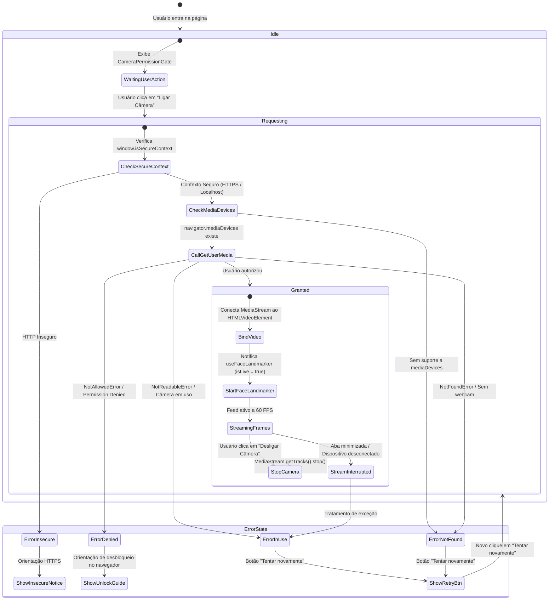
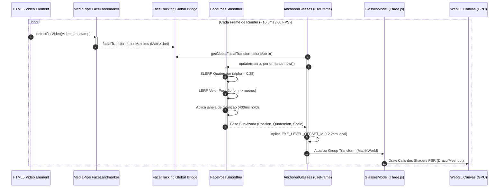
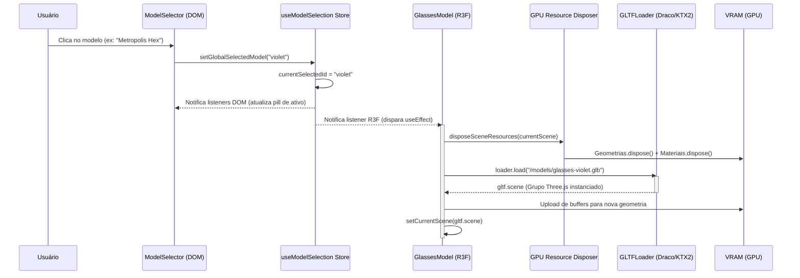
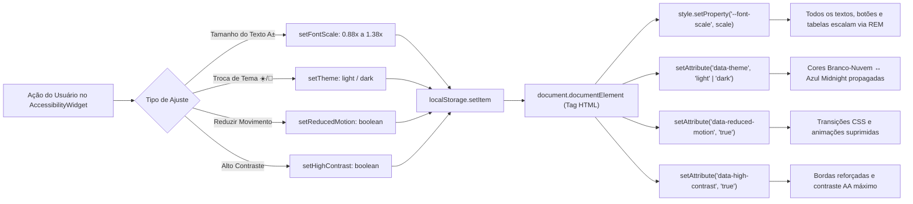
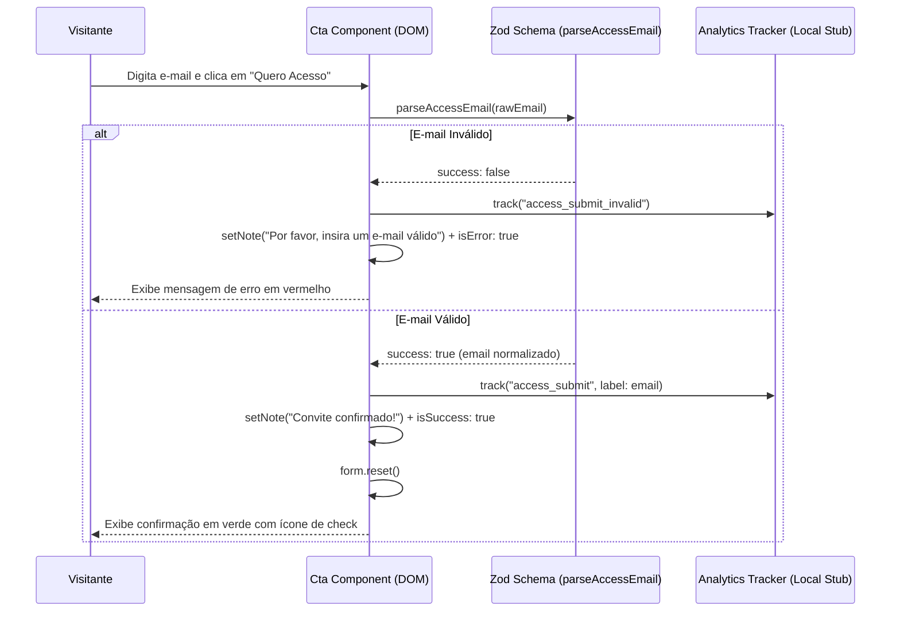

# 🔄 Fluxo de Dados e Ciclo de Vida

Este documento detalha o fluxo de dados em tempo real da aplicação, descrevendo as máquinas de estado, os diagramas de sequência de cada funcionalidade e a interação entre a árvore DOM e o renderizador WebGL.

---

## 1. Ciclo de Vida da Câmera & Permissões (`useCamera`)

A obtenção de acesso à webcam segue uma máquina de estados estrita com recuperação graciosa de falhas e conformidade com a LGPD.

---

## 2. Pipeline de Tracking Facial & Render Loop a 60 FPS

O diagrama de sequência abaixo descreve o ciclo executado a cada frame durante a prova virtual ativa:

---

## 3. Sincronização Reativa do Seletor de Modelos (`useSyncExternalStore`)

Como o React Three Fiber roda em um loop de renderização independente da árvore DOM, o compartilhamento do modelo selecionado utiliza uma store externa reativa sem causar re-renderizações no DOM:

---

## 4. Fluxo do Sistema de Acessibilidade & Temas

O motor de acessibilidade orquestra o tamanho de fonte, modo claro/escuro e preferências de movimento através de variáveis CSS dinâmicas:

---

## 5. Fluxo do Formulário de Acesso Antecipado (`Cta.tsx`)

O formulário de conversão de early access aplica validação segura de dados via schema Zod no cliente:

---

## 📚 Documentos Relacionados

- [[02-Arquitetura]] — Visão geral da arquitetura de sistema
- [[Como-Funciona-o-Tracking]] — Detalhes matemáticos e parâmetros de ancoragem
- [[Orcamento-de-Performance]] — Métricas de tempo de quadro e orçamento de draw calls
- [[LGPD-e-Consentimento]] — Diretrizes de proteção de dados biométricos

⬅ [[02-Arquitetura]]
