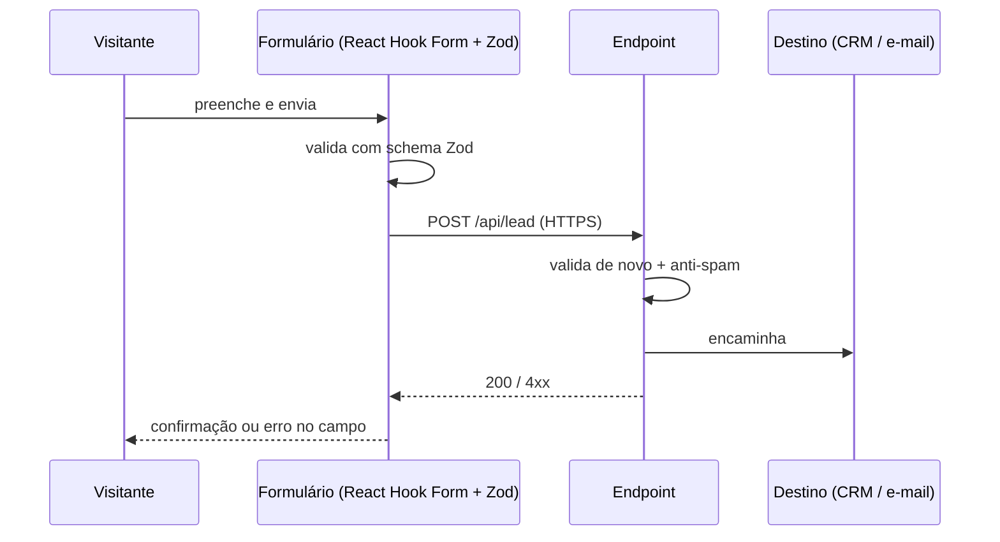

# Fluxo de Dados

A LP tem pouquíssimo dado — e isso é uma decisão, não uma limitação. Menos dado
significa menos obrigação de LGPD e menos superfície de ataque.

## Os três fluxos

### 1. Lead (formulário)

- **Validar no cliente e no servidor** com o mesmo schema Zod.
- Anti-spam sem CAPTCHA de terceiro: honeypot + rate limit por IP + verificação de tempo
  de preenchimento. Se precisar de CAPTCHA, **Altcha** (open source, sem rastreamento).
- **Nunca** logar o corpo do formulário em texto claro.

### 2. Telemetria de comportamento

Eventos anônimos e agregados. Detalhe completo em [[Plano-de-Eventos]].

### 3. Assets 3D

Estáticos, servidos pelo CDN, com cache longo e hash no nome. Sem dado de usuário.

## Dados pessoais tratados

| Dado | Origem | Base legal (LGPD) | Retenção |
| --- | --- | --- | --- |
| Nome | Formulário | Consentimento / execução de contrato | _a definir_ |
| E-mail | Formulário | Consentimento | _a definir_ |
| Telefone | Formulário (opcional) | Consentimento | _a definir_ |
| IP | Servidor / analytics | Legítimo interesse (segurança) | Não persistido pelo Umami |

> Preencher retenção e responsável antes do lançamento — ver [[LGPD-e-Consentimento]].

## Fronteiras

- O canvas 3D **não** envia dado de pose para lugar nenhum. Posição de cabeça e mãos é
  biométrica-adjacente; se algum dia virar métrica, precisa de consentimento explícito
  e nota própria neste vault.
- Sem cookies de terceiros. Sem pixel de rede social carregado antes de consentimento.

## Relacionados

- [[LGPD-e-Consentimento]]
- [[Plano-de-Eventos]]
- [[Requisitos]]

⬅ [[02-Arquitetura]]
