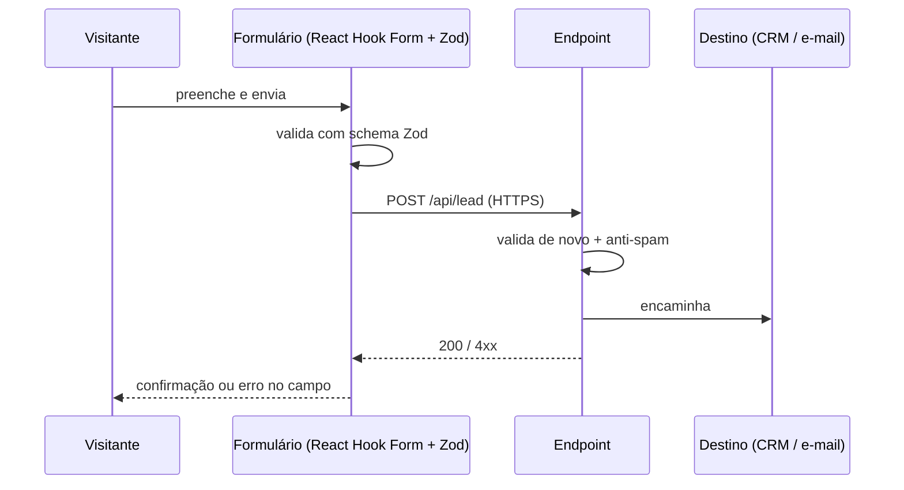

# Fluxo de Dados

A LP tem pouquíssimo dado — e isso é uma decisão, não uma limitação. Menos dado
significa menos obrigação de LGPD e menos superfície de ataque.

## Os três fluxos

> **Nota (2026-08-14)**: o fluxo de lead abaixo é do design anterior à
> [[ADR-0003-Feature-Try-On-Facial]] — a feature de try-on atual não tem formulário nem
> endpoint de leads no escopo (ver [[Escopo]]). Preservado caso volte a fazer parte do
> produto; o fluxo ativo hoje é o nº 3 (câmera → detecção facial → ancoragem, 100%
> local, sem servidor).

### 1. Lead (formulário) — histórico, fora do escopo atual

- **Validar no cliente e no servidor** com o mesmo schema Zod.
- Anti-spam sem CAPTCHA de terceiro: honeypot + rate limit por IP + verificação de tempo
  de preenchimento. Se precisar de CAPTCHA, **Altcha** (open source, sem rastreamento).
- **Nunca** logar o corpo do formulário em texto claro.

### 2. Telemetria de comportamento

Eventos anônimos e agregados. Detalhe completo em [[Plano-de-Eventos]].

### 3. Assets 3D

Estáticos, servidos pelo CDN, com cache longo e hash no nome. Sem dado de usuário.

## Dados pessoais tratados

| Dado | Origem | Base legal (LGPD) | Retenção |
| --- | --- | --- | --- |
| Nome | Formulário | Consentimento / execução de contrato | _a definir_ |
| E-mail | Formulário | Consentimento | _a definir_ |
| Telefone | Formulário (opcional) | Consentimento | _a definir_ |
| IP | Servidor / analytics | Legítimo interesse (segurança) | Não persistido pelo Umami |

> Preencher retenção e responsável antes do lançamento — ver [[LGPD-e-Consentimento]].

## Fronteiras

- A câmera e o processamento de landmarks faciais **não** enviam nada para fora do
  dispositivo — vídeo e pose facial são dado biométrico (LGPD, dado sensível), não só
  "adjacente" como a pose de VR do design anterior. Ver
  [[LGPD-e-Consentimento]] §"dados faciais/câmera" e [[ADR-0003-Feature-Try-On-Facial]].
- Sem cookies de terceiros. Sem pixel de rede social carregado antes de consentimento.

## Relacionados

- [[LGPD-e-Consentimento]]
- [[Plano-de-Eventos]]
- [[Requisitos]]

⬅ [[02-Arquitetura]]
