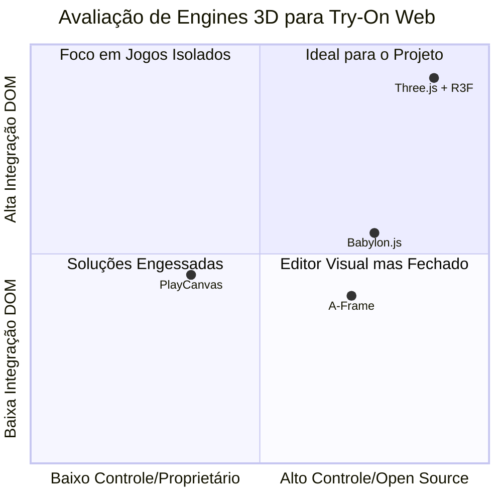
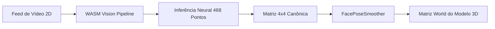

# 🛠️ Stack Tecnológica e Decisões de Ferramentas

Este documento detalha todas as camadas tecnológicas do **VOID Spatial Optics**, as alternativas avaliadas, os trade-offs considerados e as razões pelas quais cada ferramenta foi escolhida.

---

## 📊 Matriz Resumo da Stack Atual

| Camada | Tecnologia | Versão | Licença | Justificativa Principal |
|---|---|---|---|---|
| **Linguagem** | TypeScript | `^7.0.2` (Strict) | Apache-2.0 | Segurança de tipo em matrizes 4x4, vetores e contratos de API |
| **Bundler & Dev** | Vite | `^8.2.1` | MIT | Compilação em < 3s, suporte nativo a ESM e code-splitting |
| **UI Framework** | React | `^19.2.8` | MIT | Base do ecossistema R3F e gerenciamento reativo do DOM |
| **Motor Gráfico 3D** | Three.js | `^0.185.1` | MIT | Padrão da indústria web para renderização PBR e WebGL 2.0 |
| **Ponte 3D ↔ React** | @react-three/fiber | `^9.7.0` | MIT | Grafo de cena 3D declarativo sincronizado com ciclo de vida React |
| **Utilitários 3D** | @react-three/drei | `^10.7.8` | MIT | `OrbitControls`, loaders e abstrações auxiliares |
| **Visão Computacional** | @mediapipe/tasks-vision | `^1.0.1` | Apache-2.0 | Face Landmarker 100% no navegador (WASM/SIMD) com matriz 4x4 |
| **Câmera** | `getUserMedia` | API Nativa | — | Zero dependência externa, baixo overhead de transferência |
| **Estilização** | Vanilla CSS + Tailwind | `^3.4.19` | MIT | Design Tokens Branco-Nuvem / Midnight e layout responsivo |
| **Validação** | Zod | `^4.4.3` | MIT | Schemas de validação de e-mail seguros e tipados |
| **Pipeline 3D** | @gltf-transform/* | `^4.4.2` | MIT | Compressão Draco, quantização e otimização Meshopt |

---

## 🔍 Avaliação e Comparativo de Engines

### 1. Three.js + React Three Fiber (Escolhida)
- **Vantagens**:
  - Ecossistema maduro, suporte a Draco, Meshopt e KTX2 de fábrica.
  - O R3F permite que componentes 3D acessem hooks do React e compartilhem o ciclo de vida da UI.
  - Zero sobrecarga de editores proprietários.
- **Trade-offs**: Requer disciplina rigorosa de descarte de GPU (`geometry.dispose()`, `material.dispose()`) para evitar vazamentos de VRAM.

### 2. Babylon.js (Não Escolhida)
- **Vantagens**: Excelente motor físico e renderizador de áudio espacial integrado.
- **Desvantagens**: Bundle base consideravelmente mais pesado (~3.5 MB) e integração com o DOM menos natural para o padrão de overlays translúcidos sobrepostos ao `<video>`.

### 3. A-Frame (Descartada)
- **Vantagens**: Facilidade para protótipos rápidos declarativos em HTML.
- **Desvantagens**: A camada de abstração sobre o Three.js dificulta a manipulação de matrizes de transformação de alta frequência (60 FPS) e gera overhead desnecessário no DOM.

---

## 🧠 Camada de Visão Computacional: Por que `@mediapipe/tasks-vision`?

A escolha do **MediaPipe Face Landmarker** em detrimento de bibliotecas legadas (como `face-api.js` ou TensorFlow.js bruto) baseou-se em três fatores críticos:

1. **`facialTransformationMatrixes` Nativas**:
   - A biblioteca resolve internamente o problema de **Perspective-n-Point (PnP)**, retornando uma matriz de transformação 4×4 por frame referenciada a um modelo canônico tridimensional.
   - Isso elimina a necessidade de calcular matrizes manualmente a partir de pontos esparsos (ex.: distância entre cantos dos olhos), reduzindo drasticamente o jitter.
2. **Execução Local WebAssembly com SIMD**:
   - O runtime roda diretamente na CPU/GPU do cliente com aceleração vetorial SIMD, atingindo latências médias de **10ms a 14ms** em laptops e smartphones modernos.
3. **Privacidade e Conformidade LGPD**:
   - Todo o processamento ocorre no espaço de memória do navegador. Nenhum pixel é transmitido para a nuvem.

---

## ⚡ Motor de Motion & Animações: Por que Vanilla Hooks em vez de Framer Motion?

Para garantir a meta de **carregamento inicial < 300 kB** definida em [[Orcamento-de-Performance]], evitou-se a inclusão de bibliotecas pesadas de animação em runtime (como `framer-motion` ~35 kB gzip).

### Estratégia Implementada:
1. **`useScrollAnimations`**: Rastreia `scrollY`, progresso e seções ativas via `window.requestAnimationFrame`, sem criar listeners redundantes nem travar o scroll do navegador.
2. **`useCounterAnimation`**: Interpolação numérica quártica (`1 - (1 - progress)^4`) para contadores de métricas no Hero.
3. **`KineticText`**: Revelação de texto por palavra usando opacidade progressiva e transições nativas de CSS (`will-change: opacity, transform`).
4. **`InteractiveTiltCard`**: Cálculo de matriz de perspectiva 3D (`rotateX`, `rotateY`) e spotlight glare em CSS puro baseado nas coordenadas relativas do ponteiro (`PointerEvent`).

---

## 📚 Documentos Relacionados

- [[02-Arquitetura]] — Visão geral da arquitetura
- [[Pipeline-de-Assets-3D]] — Compressão e otimização de GLBs
- [[Orcamento-de-Performance]] — Métricas e portões de qualidade
- [[ADR-0003-Feature-Try-On-Facial]] — Decisão do pivô para visão computacional

⬅ [[02-Arquitetura]]
