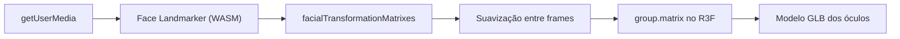
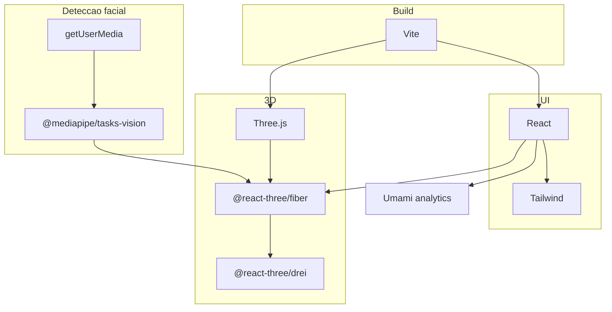

# Stack Tecnológica

> **Atualizado em 2026-08-14** por [[ADR-0003-Feature-Try-On-Facial]]: o produto virou
> uma feature isolada de try-on facial por câmera, não mais uma landing page com sessão
> `immersive-vr`. A base (Vite/TS/React/Three.js/R3F/Tailwind) de [[ADR-0002-Stack-Base]]
> continua valendo e já está implementada em `dev`; o que muda é a camada de tracking:
> sai `@react-three/xr`, entra `@mediapipe/tasks-vision` + `getUserMedia`.

Critérios usados na avaliação: **open source com licença permissiva**, suporte real a
câmera/WASM no navegador, boa performance em dispositivo de entrada e comunidade ativa
em 2026.

## 0. Detecção facial — a peça nova

| Camada | Escolha | Licença | Por quê |
| --- | --- | --- | --- |
| Detecção de landmarks faciais | **`@mediapipe/tasks-vision`** (Face Landmarker) | Apache-2.0 | Roda inteiramente no navegador via WASM — nenhum frame de vídeo sai do dispositivo (ver [[LGPD-e-Consentimento]]); expõe `facialTransformationMatrixes`, uma matriz 4×4 pronta por rosto detectado |
| Acesso à câmera | **`getUserMedia`** (API nativa do navegador) | — | Não é dependência npm; exige contexto seguro (HTTPS), mesmo requisito que o WebXR tinha, só que agora é a câmera quem exige — ver [[Setup-do-Ambiente]] |

### Como ancorar o modelo sem jitter (a parte que costuma dar errado)

O Face Landmarker devolve 478 pontos 3D por rosto **e**, se a opção
`outputFacialTransformationMatrixes: true` estiver ligada, uma matriz de transformação
4×4 já pronta (posição + rotação) por rosto detectado. **Use essa matriz diretamente**
para posicionar o `group`/`object3D` dos óculos no R3F — não deriva posição/rotação
recalculando a cada frame a partir de pontos individuais (ex.: "ponte do nariz = ponto
168, têmporas = pontos X e Y"), que é a causa mais comum de jitter visível em
implementações de try-on facial. Ainda assim, suavize a matriz entre frames (média móvel
curta ou `lerp`/`slerp` de posição e rotação) — mesmo a matriz "pronta" varia
frame a frame por ruído de detecção, e alguma suavização é o que faz a diferença entre
"parece um filtro profissional" e "parece que os óculos estão tremendo".



---

## 1. Engine 3D — a decisão que define o resto

> Contexto original (pré-[[ADR-0003-Feature-Try-On-Facial]]): a comparação abaixo
> pesava suporte a WebXR, porque o produto tinha sessão de headset. Isso não é mais um
> critério — a feature atual renderiza um GLB ancorado numa `<video>` de câmera comum,
> não numa sessão XR. A escolha de engine (Three.js/R3F) não mudou porque já era a
> opção certa para "3D convivendo com DOM/React", que continua sendo exatamente o caso.

| Engine | Licença | Pontos fortes | Pontos fracos |
| --- | --- | --- | --- |
| **Three.js** | MIT | Padrão de fato na web (270× mais downloads que PlayCanvas); WebGPU pronto para produção desde set/2025; controle total | Você monta o "engine" em volta; sem editor |
| **Babylon.js** | Apache-2.0 | Muita coisa pronta (física, UI 3D) | Bundle maior; menos natural para um overlay simples sobre vídeo |
| **A-Frame** | MIT | HTML declarativo, protótipo em minutos; roda sobre Three.js | Abstração atrapalha quando a LP precisa de layout customizado |
| **PlayCanvas** | MIT (engine) | Editor visual colaborativo; runtime leve | Editor é **proprietário e hospedado** — quebra o critério open source |

### Recomendação

**Three.js + React Three Fiber** — mantido de ADR-0002.

Justificativa: o overlay 3D convive com DOM (vídeo da câmera, seletor de modelos,
avisos de erro). R3F é o padrão para 3D declarativo em React e integra a cena ao mesmo
ciclo de estado do restante da página, o que evita a ponte manual entre DOM e canvas —
o mesmo motivo de antes, só que agora o "resto da página" é o feed de câmera + UI de
seleção, não mais o funil de conversão de uma LP.

**Use A-Frame apenas para protótipo descartável** de validação de conceito.

---

## 2. Stack proposta

| Camada | Escolha | Licença | Por quê |
| --- | --- | --- | --- |
| Linguagem | **TypeScript** | Apache-2.0 | Matriz de transformação errada vira erro de compilação, não bug em headset |
| Build/dev | **Vite** | MIT | HMR rápido, `--https` fácil (WebXR exige contexto seguro) |
| UI | **React** | MIT | Base do R3F; ecossistema de formulário e a11y |
| Render 3D | **Three.js** | MIT | Ver acima |
| Cola 3D↔React | **@react-three/fiber** | MIT | Cena como componentes |
| Helpers | **@react-three/drei** | MIT | Loaders, controles, `<Environment>`, sem reinventar |
| Detecção facial | **@mediapipe/tasks-vision** | Apache-2.0 | Face Landmarker — ver seção 0 acima |
| Câmera | **getUserMedia** (nativo) | — | Sem dependência npm |
| Estilo | **Tailwind CSS** | MIT | CSS previsível fora do canvas |
| Animação DOM | **Motion** (ex-Framer Motion) | MIT | Transições da LP |
| Formulário | **React Hook Form + Zod** | MIT | Validação compartilhada cliente/servidor |
| Assets 3D | **glTF-Transform** / **gltfpack** | MIT | Ver [[Pipeline-de-Assets-3D]] |
| Analytics | **Umami** (self-host) | MIT | Ver [[Ferramentas-de-Analytics]] |
| Lint/format | **Biome** ou ESLint+Prettier | MIT | Biome = uma ferramenta, muito mais rápido |
| Testes | **Vitest** + **Playwright** | MIT / Apache-2.0 | Unidade e E2E do funil |
| CI | **GitHub Actions** | — | Lint, build e Lighthouse por PR |

### Instalação de referência

```bash
npm create vite@latest . -- --template react-ts
npm i three @react-three/fiber @react-three/drei @mediapipe/tasks-vision
npm i -D @types/three vite-plugin-mkcert
npm i -D tailwindcss @tailwindcss/vite
```

> `vite-plugin-mkcert` gera certificado local — sem HTTPS, `getUserMedia` recusa acesso
> à câmera ao acessar pela rede (fora de `localhost`). Detalhes em
> [[Setup-do-Ambiente]].

### Camadas da stack



### Ponto de atenção no `package.json`

O arquivo atual declara `"type": "commonjs"`. O ferramental moderno (Vite, Vitest,
Biome) assume ESM. Mudar para `"type": "module"` faz parte do scaffold.

---

## 3. Alternativa mínima (sem React)

Se a LP for pequena e estática, dá para cortar React inteiro:

| Camada | Escolha |
| --- | --- |
| Build | Vite (vanilla-ts) |
| 3D | Three.js puro + `VRButton` |
| Estilo | CSS moderno (nesting, `@layer`) |
| Conteúdo | HTML estático ou Astro (MIT) |

Menos dependências, bundle bem menor, melhor Lighthouse — ao custo de gerenciar estado
e ciclo de vida da cena na mão. **Astro** é uma opção forte aqui: zero JS por padrão e
"ilhas" só onde o 3D vive.

---

## 4. WebGL ou WebGPU?

WebGPU está pronto para produção no Three.js desde setembro de 2025 e, com o Safari 26,
existe em todos os navegadores principais. Sem sessão WebXR no escopo atual, essa
escolha fica mais simples do que era — não há mais a variável de maturidade
WebXR+WebGPU nos headsets a considerar, só o suporte a WebGPU nos navegadores comuns.

- Three.js oferece `WebGPURenderer` com fallback automático para WebGL.

**Decisão sugerida**: começar em WebGL2 (já em produção via R3F desde a Task 1/2),
escrever materiais via TSL/nós quando possível e reavaliar WebGPU antes do lançamento —
sem urgência, já que WebGL2 cobre o caso de uso atual sem gargalo conhecido.

---

## 5. Em aberto

- [ ] Hospedagem — ver [[Deploy-e-Ambientes]]
- [ ] Destino do formulário (e-mail, CRM, planilha, backend próprio)
- [ ] Precisa de CMS? Se o texto muda muito, considerar um headless CMS open source
- [ ] i18n será necessário?

## Relacionados

- [[Estrutura-de-Pastas]]
- [[ADR-0002-Stack-Base]]
- [[Como-Funciona-o-Tracking]]
- [[Orcamento-de-Performance]]

## Fontes

- [Three.js Alternatives Compared: Babylon.js vs PlayCanvas (2026)](https://www.utsubo.com/blog/threejs-vs-babylonjs-vs-playcanvas-comparison)
- [What's New in Three.js (2026): WebGPU, New Workflows & Beyond](https://www.utsubo.com/blog/threejs-2026-what-changed)
- [React Three Fiber vs. Three.js in 2026](https://graffersid.com/react-three-fiber-vs-three-js/)

⬅ [[02-Arquitetura]]
