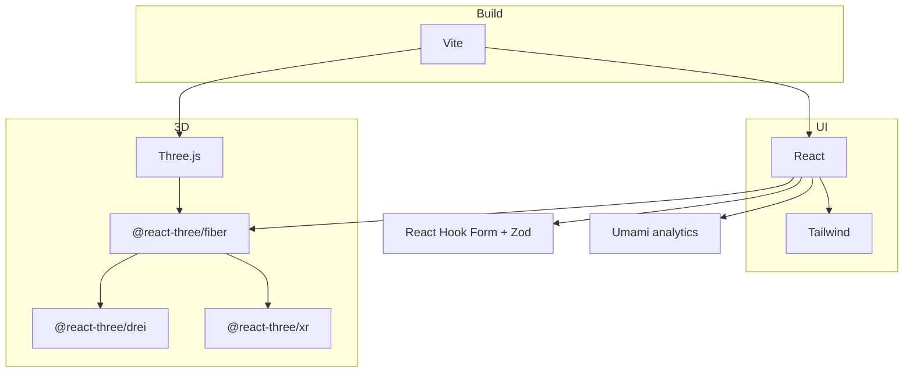

# Stack Tecnológica

> **Estado atual do repositório**: apenas `package.json` (`"type": "commonjs"`), sem
> dependências. Nada foi escolhido ainda — este documento é a proposta a ser aprovada
> em [[ADR-0002-Stack-Base]].

Critérios usados na avaliação: **open source com licença permissiva**, suporte real a
WebXR, boa performance em headset standalone e comunidade ativa em 2026.

---

## 1. Engine 3D — a decisão que define o resto

| Engine | Licença | Pontos fortes | Pontos fracos |
| --- | --- | --- | --- |
| **Three.js** | MIT | Padrão de fato na web (270× mais downloads que PlayCanvas); WebGPU pronto para produção desde set/2025; controle total | Você monta o "engine" em volta; sem editor |
| **Babylon.js** | Apache-2.0 | **WebXR mais completo e testado** do mercado; muita coisa pronta (teleporte, UI 3D, física) | Bundle maior; menos exemplos de LP no ecossistema |
| **A-Frame** | MIT | HTML declarativo, protótipo de VR em minutos; roda sobre Three.js | Abstração atrapalha quando a LP precisa de layout customizado |
| **PlayCanvas** | MIT (engine) | Editor visual colaborativo; runtime leve | Editor é **proprietário e hospedado** — quebra o critério open source |

### Recomendação

**Three.js + React Three Fiber**, com Babylon.js como plano B.

Justificativa: a peça central é uma **landing page** — o 3D convive com DOM, formulário,
scroll e SEO. R3F é o padrão para 3D declarativo em React e integra a cena ao mesmo
ciclo de estado do restante da página, o que evita a ponte manual entre DOM e canvas.

**Escolha Babylon.js se** a experiência XR crescer e virar o produto (locomoção
complexa, física, UI 3D densa). Nesse cenário Babylon reduz muito o atrito, e a troca
custa caro depois — decida antes de escrever a cena.

**Use A-Frame apenas para protótipo descartável** de validação de conceito.

---

## 2. Stack proposta

| Camada | Escolha | Licença | Por quê |
| --- | --- | --- | --- |
| Linguagem | **TypeScript** | Apache-2.0 | Matriz de transformação errada vira erro de compilação, não bug em headset |
| Build/dev | **Vite** | MIT | HMR rápido, `--https` fácil (WebXR exige contexto seguro) |
| UI | **React** | MIT | Base do R3F; ecossistema de formulário e a11y |
| Render 3D | **Three.js** | MIT | Ver acima |
| Cola 3D↔React | **@react-three/fiber** | MIT | Cena como componentes |
| Helpers | **@react-three/drei** | MIT | Loaders, controles, `<Environment>`, sem reinventar |
| XR | **@react-three/xr** | MIT | Sessão, controllers, hands, teleporte |
| Estilo | **Tailwind CSS** | MIT | CSS previsível fora do canvas |
| Animação DOM | **Motion** (ex-Framer Motion) | MIT | Transições da LP |
| Formulário | **React Hook Form + Zod** | MIT | Validação compartilhada cliente/servidor |
| Assets 3D | **glTF-Transform** / **gltfpack** | MIT | Ver [[Pipeline-de-Assets-3D]] |
| Analytics | **Umami** (self-host) | MIT | Ver [[Ferramentas-de-Analytics]] |
| Lint/format | **Biome** ou ESLint+Prettier | MIT | Biome = uma ferramenta, muito mais rápido |
| Testes | **Vitest** + **Playwright** | MIT / Apache-2.0 | Unidade e E2E do funil |
| CI | **GitHub Actions** | — | Lint, build e Lighthouse por PR |

### Instalação de referência

```bash
npm create vite@latest . -- --template react-ts
npm i three @react-three/fiber @react-three/drei @react-three/xr
npm i -D @types/three vite-plugin-mkcert
npm i -D tailwindcss @tailwindcss/vite
```

> `vite-plugin-mkcert` gera certificado local — sem HTTPS, o headset não entra em
> sessão XR ao acessar pela rede. Detalhes em [[Setup-do-Ambiente]].

### Camadas da stack



### Ponto de atenção no `package.json`

O arquivo atual declara `"type": "commonjs"`. O ferramental moderno (Vite, Vitest,
Biome) assume ESM. Mudar para `"type": "module"` faz parte do scaffold.

---

## 3. Alternativa mínima (sem React)

Se a LP for pequena e estática, dá para cortar React inteiro:

| Camada | Escolha |
| --- | --- |
| Build | Vite (vanilla-ts) |
| 3D | Three.js puro + `VRButton` |
| Estilo | CSS moderno (nesting, `@layer`) |
| Conteúdo | HTML estático ou Astro (MIT) |

Menos dependências, bundle bem menor, melhor Lighthouse — ao custo de gerenciar estado
e ciclo de vida da cena na mão. **Astro** é uma opção forte aqui: zero JS por padrão e
"ilhas" só onde o 3D vive.

---

## 4. WebGL ou WebGPU?

WebGPU está pronto para produção no Three.js desde setembro de 2025 e, com o Safari 26,
existe em todos os navegadores principais. Mas:

- O caminho WebXR + WebGPU ainda é menos maduro que WebXR + WebGL2 nos headsets.
- Three.js oferece `WebGPURenderer` com fallback automático para WebGL.

**Decisão sugerida**: começar em WebGL2, escrever materiais via TSL/nós quando possível
e reavaliar antes do lançamento.

---

## 5. Em aberto

- [ ] Hospedagem — ver [[Deploy-e-Ambientes]]
- [ ] Destino do formulário (e-mail, CRM, planilha, backend próprio)
- [ ] Precisa de CMS? Se o texto muda muito, considerar um headless CMS open source
- [ ] i18n será necessário?

## Relacionados

- [[Estrutura-de-Pastas]]
- [[ADR-0002-Stack-Base]]
- [[Como-Funciona-o-Tracking]]
- [[Orcamento-de-Performance]]

## Fontes

- [Three.js Alternatives Compared: Babylon.js vs PlayCanvas (2026)](https://www.utsubo.com/blog/threejs-vs-babylonjs-vs-playcanvas-comparison)
- [What's New in Three.js (2026): WebGPU, New Workflows & Beyond](https://www.utsubo.com/blog/threejs-2026-what-changed)
- [React Three Fiber vs. Three.js in 2026](https://graffersid.com/react-three-fiber-vs-three-js/)

⬅ [[02-Arquitetura]]
