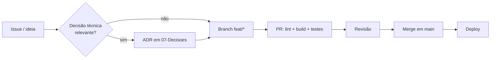

# 🛠 Desenvolvimento

Como trabalhar neste repositório.

## Notas desta área

| Nota | Assunto |
| --- | --- |
| [[Setup-do-Ambiente]] | Rodar localmente, inclusive testando no headset |
| [[Convencoes-de-Codigo]] | Estilo, commits, branches, revisão |
| [[Arquivos-de-Engenharia]] | Quais documentos o repositório mantém e por quê |

## Fluxo de trabalho

## Regras de ouro

1. **`main` sempre deployável.**
2. **Decisão técnica sem ADR não existe** — daqui a três meses ninguém lembra do porquê.
3. **Mudou a cena 3D? Rode o checklist de [[Orcamento-de-Performance]]** antes do PR.
4. **Documentação viaja junto com o código**, no mesmo PR.

⬅ [[Home]]
