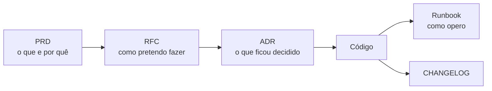

# Arquivos de Engenharia

Quais documentos um projeto de software mantém, o que cada um responde e onde ele vive
neste repositório. O princípio que guia a lista: **poucos documentos, ligados entre si
e vivos**. Documento que ninguém atualiza é pior que documento que não existe.

## O mapa

| Documento | Pergunta que responde | Quando escrever | Onde fica aqui |
| --- | --- | --- | --- |
| **README** | O que é isso e como eu rodo? | No primeiro commit | `/README.md` |
| **PRD** | O que construir e para quem? | Antes de projetar | [[Escopo]] + [[Requisitos]] |
| **RFC / Design Doc** | Como pretendo construir? | Antes de mudança grande | `07-Decisoes/RFC-*` |
| **ADR** | Por que decidimos assim? | No momento da decisão | `07-Decisoes/ADR-*` |
| **Runbook** | Como opero quando quebra? | Antes de ir para produção | `08-Operacoes/` |
| **CHANGELOG** | O que mudou entre versões? | A cada release | `/CHANGELOG.md` |
| **CONTRIBUTING** | Como contribuo? | Quando entra a 2ª pessoa | `/CONTRIBUTING.md` |
| **CODEOWNERS** | Quem revisa o quê? | Quando há times | `/.github/CODEOWNERS` |
| **SECURITY** | Como reporto vulnerabilidade? | Se o repo for público | `/SECURITY.md` |
| **LICENSE** | O que posso fazer com isso? | No primeiro commit | `/LICENSE` |
| **CLAUDE.md / AGENTS.md** | Como um agente de IA trabalha aqui? | Se você usa IA no repo | `/CLAUDE.md` |

## A cadeia que importa

O PRD define **o que** deve ser construído e por quê, do ponto de vista de produto.
O ADR registra **como e por que** uma decisão técnica foi tomada para viabilizar aquilo.
O RFC é o espaço intermediário: a proposta em discussão, antes de virar decisão.

## ADR — o documento de maior retorno

Um ADR é curto (uma página), imutável e numerado. Ele captura a informação que se perde
mais rápido: **o contexto em que a decisão fez sentido**.

Regra prática: escreva um ADR quando a decisão for **cara de reverter**. Escolher a
engine 3D, o modelo de dados, o provedor de hospedagem ou o formato de asset — sim.
Escolher o nome de uma função — não.

ADR nunca é editado depois de aceito. Mudou de ideia? Escreva um novo ADR que
**supersede** o anterior, e marque o antigo como `superseded-by`. O histórico de
decisões erradas é parte do valor.

Template: `99-Templates/Template-ADR.md`.

## Runbook — o que salva a madrugada

Um runbook responde: como faço o deploy, como faço rollback, o que checo quando o site
cai, quem eu aviso. Escrito **antes** de precisar, em passos executáveis, sem prosa.

Teste de qualidade: alguém que nunca mexeu no projeto consegue seguir sozinho?

## Docs-as-code

Os documentos vivem no repositório, em Markdown, versionados junto com o código e
revisados no mesmo PR.

- **Referência derivada do código** (tipos, API, props) deve ser **gerada**, nunca
  escrita à mão — ela desatualiza sozinha.
- **Intenção de design e rationale** precisam de autor humano; nenhuma ferramenta extrai
  isso do código.
- **README é porta de entrada**, não enciclopédia: descreva, aponte links, pare.

## O que este projeto adota

Projeto pequeno, uma pessoa. A lista é deliberadamente curta:

- [x] Vault de documentação (`docs/vault`)
- [ ] `README.md` na raiz — descrição, setup, link para o vault
- [ ] ADRs para decisões caras de reverter
- [ ] Runbook de deploy antes do lançamento
- [ ] `LICENSE`
- [ ] `CHANGELOG.md` — só se houver versionamento público
- [ ] `CONTRIBUTING.md` — só quando entrar outra pessoa
- [ ] RFC — só para mudanças grandes; num projeto solo, o ADR costuma bastar

> Não crie um documento porque "todo projeto tem". Crie quando a ausência dele já
> tiver custado tempo.

## Relacionados

- [[07-Decisoes]] — onde os ADRs moram
- [[Convencoes-de-Codigo]]
- [[Deploy-e-Ambientes]]

## Fontes

- [Engineering Planning with RFCs, Design Documents and ADRs — Pragmatic Engineer](https://newsletter.pragmaticengineer.com/p/rfcs-and-design-docs)
- [Companies Using RFCs or Design Docs and Examples](https://blog.pragmaticengineer.com/rfcs-and-design-docs/)
- [10 Docs That Compound: ADRs, Runbooks & "Why" Files](https://medium.com/@sparknp1/10-docs-that-compound-adrs-runbooks-why-files-f9fb1c38b582)

⬅ [[03-Desenvolvimento]]
