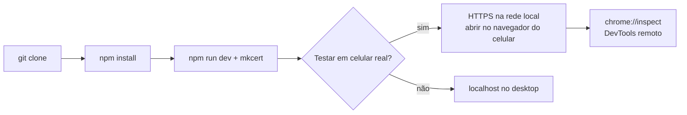

# Setup do Ambiente

> **Atenção**: o projeto ainda não tem scaffold. Este documento descreve o setup
> pretendido pela [[Stack-Tecnologica]]; atualize assim que o código existir.

## Requisitos

| Item | Versão |
| --- | --- |
| Node.js | ≥ 22 LTS |
| npm / pnpm | npm 10+ ou pnpm 9+ |
| Git | qualquer recente |
| Navegador | Chrome/Edge para debug; qualquer navegador moderno com câmera para testar a feature |

## Primeira execução

```bash
git clone <url> LP-with-VR
cd LP-with-VR
npm install
npm run dev
```

## HTTPS local — obrigatório para acessar a câmera

> Atualizado por [[ADR-0003-Feature-Try-On-Facial]] (2026-08-14) — antes era o WebXR
> que exigia contexto seguro; agora é o `getUserMedia`, com a mesma regra prática.

`getUserMedia` só funciona em contexto seguro. `localhost` é considerado seguro, mas
testar num **celular real pela rede local** exige `https://`, senão o navegador recusa
o pedido de permissão de câmera.

```ts
// vite.config.ts
import mkcert from 'vite-plugin-mkcert';

export default defineConfig({
  plugins: [react(), mkcert()],
  server: { host: true }, // expõe na rede local
});
```

Depois disso, o Vite imprime algo como `https://192.168.0.10:5173` — é esse endereço que
você abre no navegador do celular para testar a câmera de verdade. Aceite o aviso de
certificado autoassinado.



## Debug em dispositivo móvel real

A performance de câmera + MediaPipe + R3F rodando juntos em um celular de entrada é
bem diferente do desktop — vale testar em hardware real, não só emular.

1. Ative o **modo desenvolvedor** no Android (ou use o Safari Web Inspector no iOS).
2. Conecte via USB e autorize o computador.
3. `adb devices` para confirmar (Android).
4. Abra `chrome://inspect` no desktop → o navegador do celular aparece em *Remote Target*.
5. Clique em **inspect** — DevTools completo (console, network, profiler) na aba do celular.

Sem dispositivo real à mão, teste no desktop mesmo — a webcam do notebook já passa pelo
mesmo caminho de `getUserMedia` + MediaPipe, só que sem o perfil de performance de
mobile. Não deixe de validar em pelo menos um celular real antes do lançamento.

## Scripts previstos

| Comando | O que faz |
| --- | --- |
| `npm run dev` | Servidor de desenvolvimento com HTTPS |
| `npm run build` | Build de produção |
| `npm run preview` | Serve o build local |
| `npm run lint` | Biome/ESLint |
| `npm run test` | Vitest |
| `npm run test:e2e` | Playwright |
| `npm run assets` | Pipeline glTF-Transform — ver [[Pipeline-de-Assets-3D]] |

## Problemas comuns

| Sintoma | Causa provável |
| --- | --- |
| `getUserMedia` rejeita com `NotAllowedError` | Permissão de câmera negada pelo usuário — trate como erro esperado, com instrução de como reativar |
| `getUserMedia` rejeita com `NotFoundError` | Dispositivo sem câmera, ou câmera em uso por outro app |
| Câmera nunca pede permissão / falha silenciosa | Acessando por `http://` em vez de `https://` (fora de `localhost`) |
| Face Landmarker não detecta nenhum rosto | Iluminação ruim, rosto fora de quadro, ou WASM ainda carregando — dê feedback visual, não falhe silenciosamente |
| Óculos "tremem" no rosto (jitter) | Ancoragem recalculada a partir de landmarks individuais em vez de `facialTransformationMatrixes`, ou sem suavização entre frames — ver [[Stack-Tecnologica]] §0 |
| Modelo carrega mas fica preto | Falta `<Environment>` / luz, ou material PBR sem IBL |
| `KTX2Loader: transcoder not found` | Faltou copiar `basis/` para `public/` |
| Cena trava a cada poucos segundos | Alocação dentro do render loop gerando GC |

## Relacionados

- [[Convencoes-de-Codigo]]
- [[Suporte-de-Dispositivos]]

⬅ [[03-Desenvolvimento]]
