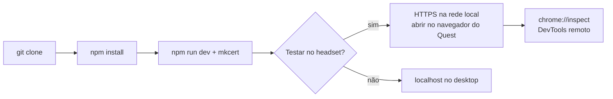

# Setup do Ambiente

> **Atenção**: o projeto ainda não tem scaffold. Este documento descreve o setup
> pretendido pela [[Stack-Tecnologica]]; atualize assim que o código existir.

## Requisitos

| Item | Versão |
| --- | --- |
| Node.js | ≥ 22 LTS |
| npm / pnpm | npm 10+ ou pnpm 9+ |
| Git | qualquer recente |
| Navegador | Chrome/Edge para debug; Quest Browser para XR |

## Primeira execução

```bash
git clone <url> LP-with-VR
cd LP-with-VR
npm install
npm run dev
```

## HTTPS local — obrigatório para testar VR

WebXR só funciona em contexto seguro. `localhost` é considerado seguro, mas o **headset
acessa pela rede local**, e aí o `http://` é bloqueado. Sem HTTPS, o botão de VR
simplesmente não aparece no Quest.

```ts
// vite.config.ts
import mkcert from 'vite-plugin-mkcert';

export default defineConfig({
  plugins: [react(), mkcert()],
  server: { host: true }, // expõe na rede local
});
```

Depois disso, o Vite imprime algo como `https://192.168.0.10:5173` — é esse endereço que
você abre no navegador do headset. Aceite o aviso de certificado autoassinado.



## Debug no Quest

1. Ative o **modo desenvolvedor** na conta Meta e no app do celular.
2. Conecte via USB e autorize o computador.
3. `adb devices` para confirmar.
4. Abra `chrome://inspect` no desktop → o Quest Browser aparece em *Remote Target*.
5. Clique em **inspect** — DevTools completo (console, network, profiler) na aba do headset.

Sem headset, use a extensão **WebXR API Emulator** para o fluxo básico. Ela não simula
latência, perda de tracking nem custo de GPU — o que quer dizer que **ela não valida
performance nem conforto**.

## Scripts previstos

| Comando | O que faz |
| --- | --- |
| `npm run dev` | Servidor de desenvolvimento com HTTPS |
| `npm run build` | Build de produção |
| `npm run preview` | Serve o build local |
| `npm run lint` | Biome/ESLint |
| `npm run test` | Vitest |
| `npm run test:e2e` | Playwright |
| `npm run assets` | Pipeline glTF-Transform — ver [[Pipeline-de-Assets-3D]] |

## Problemas comuns

| Sintoma | Causa provável |
| --- | --- |
| Botão de VR não aparece no headset | Acessando por `http://` em vez de `https://` |
| `Cannot read properties of undefined (reading 'isSessionSupported')` | `navigator.xr` não existe — falta feature detection |
| Modelo carrega mas fica preto | Falta `<Environment>` / luz, ou material PBR sem IBL |
| `KTX2Loader: transcoder not found` | Faltou copiar `basis/` para `public/` |
| Cena trava a cada poucos segundos | Alocação dentro do render loop gerando GC |
| Usuário nasce dentro do chão | Reference space `local` sem offset de altura — ver [[Como-Funciona-o-Tracking]] |

## Relacionados

- [[Convencoes-de-Codigo]]
- [[Suporte-de-Dispositivos]]

⬅ [[03-Desenvolvimento]]
