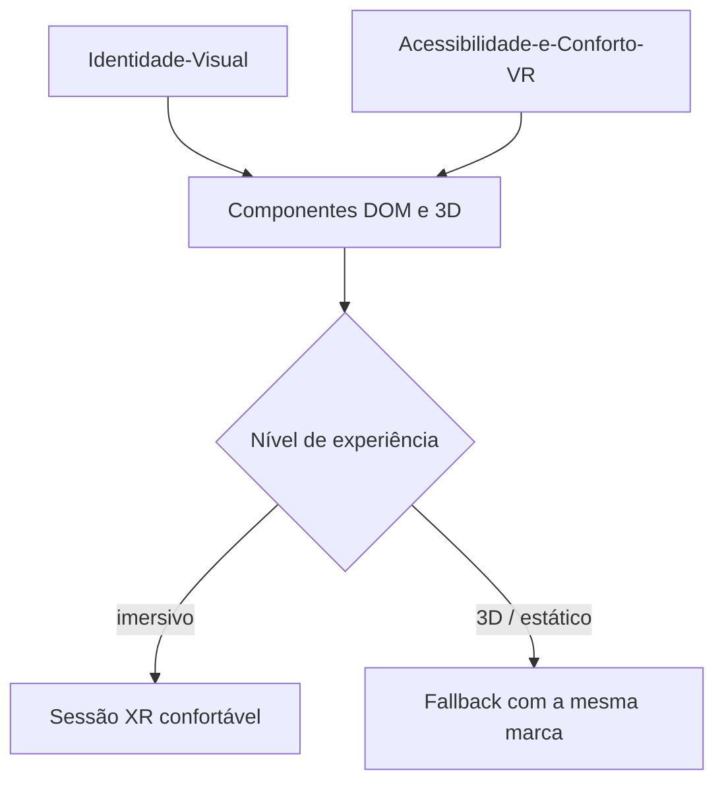

# 🎨 Design e UX

Como a landing page se parece e como ela trata o corpo de quem entra em VR.

## Notas desta área

| Nota | Assunto |
| --- | --- |
| [[Identidade-Visual]] | Paleta, tipografia, tom de voz, logo |
| [[Acessibilidade-e-Conforto-VR]] | Cybersickness, locomoção, WCAG aplicado a XR |

## Por que design e conforto VR moram na mesma pasta

Em uma LP comum, UX é sobre clareza e conversão. Em VR, UX também é sobre **o corpo do
usuário** — uma decisão de movimento de câmera mal feita produz náusea real, não só uma
má impressão. As duas coisas (visual e conforto) são decididas pela mesma pessoa neste
projeto, então ficam na mesma área.

## Princípios

1. **Conforto não é opcional nem configurável só para "quem sente enjoo".** É o padrão
   para todo mundo, com intensidade ajustável.
2. **Identidade visual funciona sem o 3D.** Quem cai no fallback estático (ver
   [[Suporte-de-Dispositivos]]) precisa da mesma clareza de marca.
3. **Acessibilidade é layout, não plugin.** Contraste, foco visível e leitura por teclado
   valem tanto na camada DOM quanto na camada 3D.

⬅ [[Home]]
