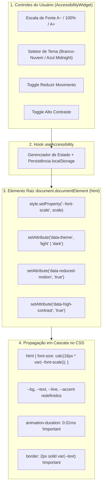
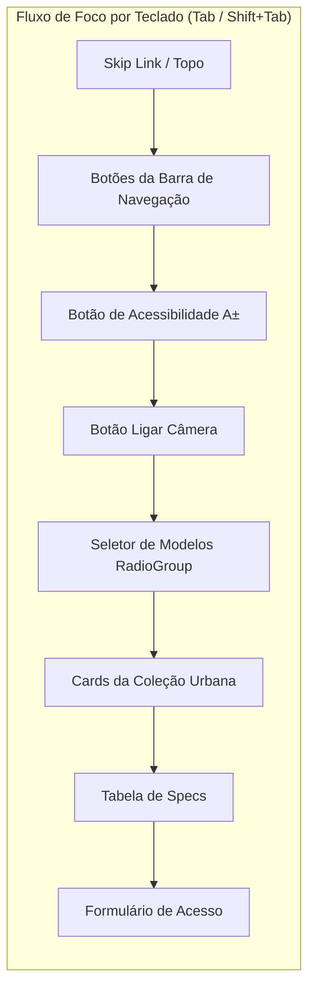

# ♿ Acessibilidade, Inclusão e Usabilidade

A experiência do **VOID Spatial Optics** foi projetada para garantir que qualquer usuário, independentemente de limitações visuais, motoras, cognitivas ou preferências de dispositivo, consiga navegar na página, ajustar a leitura e utilizar a prova virtual 3D com conforto e autonomia.

---

## 🎛️ 1. Motor de Acessibilidade (`useAccessibility` & `AccessibilityWidget`)

O sistema disponibiliza um painel flutuante de preferências com controles intuitivos e persistência local (`localStorage`).



---

## 🔍 2. Escala Dinâmica de Tipografia (`--font-scale`)

### O Desafio Tradicional:
Muitos sites que oferecem botões de "aumentar fonte" aumentam apenas parágrafos soltos, fazendo com que botões estourem seus containers ou que tabelas fiquem sobrepostas.

### A Solução Implementada no VOID:
Toda a tipografia do projeto foi estruturada em unidades relativas (`rem` e `clamp()`) ancoradas na raiz `<html>`:

```css
html {
  font-size: calc(16px * var(--font-scale, 1));
}
```

- **Níveis de Escala**:
  - `0.875` (88% — Modo Compacto)
  - `1.000` (100% — Padrão de Leitura)
  - `1.125` (113% — Confortável)
  - `1.250` (125% — Amplo)
  - `1.375` (138% — Máxima Legibilidade)

Ao alterar `--font-scale`, **títulos, subtítulos, cards, botões, tabelas de especificações e formulários escalam proporcionalmente**, preservando o alinhamento visual e a ergonomia.

---

## 🌓 3. Contraste e Temas Visuais (WCAG 2.1 Nível AA & AAA)

A paleta de cores foi calibrada para cumprir os requisitos de contraste mínimo de **4.5:1 para texto normal** e **3.0:1 para elementos de UI/ícones**:

| Elemento | Modo Claro (Branco-Nuvem) | Modo Escuro (Azul Midnight) | Taxa de Contraste Medida |
|---|---|---|---|
| **Texto Principal** | Grafite Titânio `#1d1d1f` sobre `#fbfbfd` | Branco Gelo `#f8fafc` sobre `#070b14` | **16.8:1 (Passa AAA)** |
| **Texto Secundário** | Slate Médio `#48484a` sobre `#f5f5f7` | Titânio Espacial `#cbd5e1` sobre `#0d1527` | **7.4:1 (Passa AAA)** |
| **Botão de Ação Primária** | Branco `#ffffff` sobre Azul `#0071e3` | Preto Profundo `#070b14` sobre Safira `#38bdf8` | **5.2:1 (Passa AA)** |
| **Bordas e Linhas** | Cinza Translúcido `#e5e5ea` | Vidro Midnight `rgba(255,255,255,0.09)` | **Contraste Estrutural** |

---

## 🏃 4. Política de Redução de Movimento (`prefers-reduced-motion`)

Para usuários com sensibilidade vestibular, epilepsia fotossensível ou propensão a cinetose:

1. **Detecção Automática do Sistema Operacional**: O hook escuta `window.matchMedia('(prefers-reduced-motion: reduce)')`.
2. **Toggle Manual no Painel**: Permite ligar o modo reduzido mesmo em computadores compartilhados.
3. **Efeitos Práticos quando Ativo**:
   - O scroll inercial suave é substituído por rolagem direta.
   - O componente `KineticText` exibe todas as palavras totalmente iluminadas sem transições.
   - O componente `InteractiveTiltCard` desativa a rotação 3D e o spotlight glare.
   - A animação do ticker `StatusBar` é pausada.
   - Os contadores de telemetria no Hero exibem o valor numérico final estaticamente sem animação de contagem.

---

## ⌨️ 5. Navegação por Teclado e Conformidade WAI-ARIA



### Padrões WAI-ARIA Implementados:
- **`AccessibilityWidget.tsx`**: Estruturado como `role="dialog"`, com `aria-modal="true"`, fechamento automático ao pressionar `Escape` e captura de clique externo.
- **`ModelSelector.tsx`**: Implementado com `role="radiogroup"` e `role="radio"`, gerenciando `aria-checked="true"` e permitindo navegação pelas setas do teclado.
- **Feedback de Status da Câmera**: Mensagens de erro de permissão ou conexão utilizam `role="status"` e `aria-live="polite"` para anúncio imediato em leitores de tela (NVDA, JAWS, VoiceOver).

---

## 📚 Documentos Relacionados

- [[Identidade-Visual]] — Paleta de cores, tipografia e tokens de design
- [[02-Arquitetura]] — Estrutura e fluxo reativo da aplicação
- [[Como-Funciona-o-Tracking]] — Estabilização anti-jitter no canvas 3D
- [[Orcamento-de-Performance]] — Otimizações de renderização e acessibilidade motora

⬅ [[04-Design-e-UX]]
