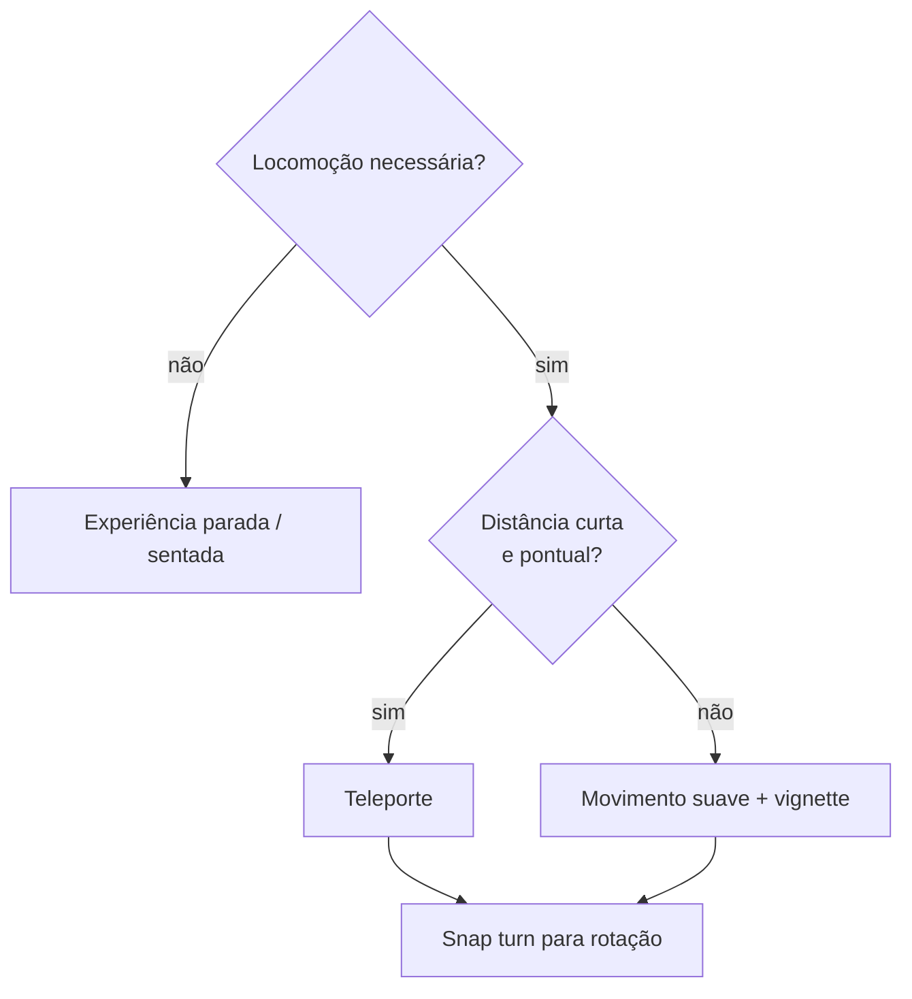

# Acessibilidade e Conforto em VR

> Ligado por [[Como-Funciona-o-Tracking]]: lá está o *como* técnico do tracking; aqui
> está o *como tratar o corpo e os limites* de quem usa a experiência.

## Cybersickness: por que acontece

Cybersickness (ou VIMS — *visually induced motion sickness*) nasce de um conflito
sensorial: o olho reporta movimento, o sistema vestibular (ouvido interno) não sente
nada correspondente. Cinco alavancas reduzem esse conflito: controle do ponto de vista
pelo próprio usuário, evitar aceleração visual, oferecer indicadores de movimento
antecipados, usar **referenciais de repouso** (algo estático no campo de visão) e reduzir
o campo de visão durante o movimento.

## Locomoção: a decisão de maior impacto

| Técnica | Conforto | Nota |
| --- | --- | --- |
| **Teleporte** | Alto | Padrão recomendado; sem movimento contínuo, sem conflito vestibular |
| Movimento suave + **vignette** (estreita o campo de visão durante o deslocamento) | Médio | Só se teleporte não servir à narrativa |
| Movimento suave sem vignette | Baixo | Evitar |
| **Snap turn** (rotação em degraus, não contínua) | Alto | Preferir à rotação suave de câmera |
| Rotação de câmera fora do controle do usuário (cutscene, shake) | — | **Proibido** — regra já registrada em [[Como-Funciona-o-Tracking]] |

Referenciais estáticos no campo de visão (uma cabine, um chão com grade, um horizonte
fixo) ajudam mesmo quando o restante da cena se move — o mesmo princípio de "olhar o
horizonte" contra o enjoo em barco.

## Configurações de conforto expostas ao usuário

- Alternar teleporte ↔ movimento suave.
- Alternar rotação suave ↔ snap turn, com o passo do snap ajustável (ex.: 30°/45°).
- Vignette durante movimento, ligado por padrão.
- Ajuste de altura/escala do avatar quando `local-floor` não é suportado (ver seção 4 de
  [[Como-Funciona-o-Tracking]]).
- Opção de **sessão sentada**: nem toda experiência exige o usuário de pé.

## Acessibilidade em XR — além do enjoo

XR acessível é uma filosofia de design em torno de autonomia, dignidade e segurança:
quando a acessibilidade nasce na plataforma, mais gente participa sem precisar de
solução alternativa.

Práticas concretas para a LP:

- **Legendas** em qualquer áudio/narração da cena.
- **Áudio espacial** como reforço, nunca como único canal de informação crítica.
- **Seleção por `select`, não por hover contínuo** — já é regra técnica em
  [[Como-Funciona-o-Tracking]] por causa do Vision Pro, e também é acessibilidade: hover
  sustentado é difícil para quem tem tremor ou baixa precisão motora.
- **Contraste mínimo AA (4.5:1)** também dentro do canvas 3D — texto e UI espacial não
  ficam isentos do critério que vale no DOM.
- **Alvo de interação generoso**: raio de seleção maior que o visual do objeto, mesma
  lógica de área de toque em mobile.
- **`prefers-reduced-motion: reduce`** já é usado para decidir o nível de experiência em
  [[Suporte-de-Dispositivos]] — a mesma preferência do sistema operacional deve
  desabilitar parallax, auto-rotação de câmera e qualquer animação ambiental na versão
  2D da LP.

## Rótulo de conforto

Prática recomendada pela comunidade de acessibilidade em VR: declarar um **nível de
conforto** da experiência (ex.: Confortável / Moderado / Intenso) antes do usuário
entrar, do mesmo jeito que um jogo declara conteúdo sensível. Para esta LP, com
locomoção por teleporte e sem movimento forçado de câmera, o alvo é **Confortável**.

## Checklist

- [ ] Locomoção padrão é teleporte
- [ ] Rotação padrão é snap turn
- [ ] Vignette ativo durante qualquer movimento suave
- [ ] Nenhuma cutscene move a câmera sem input
- [ ] Seleção funciona por `select`, testada sem hover
- [ ] Contraste AA verificado na UI dentro do canvas
- [ ] `prefers-reduced-motion` respeitado no fallback 2D/3D
- [ ] Rótulo de conforto declarado antes da sessão XR

## Relacionados

- [[Como-Funciona-o-Tracking]]
- [[Suporte-de-Dispositivos]]
- [[Orcamento-de-Performance]] — frame perdido também é gatilho de desconforto

## Fontes

- [Accessible XR in 2026 — Equal Entry](https://equalentry.com/xr-accessibility-inclusive-design/)
- [Virtual Reality Accessibility: Comfort Ratings and Reducing Motion — Equal Entry](https://equalentry.com/virtual-reality-accessibility-comfort-ratings-and-reduced-motion/)
- [VR Motion Sickness: Causes, Prevention & Treatment (2026)](https://netpsychology.org/understanding-and-preventing-vr-motion-sickness/)
- [What is Cybersickness in Virtual Reality? — IxDF](https://ixdf.org/literature/topics/cybersickness-in-virtual-reality)
- [Peripheral Teleportation: A Rest Frame Design to Mitigate Cybersickness (arXiv)](https://arxiv.org/pdf/2502.15227)

⬅ [[04-Design-e-UX]]
