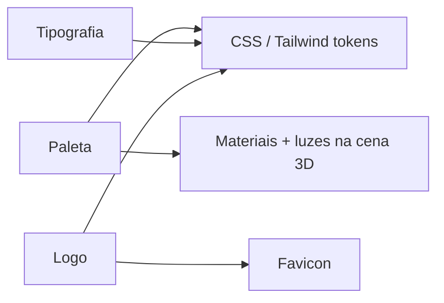

# Identidade Visual

> **Preenchida em 2026-08-17** a partir do redesign completo da landing page (frontend,
> sem task numerada na fila do `dispatch.sh` — trabalho feito direto na working tree de
> `dev`, documentado aqui após revisão). Fecha os dois itens que estavam em aberto no
> backlog de [[Home]]: "Preencher Identidade-Visual" e "Revisitar a cópia de marketing".
>
> **Contexto explícito do próprio projeto** (ver rodapé do site, `Footer.tsx`): "Projeto
> conceitual, fins de estudo e treinamento" — inspirado nas linguagens de design da
> **Apple** e do **Shopify Editions**, não um produto comercial. Isso é uma citação da
> própria cópia do site, registrada aqui porque justifica a mudança de direção (de
> estética "void" neon cyberpunk para um visual editorial claro estilo Apple Keynote).

## Paleta

Pivô de paleta: de "void" neon escuro (acid/violet/magenta sobre `#08080a`) para um
sistema de dois temas claro/escuro estilo Apple, controlado por `data-theme` no `<html>`
(`src/hooks/useAccessibility.ts`, aplicado em `src/styles/site.css`).

### Tema claro — "Branco-Nuvem" (padrão)

| Uso | Cor | Hex |
| --- | --- | --- |
| Primária / ação | Apple Blue | `#0071e3` (hover `#0077ed`) |
| Fundo | Cloud 100/200 | `#fbfbfd` / `#f5f5f7` |
| Superfície / cartão | Cloud 50 | `#ffffff` |
| Texto principal | Slate Charcoal | `#1d1d1f` |
| Texto secundário | Slate Muted/Light | `#6e6e73` / `#86868b` |
| Acento secundário | Cobalto | `#3b4261` |
| Sucesso | Emerald | `#34c759` |

### Tema escuro — "Azul Midnight" (alternável via `AccessibilityWidget`)

Ver bloco `[data-theme="dark"]` em `site.css` (linha ~71) — Apple Blue como acento
permanece, fundo e superfícies invertem para tons de azul-marinho escuro em vez do preto
puro que o tema "void" antigo usava.

### Paleta antiga (ainda referenciada em código, ver "Inconsistência em aberto" abaixo)

| Uso | Cor | Hex | Onde ainda aparece |
| --- | --- | --- | --- |
| Acid (antigo primário) | `#cfff04` | `scripts/generate-placeholder-glasses.mjs`, docs/vault antigas |
| Violet (antigo secundário) | `#8b5cf6` | idem |
| Magenta (antigo terciário) | `#ff2e6a` | idem |

## Tipografia

| Uso | Fonte | Peso |
| --- | --- | --- |
| Títulos / display | `Plus Jakarta Sans` (fallback `-apple-system`, `SF Pro Display`) | 300–800, itálico 400 |
| Corpo | Mesma família (`Plus Jakarta Sans`) | 400–600 |
| Técnico / telemetria / mono | `JetBrains Mono` | 400–600 |

Trocou de `JetBrains Mono` como fonte de display (era o único par carregado antes) para
`Plus Jakarta Sans` + `JetBrains Mono` — mono agora reservado para elementos técnicos
(StatusBar, badges de telemetria, specs), igual ao padrão editorial da Apple/Shopify
Editions de combinar uma sans humanista com uma mono técnica de apoio.

## Logo e assets de marca

- [x] Logo em SVG inline (círculo + núcleo azul, ver `nav__logo-icon` em `Nav.tsx` e
      `footer__logo-icon` em `Footer.tsx`) — substitui o anel neon acid do design antigo
- [x] Versão para fundo escuro — herda de `data-theme="dark"`, mesmo SVG (cor do núcleo é
      fixa em `#0071e3`, funciona nos dois temas)
- [x] Favicon — círculo azul com núcleo branco (`index.html`), trocou do anel neon acid

## Tom de voz

Editorial/técnico, em primeira pessoa do produto — mistura especificação técnica precisa
("468 pontos de tracking", "~12ms de latência", "Filtro Cinemático Anti-Jitter") com
linguagem de manifesto urbano/lifestyle ("A precisão da metrópole. Direto no seu olhar.").
Nomenclatura de modelos migrou de referências cyberpunk (Neon Classic, Cyber Edge,
Cyberdeck Visor) para nomes de "coleção urbana" (Titanium Minimal, Metropolis Hex,
Spatial Studio Visor) — ver `useModelSelection.ts`.

## Aplicação no 3D

- [x] As cores de material na cena 3D seguem a paleta acima? `Scene.tsx` trocou a
      iluminação de "point light acid `#cfff04`" para um setup "studio Apple" (luz branca
      + realce azul `#0071e3`), coerente com o fundo branco-nuvem
- [ ] Os 3 modelos GLB (`public/models/*.glb`, gerados por
      `scripts/generate-placeholder-glasses.mjs`) **ainda usam as cores antigas**
      (`#cfff04`/`#8b5cf6`/`#ff2e6a`) — `useModelSelection.ts` já registra as cores novas
      (`#242528`/`#3b4261`/`#0f4c81` + acentos `#0071e3`/`#6366f1`/`#0071e3`) nos campos
      `color`/`accentColor` (usados em swatches 2D no `ModelSelector`/`Showcase`), mas
      isso não recolore o material real do GLB no Canvas — ver "Inconsistência em aberto"
- [x] O tema (claro/escuro) do canvas acompanha o tema da página? Sim — a iluminação da
      cena não depende de `data-theme` diretamente, mas o fundo do `<Canvas>`
      (`gl={{ alpha: true }}`) deixa a superfície branca/escura do DOM aparecer atrás,
      então acompanha visualmente

## ⚠️ Inconsistência em aberto — paleta 2D vs. material 3D real

O redesign trocou a paleta em **todo o DOM** (nav, footer, botões, cards, swatches 2D em
`ModelSelector`/`Showcase`) e nos **campos de dados** (`color`/`accentColor` em
`useModelSelection.ts`), mas os **3 arquivos GLB reais** em `public/models/` continuam
com os materiais antigos (`Material_Acid_Frame` = `#cfff04` etc., gerados por
`scripts/generate-placeholder-glasses.mjs`) — ninguém rodou o gerador de novo nem editou
os materiais do GLB. Resultado: o swatch/círculo 2D ao lado de cada modelo no
`ModelSelector`/`Showcase` mostra a cor nova (ex.: titânio escuro `#242528`), mas o
modelo 3D real ancorado no rosto (`GlassesModel.tsx` → `AnchoredGlasses.tsx`) ainda
renderiza com o frame verde-neon/violeta/magenta antigo — **desalinhamento visual entre
a prévia 2D e o resultado 3D real**.

Isso também é relevante pra Task 10 (`TASKS.md` na raiz do repo — modelos GLB reais +
oclusão da haste, 1ª tentativa de dispatch falhou, retry pendente): o prompt daquela
task pediu pra recolorir
os novos GLBs pra paleta **antiga** (`#cfff04`/`#8b5cf6`/`#ff2e6a`), que já não é a
paleta vigente no resto do produto — precisa ajustar o prompt pra paleta nova
(`#242528`/`#0071e3`, `#3b4261`/`#6366f1`, `#0f4c81`/`#0071e3`) antes de rodar de novo.

## Componente órfão encontrado durante a revisão

`src/components/Portal.tsx` não é mais importado por ninguém — `Filosofia.tsx` (única
consumidora antes do redesign) trocou para `KineticText`/`InteractiveTiltCard`. Só
`StaticFallback.tsx` menciona a palavra "Portal" (num `aria-label` de texto, não import).
Candidato a remoção numa limpeza futura — não removido aqui porque não fazia parte do
pedido desta revisão (documentar, não editar código).

## Relacionados

- [[Acessibilidade-e-Conforto-VR]] — contraste mínimo vale também para a UI dentro do canvas
- [[Escopo]]
- [[Home]] — backlog de documentação

⬅ [[04-Design-e-UX]]
