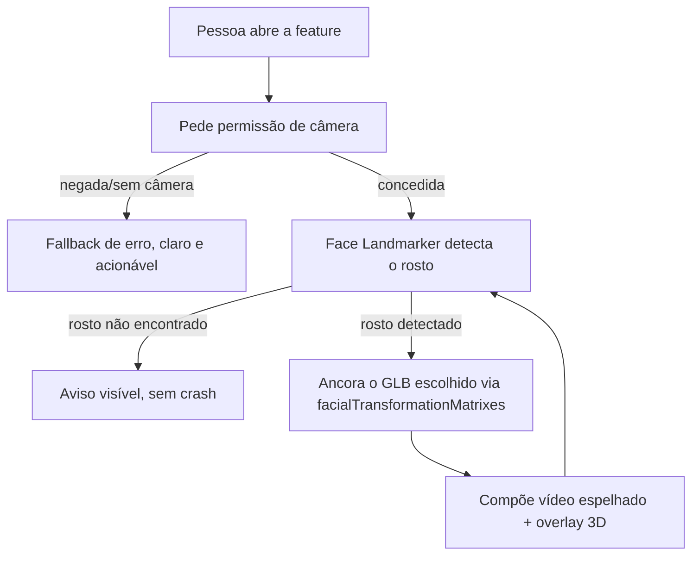

# 🥽 VR e 3D

> **Atualizado por [[ADR-0003-Feature-Try-On-Facial]] (2026-08-14).** O produto deixou
> de ter sessão `immersive-vr` — [[Como-Funciona-o-Tracking]] e
> [[Suporte-de-Dispositivos]] foram substituídas e descrevem a versão anterior do
> produto (registro histórico, não apagado). [[Pipeline-de-Assets-3D]] e
> [[Orcamento-de-Performance]] continuam valendo — ainda é uma cena Three.js
> renderizando GLB, só que ancorada num rosto detectado por câmera, não numa sessão XR.

Tudo que envolve a camada 3D da feature: como o modelo é ancorado no rosto, como
preparar os assets e quanto custa cada frame.

## Notas desta área

| Nota | Assunto |
| --- | --- |
| ~~[[Como-Funciona-o-Tracking]]~~ | Substituída — 6DoF, SLAM, reference spaces de headset (histórico) |
| ~~[[Suporte-de-Dispositivos]]~~ | Substituída — matriz de compatibilidade WebXR (histórico) |
| [[Pipeline-de-Assets-3D]] | glTF/GLB, Draco, Meshopt, KTX2 — ainda válido |
| [[Orcamento-de-Performance]] | Onde o tempo de frame é gasto — ainda válido em espírito |

Para como a detecção/ancoragem facial funciona hoje, ver [[Stack-Tecnologica]] §0 e
[[ADR-0003-Feature-Try-On-Facial]].

## Princípios adotados

1. **Progressive enhancement.** A feature precisa se comunicar claramente mesmo quando
   a câmera/detecção facial falha. Fallback de erro é requisito, não afterthought.
2. **Feature detection por módulo.** Nunca por user-agent — `getUserMedia`, WASM e
   suporte a `OffscreenCanvas` são checados por capacidade, não por navegador.
3. **Estabilidade acima de espetáculo.** Suavizar a pose entre frames é obrigatório —
   jitter visível é o principal jeito da feature parecer quebrada.
4. **Orçamento antes de arte.** Modelo que estoura o budget volta para o pipeline.

## Fluxo da experiência

⬅ [[Home]]
