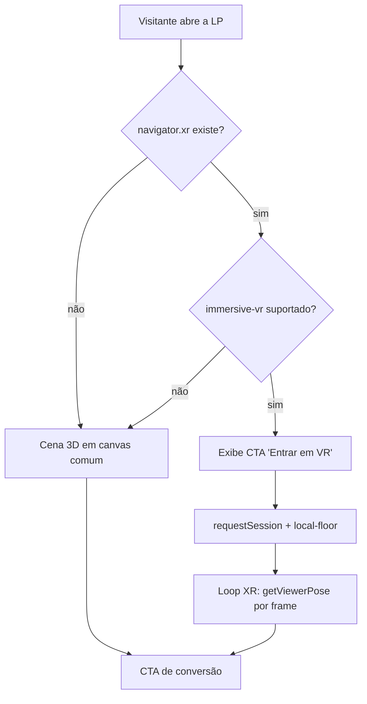

# 🥽 VR e 3D

Tudo que envolve a experiência imersiva: como o hardware rastreia o usuário, o que cada
dispositivo suporta, como preparar os assets e quanto custa cada frame.

## Notas desta área

| Nota | Assunto |
| --- | --- |
| [[Como-Funciona-o-Tracking]] | 6DoF, SLAM, reference spaces, mãos e controles |
| [[Suporte-de-Dispositivos]] | Matriz de compatibilidade e estratégia de fallback |
| [[Pipeline-de-Assets-3D]] | glTF/GLB, Draco, Meshopt, KTX2 |
| [[Orcamento-de-Performance]] | 11,1 ms por frame: onde ele é gasto |

## Princípios adotados

1. **Progressive enhancement.** A landing page precisa converter mesmo sem WebXR.
   VR é camada extra, nunca requisito.
2. **Feature detection por módulo.** Nunca por user-agent. Hand tracking, hit-test e
   anchors variam por dispositivo, não por marca.
3. **Conforto acima de espetáculo.** Nenhum movimento de câmera sem input do usuário.
4. **Orçamento antes de arte.** Modelo que estoura o budget volta para o pipeline.

## Fluxo da experiência

⬅ [[Home]]
