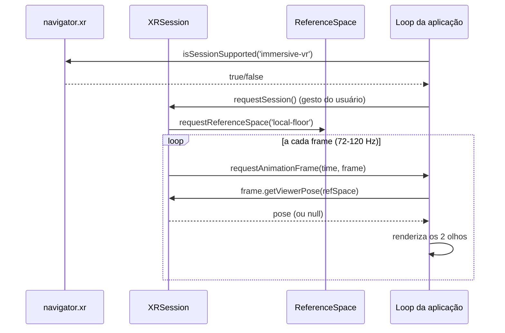

> ⚠️ **Substituída por [[ADR-0003-Feature-Try-On-Facial]] (2026-08-14).** O produto
> deixou de ter sessão `immersive-vr` — tudo abaixo (reference spaces, `XRInputSource`,
> hand tracking, `requestSession`) não se aplica mais à feature atual de try-on facial
> por câmera. Conteúdo preservado como registro histórico, conforme
> [[Arquivos-de-Engenharia]]. Para como a ancoragem facial funciona hoje, ver
> [[Stack-Tecnologica]] e [[ADR-0003-Feature-Try-On-Facial]].

# Como Funciona o Tracking (VR/WebXR)

> "Tracking" em VR é o processo de descobrir, dezenas de vezes por segundo, **onde estão
> a cabeça e as mãos do usuário no espaço físico**, e traduzir isso em matrizes de câmera
> e transformações dentro da cena 3D.

Para a medição de comportamento na landing page, veja [[06-Analytics-e-Tracking]] —
é outro sentido da palavra "tracking".

---

## 1. Graus de liberdade (DoF)

| Tipo | O que rastreia | Onde aparece | Efeito |
| --- | --- | --- | --- |
| **3DoF** | Só rotação (yaw, pitch, roll) | Cardboard, óculos simples, celular | Você olha em volta, mas não pode se aproximar de um objeto |
| **6DoF** | Rotação + translação (x, y, z) | Quest 2/3/Pro, Vision Pro, Android XR | Você anda, se agacha, chega perto |

Se o dispositivo só oferece 3DoF, o navegador entrega uma **posição emulada**
(`XRPose.emulatedPosition === true`). É um sinal importante: quando ele é `true`,
qualquer mecânica que dependa de o usuário se deslocar fisicamente deve ser desabilitada.

## 2. Inside-out vs outside-in

- **Outside-in** (antigo): sensores externos na sala (base stations) observam o headset.
  Preciso, mas exige instalação.
- **Inside-out** (padrão atual): as câmeras do próprio headset observam o ambiente.
  Sem hardware extra — é o que Quest, Vision Pro e Android XR usam.

O inside-out roda um **SLAM** (*Simultaneous Localization and Mapping*): as câmeras
extraem pontos característicos do ambiente, montam um mapa esparso e calculam a posição
do headset dentro desse mapa. Em paralelo, a **IMU** (acelerômetro + giroscópio, ~1 kHz)
fornece movimento de altíssima frequência. Um filtro funde as duas fontes:

```
IMU (rápida, acumula deriva)  ─┐
                               ├─► fusão sensorial ──► pose estável a 90–120 Hz
Câmeras/SLAM (lenta, absoluta)─┘
```

Consequências práticas para o projeto:
- **Ambiente escuro ou parede lisa e branca** degrada o SLAM → a pose "escorrega".
- **Superfícies reflexivas / espelhos** confundem o mapa.
- Depois de um *reset* de tracking, a origem do mundo muda — trate o evento
  `reset` do reference space (seção 4).

## 3. O loop de renderização em XR

O tracking chega ao seu código pelo laço de frames da sessão XR:

```js
// 1. Detecção de suporte — sempre antes de mostrar o botão "Entrar em VR"
const suportado = await navigator.xr?.isSessionSupported('immersive-vr');

// 2. Sessão (exige gesto do usuário: clique/tap)
const session = await navigator.xr.requestSession('immersive-vr', {
  requiredFeatures: ['local-floor'],
  optionalFeatures: ['hand-tracking', 'bounded-floor', 'layers'],
});

// 3. Espaço de referência: o "sistema de coordenadas" da experiência
const refSpace = await session.requestReferenceSpace('local-floor');

// 4. Loop — o navegador chama quando o compositor precisa do próximo frame
session.requestAnimationFrame(function onXRFrame(time, frame) {
  const pose = frame.getViewerPose(refSpace); // pode ser null se o tracking se perdeu
  if (pose) {
    for (const view of pose.views) {
      // view.eye → 'left' | 'right'
      // view.projectionMatrix e view.transform.matrix alimentam a câmera
    }
  }
  session.requestAnimationFrame(onXRFrame);
});
```



Pontos que costumam morder:
- `getViewerPose()` **pode retornar `null`** (usuário tirou o headset, tracking perdido).
  Nunca assuma pose válida — desenhe o último frame conhecido ou pause.
- Em XR você usa `session.requestAnimationFrame`, **não** `window.requestAnimationFrame`.
  A cadência é a do headset (72/90/120 Hz), não a do monitor.
- Cada olho é uma `view` com projeção própria: a cena é desenhada duas vezes por frame.

## 4. Espaços de referência (a parte que mais confunde)

O `XRReferenceSpace` define onde fica a origem `(0,0,0)` e que tipo de movimento é
garantido. Escolher errado é a causa nº 1 de "o usuário nasce dentro do chão".

| Tipo | Origem | Quando usar |
| --- | --- | --- |
| `viewer` | Na cabeça do usuário, acompanha ela | Raycast a partir do olhar, HUD travado na visão |
| `local` | Perto da posição inicial, altura **não garantida** | Experiências sentadas/em pé sem deslocamento |
| `local-floor` | No **chão**, abaixo da posição inicial | **Padrão para a maioria** — y=0 é o piso real |
| `bounded-floor` | No chão, com polígono de área segura (`boundsGeometry`) | Usuário caminha dentro da guardian |
| `unbounded` | Origem estável em grandes áreas | Experiências que atravessam cômodos |

Recomendação para a LP: pedir `local-floor` como `requiredFeatures` e cair para `local`
se não houver suporte. Com `local`, aplique um offset manual de altura (~1,6 m) porque
o piso não é conhecido.

```js
let refSpace;
try {
  refSpace = await session.requestReferenceSpace('local-floor');
} catch {
  const base = await session.requestReferenceSpace('local');
  // desce o mundo para simular um piso
  refSpace = base.getOffsetReferenceSpace(
    new XRRigidTransform({ x: 0, y: -1.6, z: 0 })
  );
}

// A origem pode ser recalibrada pelo sistema a qualquer momento:
refSpace.addEventListener('reset', () => {
  // reposicione teleporte, UI ancorada e checkpoints
});
```

`getOffsetReferenceSpace()` também é o mecanismo correto de **teleporte / locomoção**:
em vez de mover a câmera (que é controlada pelo tracking), você move o espaço de
referência sob o usuário.

## 5. Tracking de entrada: controles e mãos

Cada `XRInputSource` expõe espaços próprios:

| Espaço | Para que serve |
| --- | --- |
| `targetRaySpace` | O raio de mira (laser pointer) — use para hover/seleção |
| `gripSpace` | A pose da mão segurando — use para posicionar o modelo do controle |

```js
for (const src of session.inputSources) {
  const raio = frame.getPose(src.targetRaySpace, refSpace);
  const mao  = src.gripSpace ? frame.getPose(src.gripSpace, refSpace) : null;

  // src.handedness → 'left' | 'right' | 'none'
  // src.targetRayMode → 'gaze' | 'tracked-pointer' | 'screen' | 'transient-pointer'
}
```

Eventos de sessão que valem escutar: `select` / `selectstart` / `selectend`
(gatilho ou pinça), `squeeze*` (agarrar), `inputsourceschange` (controle ligou/desligou,
mão entrou em campo), `visibilitychange` (headset removido) e `end`.

**Hand tracking** (módulo `hand-tracking`): quando concedido, `inputSource.hand` é um
`XRHand` com ~25 articulações por mão (`wrist`, `index-finger-tip`, …).

```js
if (src.hand) {
  const ponta = frame.getJointPose(src.hand.get('index-finger-tip'), refSpace);
  if (ponta) {
    // ponta.transform.position e ponta.radius (raio da articulação)
  }
}
```

**Importante para compatibilidade**: no Apple Vision Pro a interação padrão é
*gaze-and-pinch*, que chega como `targetRayMode: 'transient-pointer'` — a fonte de
entrada só existe durante o gesto. Se a UI depender de hover contínuo com laser, ela
simplesmente não funciona lá. Projete a seleção em torno de `select`, não de hover.

## 6. Tracking do mundo real (AR / passthrough)

Só relevante se a LP tiver modo AR no celular ou passthrough no Quest:

| Módulo | O que dá | Suporte |
| --- | --- | --- |
| `hit-test` | Encontrar superfícies reais sob um raio | Chrome Android, Quest |
| `anchors` | Fixar objeto a um ponto do mundo, resistente a drift | Quest; persistentes entre sessões |
| `plane-detection` | Planos horizontais/verticais com rótulo semântico | Quest |
| `depth-sensing` | Mapa de profundidade para oclusão | Chrome Android, Quest |
| `mesh-detection` | Malha da sala | Quest |

Nada disso está habilitado no Safari/visionOS até agora — o módulo de AR do WebXR não
foi liberado lá. **Feature-detect módulo a módulo**, nunca por dispositivo.

## 7. Latência e conforto

O que o usuário sente como "enjoo" é quase sempre latência ou queda de frame:

- **Motion-to-photon** alvo: **< 20 ms**. Acima disso, desconforto sobe rápido.
- O compositor aplica **reprojection / timewarp**: se seu frame atrasa, ele reprojeta
  o anterior usando a pose mais recente. Salva a rotação, mas gera artefato em
  translação — não é uma rede de segurança para código lento.
- Frame budget a 90 Hz: **11,1 ms por frame**, para os dois olhos. Ver [[Orcamento-de-Performance]].
- **Nunca mova a câmera sem input do usuário.** Aceleração artificial, shake e
  cutscenes com movimento forçado são as principais causas de cybersickness.

## 8. Checklist de implementação

- [ ] `isSessionSupported()` antes de exibir qualquer CTA de VR
- [ ] Sessão criada apenas dentro de um gesto do usuário
- [ ] `local-floor` com fallback para `local` + offset de 1,6 m
- [ ] Listener de `reset` no reference space
- [ ] Guarda para `getViewerPose()` retornando `null`
- [ ] `emulatedPosition` tratado (desabilitar mecânicas de deslocamento)
- [ ] `hand-tracking` como `optionalFeatures`, com fallback para controles
- [ ] Seleção baseada em `select`, funcionando com `transient-pointer`
- [ ] Sessão encerrada e recursos liberados no evento `end`
- [ ] Fallback 3D não-imersivo para quem não tem headset — ver [[Suporte-de-Dispositivos]]

## Relacionados

- [[Suporte-de-Dispositivos]] — quem suporta o quê
- [[Orcamento-de-Performance]] — o custo de manter 90 fps
- [[Acessibilidade-e-Conforto-VR]] — enjoo, alternativas de locomoção
- [[Links-Uteis]] — specs e documentação oficial

## Fontes

- [WebXR Device API — Spatial Tracking Explainer](https://immersive-web.github.io/webxr/spatial-tracking-explainer.html)
- [MDN — XRSession.requestReferenceSpace()](https://developer.mozilla.org/en-US/docs/Web/API/XRSession/requestReferenceSpace)
- [MDN — Using bounded reference spaces](https://developer.mozilla.org/en-US/docs/Web/API/WebXR_Device_API/Bounded_reference_spaces)
- [Meta Horizon — WebXR Performance Best Practices](https://developers.meta.com/horizon/documentation/web/webxr-perf-bp/)

⬅ [[05-VR-e-3D]]
