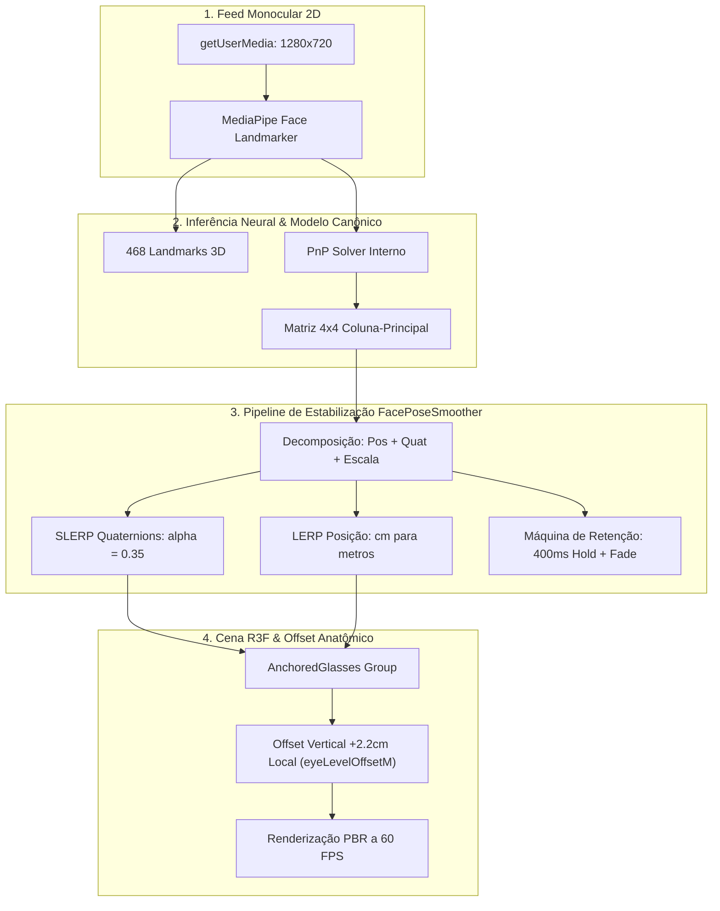
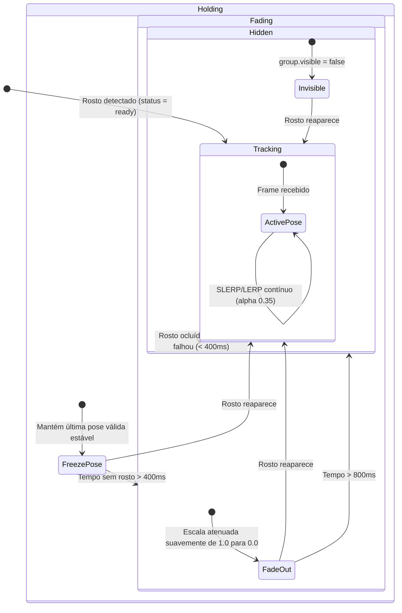
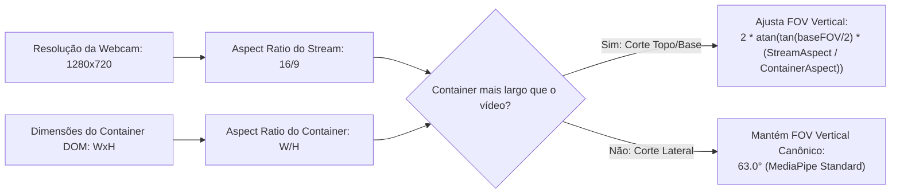

# 👁️ Como Funciona o Tracking Facial e Ancoragem 3D

Este documento detalha a matemática, os sistemas de coordenadas, o pipeline de visão computacional e os algoritmos de estabilização temporal utilizados para ancorar modelos 3D no rosto do usuário em tempo real a 60 FPS.

---

## 📐 1. O Problema de Ancoragem Facial na Web

Ancorar um objeto 3D rígido (óculos/visor) sobre um feed de vídeo 2D em tempo real envolve três desafios fundamentais:

1. **Estimativa de Pose 6DoF a partir de Imagem 2D Monocular**: Deduzir translação $(X, Y, Z)$ e rotação (Pitch, Yaw, Roll) a partir de pixels de uma webcam comum sem sensor de profundidade (LiDAR).
2. **Jitter de Detecção (Ruído Frame a Frame)**: Micro-variações nos pixels de entrada provocam tremores de alta frequência na matriz de pose se ela for aplicada crua.
3. **Casamento de Perspectiva (Aspect Ratio & FOV Alignment)**: O feed de vídeo 2D e a câmera virtual do Three.js devem compartilhar exatamente a mesma perspectiva óptica para que os óculos não pareçam "flutuar" longe do rosto.



---

## 🔢 2. Decomposição da Matriz 4×4 do MediaPipe

O MediaPipe Face Landmarker fornece a `facialTransformationMatrix`, uma matriz homogênea de transformação $4 \times 4$ no formato coluna-principal (*column-major*):

$$\mathbf{M} = \begin{bmatrix} 
r_{00} & r_{01} & r_{02} & t_x \\
r_{10} & r_{11} & r_{12} & t_y \\
r_{20} & r_{21} & r_{22} & t_z \\
0 & 0 & 0 & 1 
\end{bmatrix}$$

### Conversão de Escala Métrica
- O MediaPipe calcula as coordenadas de translação $(t_x, t_y, t_z)$ em **centímetros**.
- O Three.js adota a convenção métrica internacional padrão do WebXR (**1 unidade = 1 metro**).
- No `FacePoseSmoother.ts`, a conversão é efetuada automaticamente:

$$\mathbf{p}_{\text{ThreeJS}} = \begin{bmatrix} t_x \times 0.01 \\ t_y \times 0.01 \\ t_z \times 0.01 \end{bmatrix}$$

---

## 🔄 3. Algoritmo de Suavização Temporal (`FacePoseSmoother`)

Para eliminar o tremor (*jitter*) sem introduzir latência perceptível (mantendo o atraso abaixo de $\sim 40\text{ms}$), o sistema utiliza interpolação esférica nos quaternions e interpolação linear nas posições.

### SLERP (Spherical Linear Interpolation) para Rotação
Dados o quaternion anterior $\mathbf{q}_0$ e o quaternion do frame atual $\mathbf{q}_1$:

$$\mathbf{q}_{\text{interpolado}} = \text{slerp}(\mathbf{q}_0, \mathbf{q}_1, \alpha)$$

onde $\alpha = 0.35$ (fator de suavização calibrado). Se $\mathbf{q}_0 \cdot \mathbf{q}_1 < 0$, invertemos o sinal de $\mathbf{q}_1$ para garantir o caminho geodésico mais curto na esfera quadridimensional.

### LERP (Linear Interpolation) para Posição

$$\mathbf{p}_{\text{interpolado}} = \mathbf{p}_0 + \alpha (\mathbf{p}_1 - \mathbf{p}_0)$$

### Máquina de Estados de Perda de Rastreamento (Tolerância a Oclusão)



---

## 📍 4. Correção Anatômica do Nível dos Olhos (`EYE_LEVEL_OFFSET_M`)

A matriz canônica do MediaPipe tem sua origem centrada entre o nariz e o septo superior. Se o modelo 3D for inserido diretamente nessa origem, a armação ficará apoiada no meio do nariz em vez de repousar sobre os olhos e têmporas.

### A Matemática do Offset em Espaço Local:

Não se pode somar um valor estático no eixo $Y$ global do Three.js, pois quando o usuário inclinar a cabeça para o lado (*roll*) ou para frente (*pitch*), o deslocamento subiria em direção ao teto em vez de seguir a testa.

O deslocamento de $+2.2\text{cm}$ é rotacionado pelo quaternion da cabeça:

$$\mathbf{v}_{\text{offset}} = \mathbf{q}_{\text{atual}} \otimes \begin{bmatrix} 0 \\ 0.022 \\ 0 \end{bmatrix} \otimes \mathbf{q}_{\text{atual}}^{-1}$$

$$\mathbf{p}_{\text{final}} = \mathbf{p}_{\text{interpolado}} + \mathbf{v}_{\text{offset}}$$

```typescript
// Implementação em AnchoredGlasses.tsx com ZERO alocação:
_offsetLocal.set(0, eyeLevelOffsetM, 0).applyQuaternion(group.quaternion);
group.position.copy(pose.position).add(_offsetLocal);
```

---

## 📷 5. Sincronização de Câmera e FOV Adaptativo (`AdaptiveCameraController`)

Para que o modelo 3D acompanhe a mesma deformação de perspectiva da lente da webcam sob regras CSS de `object-fit: cover`:



### Modo Preview vs Modo Tracking:
- **Modo Preview (Câmera Desligada)**: Câmera em $[0, 0, 0.3]$, FOV de $42^\circ$, `OrbitControls` ativo com rotação suave e amortecimento inercial (`dampingFactor = 0.06`).
- **Modo Tracking (Câmera Ativa)**: Câmera posicionada na origem $[0, 0, 0]$, FOV vertical dinâmico ajustado à lente da webcam, `OrbitControls` desativado.

---

## 🪞 6. Espelhamento Selfie CSS Unificado

```
┌───────────────────────────────────────────────────────────┐
│ Container comum: transform: scaleX(-1)                    │
│                                                           │
│   ┌───────────────────────────┬───────────────────────┐   │
│   │ <video> (Câmera Frontal)  │ <Canvas> (Three.js)   │   │
│   │ object-fit: cover         │ Transparent WebGL     │   │
│   │ Z-Index: 1                │ Z-Index: 2            │   │
│   └───────────────────────────┴───────────────────────┘   │
└───────────────────────────────────────────────────────────┘
```

Vantagens desta abordagem:
1. **Normais de Iluminação Preservadas**: Não inverte a escala $X$ das malhas 3D no Three.js, mantendo a reflexão de luz PBR e sombras corretas.
2. **Zero Overhead de CPU**: O espelhamento é delegado ao compositor de renderização da GPU pelo navegador via CSS Hardware Acceleration.
3. **UI Independente**: Controles, botões e textos ficam em uma camada de overlay separada fora do container espelhado, permanecendo sempre legíveis.

---

## 📚 Documentos Relacionados

- [[02-Arquitetura]] — Estrutura de módulos e design system
- [[Fluxo-de-Dados]] — Diagramas de sequência do render loop
- [[Orcamento-de-Performance]] — Otimizações de CPU/GPU e metas de FPS
- [[ADR-0003-Feature-Try-On-Facial]] — Registro do pivô para MediaPipe Vision

⬅ [[05-VR-e-3D]]
