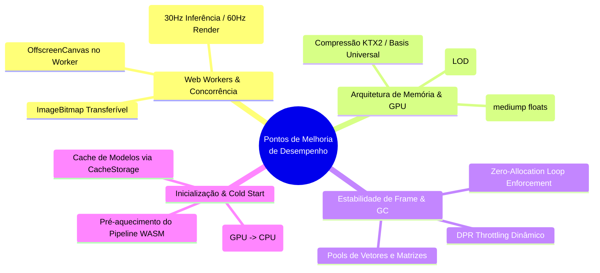
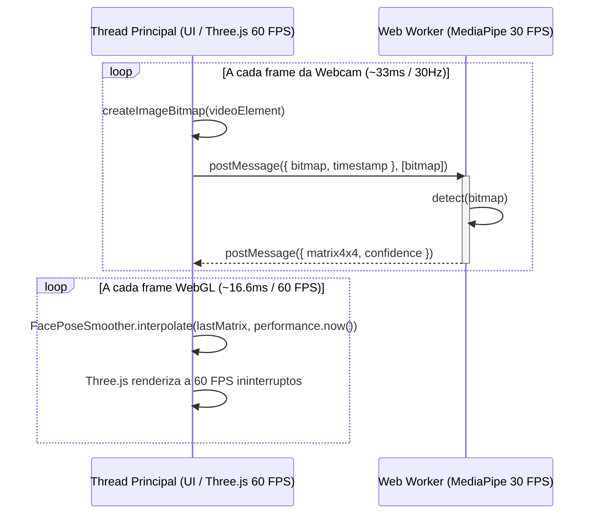

# ⚡ Orçamento de Performance, Diagnóstico e Otimizações

A performance em tempo real de uma experiência de visão computacional 3D no navegador é o principal fator de retenção e credibilidade do produto. Quedas de taxa de quadros (*frame drops*), atraso na resposta de movimento (*motion-to-photon latency*) ou superaquecimento do dispositivo degradam imediatamente a experiência do usuário.

Este documento estabelece o **orçamento de recursos (Budget)**, analisa os **gargalos computacionais** e apresenta um **roadmap detalhado de melhorias técnicas de desempenho**.

---

## ⏱️ 1. O Frame Budget no Navegador (16.6ms a 60 FPS)

Em uma tela padrão de 60 Hz, cada quadro deve ser processado, renderizado e apresentado em menos de **16,66 milissegundos**. Em telas ProMotion / 120 Hz (smartphones e MacBooks modernos), o teto cai para **8,33 milissegundos**.

```mermaid
gantt
    title Divisão do Tempo por Frame a 60 FPS (Teto: 16.66ms)
    dateFormat X
    axisFormat %s ms
    section Pipeline
    Captura de Frame (getUserMedia)       :done, 0, 2
    Inferência MediaPipe (WASM + SIMD)    :active, 2, 11
    Estabilização FacePoseSmoother         :crit, 11, 12
    Atualização de Matrizes Three.js       :done, 12, 13
    Renderização WebGL 2.0 (GPU Draw)      :done, 13, 15
    Compositor do Navegador & UI DOM       :done, 15, 16.5
```



### Decomposição do Tempo de Execução Médio (Hardware de Referência: MacBook Air M2 / iPhone 13 / Dell XPS 13)

| Etapa do Pipeline | Tempo Alvo | Teto Crítico | Estratégia de Mitigação |
|---|---|---|---|
| **Transferência de Frame 2D** | ~1.5 ms | 3.0 ms | Reutilização de `HTMLVideoElement` sem cópias de canvas intermediárias |
| **Inferência do Face Landmarker** | ~8.0 ms | 12.0 ms | Execução WebAssembly com instruções vetoriais SIMD |
| **Matemática SLERP/LERP** | ~0.3 ms | 0.8 ms | Zero alocações de memória; variáveis reutilizáveis |
| **Render WebGL (Three.js)** | ~2.5 ms | 4.5 ms | Geometrias mescladas, materiais PBR unificados, sem sombras dinâmicas pesadas |
| **Compositor DOM & Layout** | ~1.5 ms | 3.0 ms | CSS hardware-accelerated (`transform`, `opacity`, `will-change`) |
| **Margem de Segurança / Idle** | ~2.8 ms | — | Reserva para evitar throttling térmico |

---

## 🎯 2. Metas de Recursos e Orçamento de Assets

| Métrica | Alvo (Ideal) | Teto Máximo | Estado Atual no Projeto |
|---|---|---|---|
| **Tamanho do Bundle Inicial (Gzip)** | < 300 kB | 500 kB | ~283 kB (Passa com folga) |
| **Tamanho por Modelo GLB (Draco)** | < 15 kB | 50 kB | ~12 kB a 14 kB por modelo |
| **Triângulos na Cena 3D** | < 15.000 | 35.000 | ~4.200 a 8.800 triângulos |
| **Draw Calls por Frame** | < 8 calls | 20 calls | 4 a 6 draw calls |
| **Texturas em VRAM (GPU)** | < 16 MB | 64 MB | ~4 MB (Materiais procedurais/PBR) |
| **Vazamento de Memória (Memory Leak)** | 0 bytes/min | 0 bytes | Verificado com `disposeSceneResources` |

---

## 🚀 3. Diagnóstico de Gargalos e Pontos de Melhoria de Desempenho



---

### 📌 Ponto de Melhoria 1: Desacoplamento da Inferência via Web Worker e OffscreenCanvas

#### 🔍 Diagnóstico do Gargalo Atual:
Atualmente, o método `FaceLandmarker.detectForVideo()` é invocado a partir do loop de animação da thread principal do navegador. Embora o WebAssembly execute instruções em C++ nativo, em dispositivos de baixo custo ou durante animações complexas de scroll no DOM, a thread principal pode sofrer micro-concorrência, gerando *frame drops* ocasionais.

#### 💡 Solução Proposta:
Mover a instância do MediaPipe Face Landmarker para um **Dedicated Web Worker**.



#### 🏆 Benefícios Esperados:
1. **Thread Principal 100% Livre**: A UI, o scroll inercial e as transições do DOM rodam lisos a 60/120 FPS mesmo se a inferência demorar 25ms em um celular antigo.
2. **Transferência de Bitmaps com Cópia Zero**: O uso de `ImageBitmap` como objeto transferível (`Transferable Objects`) transfere o ponteiro de memória sem custo de serialização JSON.

---

### 📌 Ponto de Melhoria 2: Seleção Dinâmica de Delegate (GPU vs CPU WASM SIMD)

#### 🔍 Diagnóstico do Gargalo Atual:
O MediaPipe permite configurar `delegate: "GPU"` ou `delegate: "CPU"`. Em algumas GPUs integradas (especialmente drivers Android antigos), o delegate GPU sofre com travamentos na compilação de shaders de computação (*shader compilation hitch*) na primeira inferência.

#### 💡 Solução Proposta:
Implementar uma rotina de benchmark no primeiro frame:
1. Tentar inicializar com delegate GPU.
2. Medir o tempo dos primeiros 3 frames.
3. Se a latência média exceder 25ms, chavear automaticamente para CPU WASM com SIMD, que apresenta comportamento determinístico e sem surpresas de driver.

---

### 📌 Ponto de Melhoria 3: Pipeline de Texturas KTX2 / Basis Universal

#### 🔍 Diagnóstico do Gargalo Atual:
Texturas em formato PNG/JPG tradicionais são transferidas comprimidas pela rede, mas ao chegarem na GPU são totalmente descompactadas em formato RGBA não comprimido. Uma textura $1024 \times 1024$ consome cerca de **4,19 MB de VRAM**.

#### 💡 Solução Proposta:
Integrar o formato **KTX2 com compressão Basis Universal (UASTC / ETC1S)** através de `@gltf-transform/functions`.

```
PNG/JPG:   [Download: 150 kB] ──(Descompacta na RAM)──► [VRAM: 4.19 MB não comprimido]
KTX2/UASTC: [Download: 40 kB]  ──(Upload Direto)──────► [VRAM: 512 kB comprimido na GPU]
```

#### 🏆 Benefícios Esperados:
- **Redução de 75% a 85% no consumo de VRAM da GPU**.
- **Upload instantâneo para a placa de vídeo**, eliminando congelamentos ao alternar entre modelos no seletor.

---

### 📌 Ponto de Melhoria 4: Escalação Dinâmica de Resolução (DPR Throttling)

#### 🔍 Diagnóstico do Gargalo Atual:
Telas de altíssima densidade de pixels (como Retina Display 3x em iPhones ou telas 4K em laptops) renderizam milhões de fragmentos a cada quadro. Se o usuário estiver no modo de economia de bateria ou se o dispositivo aquecer (*thermal throttling*), a GPU integrada perde quadros.

#### 💡 Solução Proposta:
No hook `usePerfProfile.ts`, monitorar a taxa de quadros média móvel dos últimos 60 frames. Se o FPS cair abaixo de 52 FPS:
1. Reduzir o `devicePixelRatio` do Canvas de `Math.min(2, window.devicePixelRatio)` para `1.0` de forma transparente.
2. Desativar o antialiasing de fragmento secundário.
3. Retornar ao DPR nativo quando o dispositivo se estabilizar acima de 58 FPS por mais de 5 segundos.

---

### 📌 Ponto de Melhoria 5: Otimização de Shaders e Precisão de Ponto Flutuante

#### 🔍 Diagnóstico do Gargalo Atual:
Shaders padrão Three.js utilizam precisão `highp` para cálculos de vetores de luz e materiais reflexivos. Em dispositivos móveis, cálculos de ponto flutuante de alta precisão consomem o dobro de ciclos de ALU da GPU.

#### 💡 Solução Proposta:
Configurar `precision: 'mediump'` em materiais não críticos e utilizar o utilitário `gltfpack -cc` para quantizar atributos de vértices (posições de 32-bit floats para inteiros de 16-bit normalizados), reduzindo o tráfego de barramento de memória da GPU pela metade.

---

## 📊 Tabela Comparativa: Impacto das Melhorias Propostas

| Otimização | Impacto em CPU | Impacto em GPU | Impacto em Memória (RAM/VRAM) | Complexidade de Implementação |
|---|---|---|---|---|
| **Web Worker + OffscreenCanvas** | -40% na Thread Principal | Neutro | Neutro | Média |
| **Texturas KTX2 / Basis** | Neutro | -70% VRAM Bandwidth | -80% VRAM | Baixa |
| **DPR Throttling Dinâmico** | Neutro | -50% Fragment Shading | Neutro | Baixa |
| **Quantização de Vértices** | Neutro | -45% Vertex Bandwidth | -45% Buffer Size | Baixa (Script CLI) |
| **Delegate Fallback Heurístico** | +Estabilidade | +Estabilidade | Neutro | Baixa |

---

## 📚 Documentos Relacionados

- [[Como-Funciona-o-Tracking]] — Matemática do rastreamento e algoritmos de suavização
- [[Pipeline-de-Assets-3D]] — Processo de build e quantização de arquivos GLB
- [[02-Arquitetura]] — Topologia e diagrama de camadas da aplicação
- [[Stack-Tecnologica]] — Comparativo de ferramentas e bibliotecas

⬅ [[05-VR-e-3D]]
