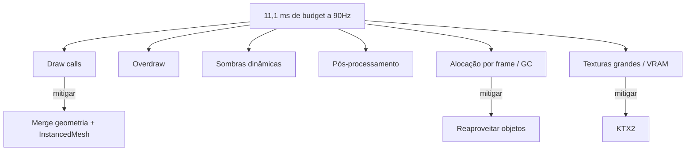

# Orçamento de Performance

Em VR, performance não é otimização tardia: é requisito de conforto. Frame perdido em
headset causa desconforto físico, não só uma animação feia.

## O frame budget

| Taxa | Tempo por frame | Contexto |
| --- | --- | --- |
| 72 Hz | 13,9 ms | Quest em modo econômico |
| **90 Hz** | **11,1 ms** | Alvo padrão |
| 120 Hz | 8,3 ms | Modo de alta taxa |

Esses 11,1 ms cobrem **os dois olhos**, mais o JavaScript da aplicação, mais o
compositor. O orçamento útil da aplicação é menor que o número cheio.

## Metas de cena (VR standalone, ex.: Quest 2/3)

| Métrica | Alvo | Teto |
| --- | --- | --- |
| Triângulos visíveis | 50k | 150k |
| Draw calls | ~100 | 150 |
| Materiais únicos | ≤ 10 | 20 |
| Luzes dinâmicas com sombra | 1 | 2 |
| Texturas em VRAM | ≤ 128 MB | 256 MB |
| Peso total baixado | ≤ 5 MB | 10 MB |

Para o **fallback 3D em desktop** esses limites podem dobrar — mas o mesmo código serve
os dois casos, então projete para o menor.

## Onde o tempo vai embora

1. **Draw calls** — cada troca de material/geometria custa. Solução: mesclar geometria
   estática (`BufferGeometryUtils.mergeGeometries`), instanciar repetições
   (`InstancedMesh`), usar atlas de textura.
2. **Overdraw** — transparência empilhada é veneno em mobile VR. Prefira *alpha cutout*
   a *alpha blend*.
3. **Sombras dinâmicas** — quase sempre substituíveis por *baked lightmaps* ou blob shadow.
4. **Pós-processamento** — bloom/SSAO em resolução de headset raramente cabe no budget.
5. **Alocação por frame** — criar `Vector3`/objetos dentro do laço gera GC, que gera
   *hitch*. Reaproveite objetos fora do loop.
6. **Texturas grandes** — VRAM estourada causa thrashing. Ver [[Pipeline-de-Assets-3D]].



## Técnicas com melhor retorno

| Técnica | Ganho típico | Custo de implementação |
| --- | --- | --- |
| KTX2 nas texturas | VRAM e tempo de upload | Baixo |
| Merge de geometria estática | Draw calls | Baixo |
| `InstancedMesh` para repetidos | Draw calls | Baixo |
| LOD (3–4 níveis por modelo) | Triângulos | Médio |
| Lightmaps assados | Elimina luz dinâmica | Médio |
| Fixed Foveated Rendering | ~ms de GPU no Quest | Baixo (config) |
| Frustum/occlusion culling | Variável | Já no engine |

**Fixed Foveated Rendering (FFR)**: o headset renderiza a periferia em resolução menor.
No Quest, exponha via `XRWebGLLayer`/projection layer:

```js
const layer = new XRWebGLLayer(session, gl, { antialias: true });
layer.fixedFoveation = 1.0; // 0 = desligado, 1 = máximo
session.updateRenderState({ baseLayer: layer });
```

Vale reduzir também `framebufferScaleFactor` (ex.: `0.8`) quando a cena for pesada —
resolução é a alavanca mais barata que existe.

## Como medir

- `renderer.info` no Three.js: `render.calls`, `render.triangles`, `memory.geometries`.
- **Spector.js** para inspecionar as chamadas WebGL de um frame.
- **OVR Metrics Tool** no Quest para FPS real, stale frames e temperatura.
- Chrome DevTools remoto (`chrome://inspect`) conectado ao Quest Browser.
- Regra prática: se aparece *stale frame* no OVR Metrics, o compositor está reprojetando
  — o usuário já está sentindo.

## Portões de qualidade

Antes de qualquer merge que toque na cena:

- [ ] `renderer.info.render.calls` ≤ 150 na cena mais pesada
- [ ] Nenhuma alocação nova dentro do render loop
- [ ] Peso total da primeira dobra ≤ 5 MB
- [ ] Testado com throttle de CPU 4× no DevTools
- [ ] Sem queda abaixo de 72 fps no dispositivo alvo por 60 s contínuos

## Fontes

- [Meta Horizon — WebXR Performance Best Practices](https://developers.meta.com/horizon/documentation/web/webxr-perf-bp/)
- [Meta Horizon — WebXR performance optimization workflow](https://developers.meta.com/horizon/documentation/web/webxr-perf-workflow/)
- [Toji.dev — WebXR Scene Optimization](https://toji.dev/webxr-scene-optimization/)

⬅ [[05-VR-e-3D]]
