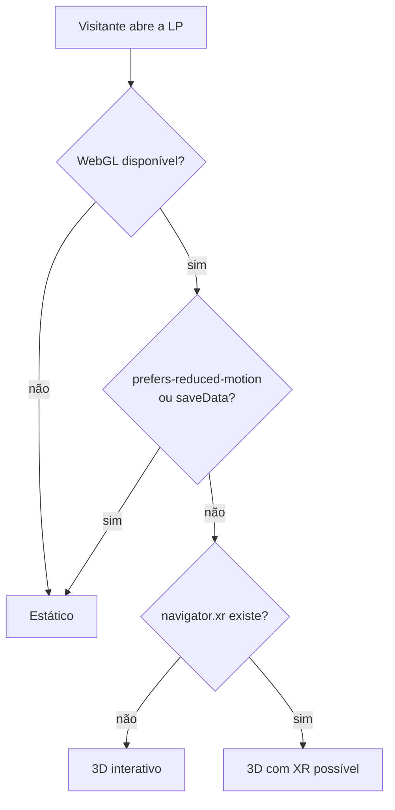

# Suporte de Dispositivos

## Matriz de compatibilidade (agosto/2026)

| Plataforma | `immersive-vr` | `immersive-ar` | Hand tracking | Hit-test / anchors | Observação |
| --- | --- | --- | --- | --- | --- |
| **Meta Quest Browser** (Quest 2/3/Pro) | ✅ | ✅ passthrough | ✅ | ✅ (anchors persistentes) | Alvo mais completo hoje |
| **Chrome / Edge desktop** + headset PC | ✅ | — | Depende do runtime | — | Via OpenXR |
| **Chrome Android** | ✅ (com headset) | ✅ | Parcial | ✅ hit-test + depth | AR de tela, `targetRayMode: 'screen'` |
| **Android XR** (ex.: Galaxy XR) | ✅ | ✅ | ✅ | ✅ | Suporte via Chrome |
| **Safari / visionOS** (Vision Pro) | ✅ desde visionOS 2 | ❌ módulo AR não liberado | Gaze-and-pinch (`transient-pointer`) | ❌ | Sem plane/mesh/depth |
| **Safari macOS / iOS** | ❌ | ❌ | ❌ | ❌ | Só o fallback 3D |
| **Firefox** | ❌ | ❌ | ❌ | ❌ | Sem WebXR |

> WebXR entrou no escopo do **Interop 2026**, então a tendência é essa matriz melhorar
> ao longo do ano. Revalidar antes do lançamento.

## Estratégia de fallback

Três níveis, do mais rico ao mais simples:

1. **Imersivo (WebXR)** — headset detectado, sessão `immersive-vr`.
2. **3D interativo** — canvas WebGL com órbita/scroll. É o que a maioria vai ver.
3. **Estático** — vídeo curto ou imagem renderizada. Usado quando:
   - `prefers-reduced-motion: reduce`
   - conexão lenta (`navigator.connection.saveData`)
   - falha ao carregar o contexto WebGL

```js
function nivelDeExperiencia() {
  if (!window.WebGLRenderingContext) return 'estatico';
  if (matchMedia('(prefers-reduced-motion: reduce)').matches) return 'estatico';
  if (navigator.connection?.saveData) return 'estatico';
  return navigator.xr ? '3d-com-xr-possivel' : '3d';
}
```

O CTA principal da landing page **nunca** pode depender do nível de experiência.



## Requisitos de entrega

- **HTTPS obrigatório.** WebXR só roda em contexto seguro (exceto `localhost`).
  Ver [[Setup-do-Ambiente]] para o certificado local.
- Sessão XR exige **gesto do usuário** — não dá para entrar em VR no `onload`.
- Permission Policy `xr-spatial-tracking` precisa estar liberada se a página for
  embutida em iframe.

## Plano de testes

| Cenário | Dispositivo | Status |
| --- | --- | --- |
| Fluxo completo em VR | Quest 3 | ⬜ não testado |
| Fallback 3D | Chrome desktop | ⬜ não testado |
| Fallback 3D | Safari iOS | ⬜ não testado |
| Fallback estático | Conexão lenta simulada | ⬜ não testado |
| Gaze-and-pinch | Vision Pro | ⬜ sem hardware |

Sem hardware físico, use o **WebXR Emulator** (extensão de navegador) para o básico —
ele não reproduz latência nem perda de tracking.

## Fontes

- [WebXR Browser Support in 2026: What Works, What Breaks](https://www.testmuai.com/learning-hub/webxr-compatible-browsers/)
- [WebXR e Interop 2026](https://vr.org/articles/webxr-interop-2026-cross-browser-standard)
- [BrowserStack — WebXR Compatible Browsers](https://www.browserstack.com/guide/webxr-and-compatible-browsers)

⬅ [[05-VR-e-3D]]
