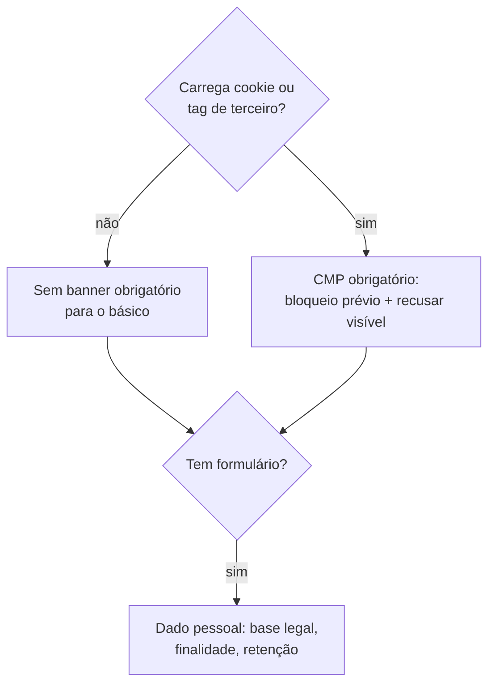

# LGPD e Consentimento

> Nota técnica de orientação, escrita por quem constrói o site — **não é parecer
> jurídico**. Valide o texto final da política com quem responde legalmente pelo projeto.

## A decisão que simplifica tudo

**Não usar cookies de rastreamento nem tags de terceiro.**

Ferramentas como o Umami identificam visitas por hash efêmero derivado de IP + user
agent + salt diário, sem persistir identificador no dispositivo e sem perfilar o
visitante entre sites. Isso muda o enquadramento: sem armazenamento no terminal do
usuário e sem dado pessoal identificável, a exigência de banner de consentimento cai —
e o site ganha performance e um problema a menos.

O preço é real: sem cookie, não há atribuição de campanha entre sessões nem
remarketing. Se marketing exigir esses recursos, a conversa vira outra e o banner passa
a ser obrigatório.

## O que continua sendo dado pessoal

O **formulário**. Nome, e-mail e telefone são dado pessoal sob a LGPD, com ou sem cookie.

Obrigações mínimas:

- **Base legal explícita** — consentimento para contato comercial, ou execução de
  contrato quando houver relação.
- **Finalidade declarada** no próprio formulário, em linguagem direta:
  "Usamos seus dados apenas para entrar em contato sobre X. Não compartilhamos com
  terceiros."
- **Checkbox não pré-marcado** quando a base for consentimento.
- **Canal de titular** — e-mail para acesso, correção e exclusão dos dados.
- **Prazo de retenção definido** — e realmente aplicado.
- **Registro do consentimento** — data/hora e versão do texto aceito.

## Se o banner virar necessário

Só use um CMP quando houver de fato tag que precise de consentimento. Nesse caso:

- Bloqueio **prévio**: nada de terceiro carrega antes do aceite.
- "Recusar" com o mesmo destaque de "Aceitar" — recusa por omissão não é válida.
- Escolha registrada e revogável, com link permanente no rodapé.
- Opções open source: **Klaro!** (Apache-2.0), **Orestbida cookieconsent** (MIT).

## Caso especial: dados de VR

Pose de cabeça e mãos revela mais do que parece — altura, padrão de movimento,
características físicas. Literatura recente mostra que sequências de movimento em VR
identificam indivíduos com alta precisão.

**Regra do projeto**: dados de tracking espacial **não saem do dispositivo**. Nenhuma
posição, rotação ou trajetória é enviada para servidor ou analytics. Se isso mudar,
exige consentimento específico, nota própria neste vault e revisão jurídica —
possivelmente tratamento de dado sensível.

## Checklist de lançamento

- [ ] Política de privacidade publicada e linkada no rodapé
- [ ] Finalidade e base legal no formulário
- [ ] Canal de titular funcionando
- [ ] Retenção definida e implementada
- [ ] Nenhuma requisição para domínio de terceiro antes de consentimento (verificar na aba Network)
- [ ] Nenhum dado pessoal em propriedade de evento — ver [[Plano-de-Eventos]]
- [ ] Nenhum dado de pose enviado para fora do dispositivo

## Fontes

- [Cookieless Tracking: métodos e conformidade](https://consently.net/blog/cookieless-tracking)
- [Cookie Consent Best Practices for Landing Pages (2026)](https://elementor.com/blog/cookie-consent-landing/)
- [Data Privacy Marketing 2026: Cookieless Strategy](https://www.digitalapplied.com/blog/data-privacy-marketing-2026-cookieless-strategy)

⬅ [[06-Analytics-e-Tracking]]
