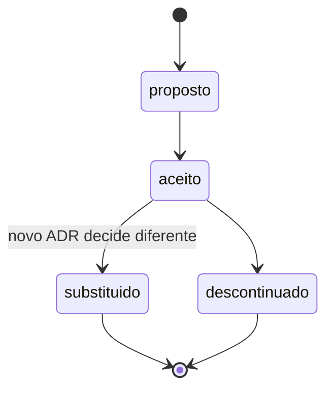

# 🧭 Decisões (ADRs)

Registro imutável das decisões técnicas: o que foi decidido, quando, com que alternativas
na mesa e sob que contexto.

## Índice

| # | Decisão | Status | Data |
| --- | --- | --- | --- |
| [[ADR-0001-Registro-de-Decisoes]] | Adotar ADRs | Aceito | 2026-08-12 |
| [[ADR-0002-Stack-Base]] | Stack base do projeto | Aceito (parcialmente substituído por ADR-0003) | 2026-08-14 |
| [[ADR-0003-Feature-Try-On-Facial]] | Pivô: try-on facial, fim da sessão immersive-vr | Aceito | 2026-08-14 |

## Como funciona

- Um arquivo por decisão, numerado sequencialmente: `ADR-NNNN-titulo-curto.md`.
- Status: `proposto` → `aceito` → `substituido` / `descontinuado`.
- **ADR aceito não é editado.** Mudou de ideia? Novo ADR que substitui o anterior;
  o antigo ganha `substituido-por: ADR-NNNN` e permanece no repositório.
- Template em `99-Templates/Template-ADR.md`.

## Quando escrever um

Escreva se a resposta for sim a qualquer uma:

- Reverter isso daqui a três meses vai doer?
- Alguém vai perguntar "por que diabos foi feito assim?"
- Existia uma alternativa razoável que foi descartada?
- A decisão restringe escolhas futuras?

Ver [[Arquivos-de-Engenharia]] para o papel do ADR entre os demais documentos.

⬅ [[Home]]
