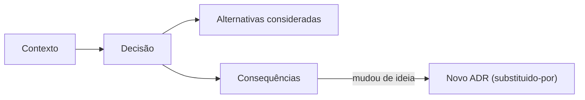

# ADR-0001 — Adotar registro de decisões arquiteturais

**Status**: Aceito · **Data**: 2026-08-12 · **Decisor**: Rafael

## Contexto

O projeto está começando e as próximas semanas concentram decisões caras de reverter:
engine 3D, framework, formato de asset, ferramenta de analytics, hospedagem. Sem
registro, em três meses sobra o resultado da decisão e some o raciocínio — e a discussão
recomeça do zero, sem o contexto que a justificava.

## Decisão

Adotar **ADRs** (Architecture Decision Records) em `docs/vault/07-Decisoes/`, um arquivo
por decisão, numerado, imutável após aceito.

Escopo: decisões caras de reverter ou que restringem escolhas futuras. Escolhas triviais
e reversíveis não geram ADR.

## Alternativas consideradas

| Alternativa | Por que não |
| --- | --- |
| Não documentar | O padrão que causa o problema descrito acima |
| Só comentários no código | Comentário explica *o quê*, não *por quê*; e some no refactor |
| Wiki externa | Sai de sincronia com o código; não passa por revisão de PR |
| RFC completo por decisão | Peso demais para projeto de uma pessoa |

## Consequências

**Positivas**
- Contexto preservado, inclusive o das decisões que se mostraram erradas.
- Revisão da decisão acontece no PR, junto do código.
- Onboarding futuro (humano ou agente de IA) lê a trilha inteira.

**Negativas**
- Alguns minutos por decisão.
- Risco de virar burocracia se aplicado a escolhas triviais — daí o escopo restrito.

## Relacionados

- [[Arquivos-de-Engenharia]]
- [[07-Decisoes]]
