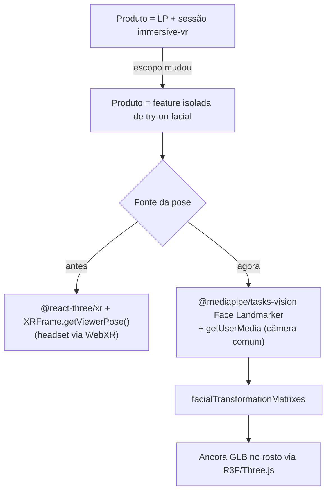

# ADR-0003 — Pivô: feature isolada de try-on facial, fim da sessão immersive-vr

**Status**: ✅ **Aceito** · **Data**: 2026-08-14 · **Decisor**: Rafael

## Contexto

O produto original (ver [[ADR-0002-Stack-Base]] e [[05-VR-e-3D]]) era uma landing page
com uma experiência 3D que, para uma fração do público equipada com headset, evoluía
para uma sessão `immersive-vr` completa via WebXR — tracking de cabeça/mãos, reference
spaces, controllers. As tasks 1 e 2 já haviam entregue esse caminho: scaffold Vite/R3F,
migração do design, Portal 3D com `@react-three/xr`, botão "Entrar em VR" condicional a
`isSessionSupported`.

O escopo do produto mudou. Não é mais uma landing page com sessão de headset — é uma
**feature isolada de prova virtual (try-on)**: a pessoa liga a câmera do próprio
dispositivo (webcam de notebook, câmera de celular), escolhe um modelo de óculos/headset
num seletor, e o modelo 3D aparece ancorado no rosto dela em tempo real, seguindo a pose
da cabeça — o mesmo padrão de um filtro de rosto de Instagram/Snapchat. Não há loja,
catálogo de venda, checkout ou qualquer sessão WebXR imersiva no escopo atual.

Essa mudança invalida a peça central de ADR-0002 (`@react-three/xr`, sessão
`immersive-vr`, reference spaces, controllers) e todo o conteúdo de
[[Como-Funciona-o-Tracking]] e [[Suporte-de-Dispositivos]], que descrevem
especificamente o ciclo de vida de uma sessão XR contra um headset. O restante da stack
base (Vite, TypeScript, React, Three.js/R3F, Tailwind) continua servindo — só troca o
que alimenta a cena 3D: em vez de um `XRFrame`/`getViewerPose()` vindo de um headset,
agora é a pose de um rosto detectado por visão computacional rodando no navegador,
contra o feed de uma câmera comum.

## Decisão

Substituir `@react-three/xr` + sessão `immersive-vr` por **`@mediapipe/tasks-vision`
(Face Landmarker)** rodando sobre o feed de `getUserMedia`, para detectar a pose do
rosto no navegador e ancorar um modelo GLB nela a cada frame. O Three.js/R3F continua
sendo o motor de renderização do modelo 3D; o que muda é a fonte da pose (câmera 2D +
CV, não mais 6DoF de headset).

## Alternativas consideradas

| Alternativa | Prós | Contras | Veredito |
| --- | --- | --- | --- |
| **`@mediapipe/tasks-vision` (Face Landmarker)** (escolhida) | Apache-2.0; roda 100% no navegador via WASM (sem servidor, sem enviar vídeo pra fora — importante pra LGPD, ver [[LGPD-e-Consentimento]]); expõe `facialTransformationMatrixes` — uma matriz 4×4 pronta por rosto detectado, a forma recomendada de ancorar um objeto rígido sem derivar posição/rotação manualmente ponto a ponto (a fonte nº 1 de jitter em implementações ingênuas); mantido pelo Google, ativo em 2026 | Modelo (~few MB) + runtime WASM engordam o bundle — precisa do mesmo tratamento de code-splitting/lazy load que o Portal 3D já usava | ✅ |
| **TensorFlow.js Face Landmarks Detection** | Também roda no navegador, Apache-2.0 | Projeto com menos investimento ativo que o MediaPipe Tasks; API de mais baixo nível para o mesmo resultado | Alternativa razoável, não escolhida |
| **face-api.js** | Leve, API simples | Projeto sem manutenção ativa há anos; landmarks em 2D, não dá a matriz de transformação 3D que a ancoragem precisa | ❌ |
| **Processar no servidor (upload de frames)** | Nenhuma vantagem técnica real aqui | Envia vídeo do rosto da pessoa para fora do dispositivo — dado biométrico saindo do cliente é exatamente o que [[LGPD-e-Consentimento]] já tratava como caso sensível para pose de VR, e aqui seria pior (imagem real do rosto, não só uma pose abstrata); adiciona latência, servidor e custo que o projeto não tem | ❌ |

## Consequências

**Positivas**
- Alcance muito maior: `getUserMedia` + WASM funcionam em qualquer navegador moderno
  com câmera — não depende mais de headset nem de `navigator.xr`. A matriz de
  compatibilidade de [[Suporte-de-Dispositivos]] (Quest, Vision Pro, etc.) deixa de ser
  o gargalo do produto.
- Todo o trabalho de `@react-three/xr`/reference-space é removido — menos superfície de
  bug, uma dependência a menos no bundle (embora entre outra: o modelo do MediaPipe).
- Three.js/R3F, o pipeline de assets ([[Pipeline-de-Assets-3D]]) e boa parte da
  disciplina de performance ([[Orcamento-de-Performance]] — draw calls, zero alocação
  no loop, KTX2) continuam valendo sem alteração: ainda é uma cena Three.js renderizando
  um GLB, só que a pose vem de outro lugar.

**Negativas**
- `@react-three/xr`, o botão "Entrar em VR", `useXRSupport` e todo o código de sessão
  XR das tasks 1-2 precisam ser removidos (nova task em TASKS.md).
- Câmera ligada = dado sensível na tela o tempo todo. Precisa de fluxo de permissão e
  erro tratado com cuidado (negado, sem câmera, sem HTTPS) — ver requisitos atualizados
  em [[Requisitos]].
- Tracking por câmera 2D é estruturalmente mais sujeito a jitter/perda de detecção do
  que 6DoF de headset (iluminação ruim, rosto de perfil, oclusão). A suavização
  (smoothing/interpolação da matriz de transformação entre frames) deixa de ser
  opcional — é o que separa a feature parecer profissional de parecer quebrada.

**Neutras / a observar**
- O orçamento de performance de [[Orcamento-de-Performance]] foi escrito pensando em
  renderização estéreo a 90 Hz para os dois olhos de um headset — essa framing
  específica não se aplica mais (é uma única view de tela), mas as técnicas gerais
  (draw calls, GC, KTX2) continuam corretas para a nova cena. Vale revisar o documento
  quando a feature estiver rodando de ponta a ponta, fora do escopo desta ADR.

## Relacionados

- [[ADR-0002-Stack-Base]] — parcialmente substituída por esta ADR (só a camada XR)
- [[Como-Funciona-o-Tracking]] — substituída por esta ADR
- [[Suporte-de-Dispositivos]] — substituída por esta ADR
- [[Stack-Tecnologica]]
- [[Escopo]]
- [[Requisitos]]
- [[LGPD-e-Consentimento]]
