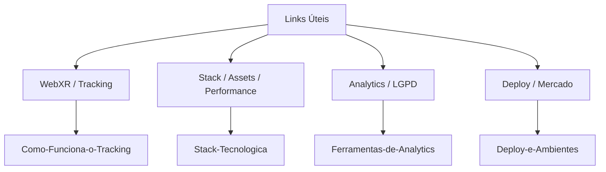

# Links Úteis

Índice de todas as fontes citadas no vault, agrupadas por tema. Cada nota de origem tem
sua própria seção **Fontes**; esta página existe para navegar por assunto em vez de por
nota.

## WebXR — specs e tracking

- [WebXR Device API — Spatial Tracking Explainer](https://immersive-web.github.io/webxr/spatial-tracking-explainer.html)
- [MDN — XRSession.requestReferenceSpace()](https://developer.mozilla.org/en-US/docs/Web/API/XRSession/requestReferenceSpace)
- [MDN — Using bounded reference spaces](https://developer.mozilla.org/en-US/docs/Web/API/WebXR_Device_API/Bounded_reference_spaces)

Ver [[Como-Funciona-o-Tracking]].

## Compatibilidade de dispositivos

- [WebXR Browser Support in 2026 — testmuai](https://www.testmuai.com/learning-hub/webxr-compatible-browsers/)
- [WebXR e Interop 2026 — vr.org](https://vr.org/articles/webxr-interop-2026-cross-browser-standard)
- [BrowserStack — WebXR Compatible Browsers](https://www.browserstack.com/guide/webxr-and-compatible-browsers)

Ver [[Suporte-de-Dispositivos]].

## Engine e stack

- [Three.js Alternatives Compared: Babylon.js vs PlayCanvas (2026)](https://www.utsubo.com/blog/threejs-vs-babylonjs-vs-playcanvas-comparison)
- [What's New in Three.js (2026): WebGPU, New Workflows & Beyond](https://www.utsubo.com/blog/threejs-2026-what-changed)
- [React Three Fiber vs. Three.js em 2026](https://graffersid.com/react-three-fiber-vs-three-js/)

Ver [[Stack-Tecnologica]].

## Assets 3D

- [glTF-Transform](https://gltf-transform.dev/)
- [gltfpack / meshoptimizer](https://meshoptimizer.org/gltf/)
- [Khronos glTF-Compressor](https://github.com/khronosgroup/gltf-compressor)

Ver [[Pipeline-de-Assets-3D]].

## Performance em VR

- [Meta Horizon — WebXR Performance Best Practices](https://developers.meta.com/horizon/documentation/web/webxr-perf-bp/)
- [Meta Horizon — WebXR performance optimization workflow](https://developers.meta.com/horizon/documentation/web/webxr-perf-workflow/)
- [Toji.dev — WebXR Scene Optimization](https://toji.dev/webxr-scene-optimization/)

Ver [[Orcamento-de-Performance]].

## Conforto e acessibilidade em VR

- [Accessible XR in 2026 — Equal Entry](https://equalentry.com/xr-accessibility-inclusive-design/)
- [Virtual Reality Accessibility: Comfort Ratings and Reducing Motion — Equal Entry](https://equalentry.com/virtual-reality-accessibility-comfort-ratings-and-reduced-motion/)
- [VR Motion Sickness: Causes, Prevention & Treatment (2026)](https://netpsychology.org/understanding-and-preventing-vr-motion-sickness/)
- [What is Cybersickness in Virtual Reality? — IxDF](https://ixdf.org/literature/topics/cybersickness-in-virtual-reality)
- [Peripheral Teleportation: A Rest Frame Design to Mitigate Cybersickness (arXiv)](https://arxiv.org/pdf/2502.15227)

Ver [[Acessibilidade-e-Conforto-VR]].

## Analytics open source

- [Self-Hosted Web Analytics 2026 — Plausible vs Matomo vs Umami vs OpenPanel](https://openpanel.dev/articles/self-hosted-web-analytics)
- [Open Source Analytics Tools: 2026 Survey of Privacy-First Options](https://openpanel.dev/articles/open-source-web-analytics)
- [12 Best Open Source Website Analytics Tools — Swetrix](https://swetrix.com/blog/open-source-website-analytics)

Ver [[Ferramentas-de-Analytics]].

## LGPD e privacidade

- [Cookieless Tracking: métodos e conformidade](https://consently.net/blog/cookieless-tracking)
- [Cookie Consent Best Practices for Landing Pages (2026)](https://elementor.com/blog/cookie-consent-landing/)
- [Data Privacy Marketing 2026: Cookieless Strategy](https://www.digitalapplied.com/blog/data-privacy-marketing-2026-cookieless-strategy)

Ver [[LGPD-e-Consentimento]].

## Deploy e hospedagem

- [Coolify — GitHub](https://github.com/coollabsio/coolify)
- [Ditch Vercel & Netlify: The Best Self-Hosted Alternatives in 2026](https://dev.to/openaltfinder/ditch-vercel-netlify-the-best-self-hosted-alternatives-in-2026-2f49)
- [Dokploy vs Coolify 2026 — Comparação](https://introserv.com/blog/dokploy-vs-coolify-complete-comparison-of-the-best-self-hosted-paas-platforms-for-vps-and-dedicated-servers-2026/)

Ver [[Deploy-e-Ambientes]].

## Mercado de VR (contexto de público-alvo)

- [Virtual Reality Statistics (2026) — DemandSage](https://www.demandsage.com/virtual-reality-statistics/)
- [Virtual Reality Statistics 2026: Market Size, Users and Data — SQ Magazine](https://sqmagazine.co.uk/virtual-reality-statistics/)

Ver [[Publico-Alvo]].

## Engenharia e documentação

- [Engineering Planning with RFCs, Design Documents and ADRs — Pragmatic Engineer](https://newsletter.pragmaticengineer.com/p/rfcs-and-design-docs)
- [Companies Using RFCs or Design Docs and Examples](https://blog.pragmaticengineer.com/rfcs-and-design-docs/)
- [10 Docs That Compound: ADRs, Runbooks & "Why" Files](https://medium.com/@sparknp1/10-docs-that-compound-adrs-runbooks-why-files-f9fb1c38b582)

Ver [[Arquivos-de-Engenharia]].

⬅ [[09-Referencias]]
