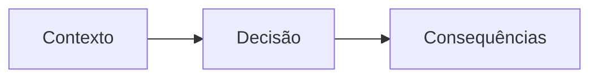

# ADR-NNNN — <título da decisão>

**Status**: Proposto · **Data**: AAAA-MM-DD · **Decisor**: 

## Contexto

<Qual é a situação? Que forças estão em jogo — prazo, custo, licença, equipe,
performance? O que torna essa decisão necessária agora? Escreva de forma que alguém
sem o contexto de hoje entenda daqui a um ano.>

## Decisão

<O que foi decidido, em uma ou duas frases, na voz ativa: "Vamos usar X".>

## Alternativas consideradas

| Alternativa | Prós | Contras | Veredito |
| --- | --- | --- | --- |
|  |  |  |  |

## Diagrama (opcional)

<Inclua um diagrama se ele ajudar a entender a decisão; apague a seção se não fizer sentido.>

## Consequências

**Positivas**
- 

**Negativas**
- 

**Neutras / a observar**
- 

## Relacionados

- [[ ]]
