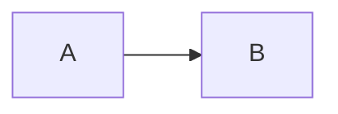

# <título>

<Uma ou duas frases dizendo do que a nota trata e para quem ela serve.>

## <seção>

## Diagrama (opcional)

<Apague esta seção se não houver fluxo, relação ou decisão que valha desenhar.>

## Decisões / regras

- 

## Pendências

- [ ] 

## Relacionados

- [[ ]]

⬅ [[ ]]
