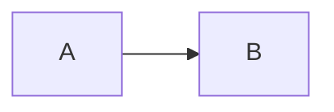

# RFC-NNNN — <título>

**Autor**: · **Status**: rascunho | em-discussão | aprovado | rejeitado

> Use RFC para mudanças **grandes**, antes de decidir. A decisão que sair daqui vira um
> ADR curto em [[07-Decisoes]]. Em projeto pequeno, muitas vezes o ADR sozinho basta —
> ver [[Arquivos-de-Engenharia]].

## Resumo

<Três linhas: o problema e a proposta.>

## Problema

<O que está ruim hoje? Que evidência sustenta isso — métrica, bug, atrito relatado?>

## Objetivos

- 

## Fora de escopo

- 

## Proposta

<Como funciona. Diagramas, trechos de API, fluxos.>

## Alternativas

| Alternativa | Por que não |
| --- | --- |
|  |  |

## Impacto

| Área | Impacto |
| --- | --- |
| Performance |  |
| Acessibilidade |  |
| Privacidade / LGPD |  |
| Manutenção |  |

## Plano de execução

- [ ] 

## Riscos e mitigação

| Risco | Mitigação |
| --- | --- |
|  |  |

## Questões em aberto

- 
