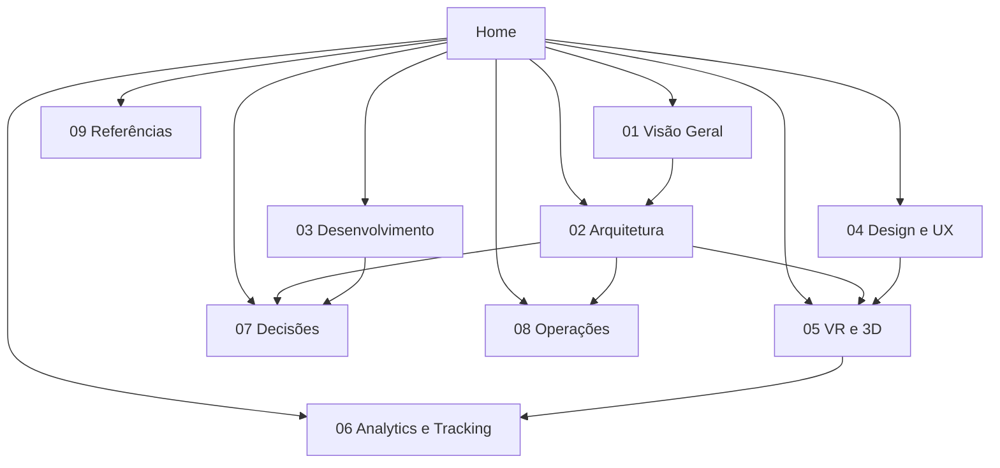

# 🏠 LP with VR — Documentação

Ponto de entrada do vault. Use este arquivo como mapa de conteúdo (MOC) para navegar
por todas as áreas da documentação.

## Sobre o projeto

Landing page com experiência imersiva em 3D/VR rodando direto no navegador (WebXR),
com fallback em 3D convencional para quem não tem headset.

| Campo | Valor |
| --- | --- |
| Repositório | `LP-with-VR` |
| Status | Em concepção — stack ainda não fechada |
| Estado atual do código | Apenas `package.json` (`type: commonjs`), sem dependências |
| Stack proposta | Vite + TypeScript + React + Three.js/R3F — ver [[Stack-Tecnologica]] |
| Responsável | Rafael |

## Mapa do vault

| Pasta | O que vive aqui |
| --- | --- |
| [[01-Visao-Geral]] | Objetivo, escopo, público-alvo, requisitos |
| [[02-Arquitetura]] | Stack, estrutura de pastas, fluxo de dados |
| [[03-Desenvolvimento]] | Setup, convenções, arquivos de engenharia |
| [[04-Design-e-UX]] | Identidade visual, conforto e acessibilidade em VR |
| [[05-VR-e-3D]] | Tracking, dispositivos, assets, performance |
| [[06-Analytics-e-Tracking]] | Medição, eventos, conversão, LGPD |
| [[07-Decisoes]] | ADRs — decisões técnicas registradas |
| [[08-Operacoes]] | Build, deploy, ambientes, monitoramento |
| [[09-Referencias]] | Links, specs, inspirações |
| `99-Templates` | Modelos de nota (ADR, RFC, nota comum) |
| `Assets` | Imagens, diagramas e anexos |

## Mapa visual

## Comece por aqui

| Se você quer… | Leia |
| --- | --- |
| Entender o que é o produto | [[Escopo]] |
| Entender como o VR rastreia a cabeça e as mãos | [[Como-Funciona-o-Tracking]] |
| Saber qual stack usar e por quê | [[Stack-Tecnologica]] |
| Rodar o projeto localmente | [[Setup-do-Ambiente]] |
| Saber quais docs manter no repositório | [[Arquivos-de-Engenharia]] |
| Preparar modelos 3D para a web | [[Pipeline-de-Assets-3D]] |
| Não estourar o frame budget | [[Orcamento-de-Performance]] |
| Medir conversão sem violar a LGPD | [[Plano-de-Eventos]] |

## Convenções do vault

- **Nomes de arquivo**: `Kebab-Case-Com-Iniciais-Maiusculas.md`, sem acentos no nome
  (acentuação correta sempre no conteúdo).
- **Frontmatter**: todo arquivo começa com `title`, `tags`, `criado`, `atualizado`.
- **Links**: use `[[wikilinks]]` em vez de caminhos relativos.
- **Um assunto por nota**: notas longas viram MOC + notas filhas.
- **Datas**: formato `AAAA-MM-DD`.
- **Status**: `rascunho` → `em-revisao` → `estavel` → `obsoleto` no frontmatter.

## Backlog da documentação

- [ ] Fechar a stack e registrar em [[ADR-0002-Stack-Base]]
- [ ] Escrever o [[Escopo]] com o objetivo real de conversão
- [ ] Definir os eventos de [[Plano-de-Eventos]]
- [ ] Preencher [[Setup-do-Ambiente]] depois do scaffold do projeto
- [ ] Rodar o teste em dispositivo real e preencher [[Suporte-de-Dispositivos]]
