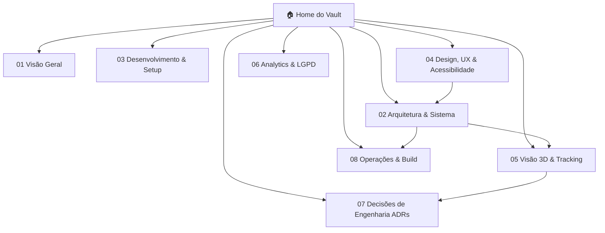

# 🏠 VOID Spatial Optics — Vault de Documentação Técnica

Ponto de entrada central do vault. Use este arquivo como mapa de conteúdo (MOC) para navegar por todas as especificações de arquitetura, matemática 3D, design system, acessibilidade e orçamentos de performance.

---

## 🎯 Sobre o Projeto & Escopo Atual

O **VOID Spatial Optics** é uma aplicação web de prova virtual (*Try-On Facial 3D*) que executa inferência de visão computacional em tempo real (468 landmarks) diretamente no navegador via WebAssembly e WebGL 2.0.

- **Conceito & Finalidade**: Projeto conceitual desenvolvido para estudo, prática e treinamento técnico em engenharia de frontend, visão computacional e computação gráfica. Não é um produto comercial e não está à venda.
- **Pivô Arquitetural**: Conforme documentado em [[ADR-0003-Feature-Try-On-Facial]], a experiência foi transferida de uma dependência de WebXR/headset para um modelo monocular por câmera frontal acessível a qualquer smartphone ou computador comum.
- **Privacidade por Design (LGPD/GDPR)**: 100% On-Device. Zero frames de vídeo ou coordenadas biométricas transmitidas pela rede.

---

## 🗺️ Mapa de Navegação do Vault

---

## 📑 Índice Detalhado por Disciplina

### 🏗️ 02. Arquitetura e Engenharia de Software
- [[02-Arquitetura]] — Topologia do sistema, diagrama de camadas e justificativas de separação de reconcilers.
- [[Stack-Tecnologica]] — Comparativo técnico de engines (Three.js vs Babylon vs A-Frame) e pipeline MediaPipe.
- [[Estrutura-de-Pastas]] — Organização de diretórios e contratos de isolamento de módulos.
- [[Fluxo-de-Dados]] — Máquinas de estado do `useCamera`, render loop a 60 FPS, sincronização `useSyncExternalStore` e acessibilidade.

### 🎨 04. Design System, UX e Inclusão
- [[Identidade-Visual]] — Especificação completa das paletas Branco-Nuvem (Claro) e Azul Midnight (Escuro), tipografia Apple e acabamento de hardware.
- [[Acessibilidade-e-Conforto-VR]] — Motor dinâmico `--font-scale` (88% a 138%), contraste WCAG 2.1 AA/AAA, redução de movimento e navegação WAI-ARIA.

### 👁️ 05. Visão Computacional, 3D e Performance
- [[Como-Funciona-o-Tracking]] — Decomposição da matriz 4x4, equações SLERP/LERP, vetor de offset dos olhos (`eyeLevelOffsetM`) e FOV adaptativo.
- [[Orcamento-de-Performance]] — Frame budget (16.6ms), diagnóstico de gargalos e roadmap de melhorias (Web Workers, KTX2, DPR Throttling).
- [[Pipeline-de-Assets-3D]] — Scripts de automação `generate-placeholder-glasses.mjs` e compressão Draco/Meshopt com `optimize-glb.mjs`.
- [[Suporte-de-Dispositivos]] — Matriz de compatibilidade em navegadores iOS, Android, macOS e Windows.

### 🔒 06. Privacidade e Decisões Técnicas
- [[LGPD-e-Consentimento]] — Arquitetura de isolamento biométrico local e diretrizes de privacidade.
- [[ADR-0001-Registro-de-Decisoes]] — Padrão de documentação de decisões arquiteturais.
- [[ADR-0002-Stack-Base]] — Definição da stack inicial TypeScript + Vite + React + Three.js.
- [[ADR-0003-Feature-Try-On-Facial]] — Pivô de produto e adoção de MediaPipe Face Landmarker.

---

## ⚡ Guia Rápido: Por Onde Começar?

| Se você deseja... | Consulte a nota... |
|---|---|
| Compreender a arquitetura completa do sistema | [[02-Arquitetura]] |
| Entender a matemática da matriz 4x4 e do filtro anti-jitter | [[Como-Funciona-o-Tracking]] |
| Analisar os pontos de melhoria de desempenho (Web Workers, KTX2) | [[Orcamento-de-Performance]] |
| Conhecer o motor de escala de fonte e tema Midnight | [[Acessibilidade-e-Conforto-VR]] |
| Reproduzir o setup local de desenvolvimento | [[Setup-do-Ambiente]] |

---

## 📜 Convenções do Vault
- **Linguagem**: Português técnico com diagramas em Mermaid e notação matemática em LaTeX.
- **Links**: Sintaxe `[[Nota]]` para navegação bidirecional no Obsidian.
- **Status**: Todas as notas foram revisadas e consolidadas no padrão `estavel`.
