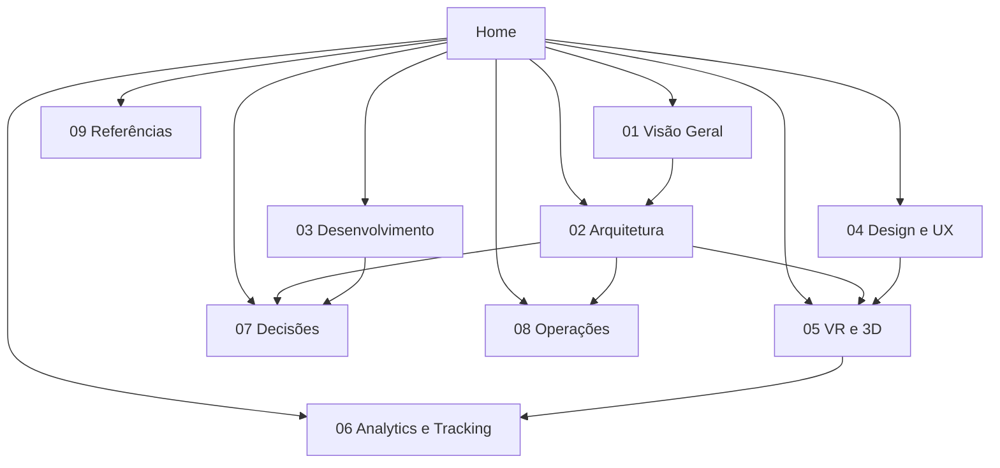

# 🏠 LP with VR — Documentação

Ponto de entrada do vault. Use este arquivo como mapa de conteúdo (MOC) para navegar
por todas as áreas da documentação.

## Sobre o projeto

Feature de try-on facial: liga a câmera, escolhe um modelo de óculos/headset, e vê o
modelo 3D ancorado no próprio rosto em tempo real — sem loja, sem checkout, sem sessão
de headset. Ver [[ADR-0003-Feature-Try-On-Facial]] (2026-08-14). O nome do repositório
é histórico, de quando o produto era uma landing page com sessão `immersive-vr`.

| Campo | Valor |
| --- | --- |
| Repositório | `LP-with-VR` (nome histórico) |
| Status | Scaffold + Portal 3D + pipeline de assets já construídos (`dev`); removendo a camada XR e construindo a feature de try-on facial |
| Stack | Vite + TypeScript + React + Three.js/R3F + `@mediapipe/tasks-vision` — ver [[Stack-Tecnologica]] |
| Responsável | Rafael |

## Mapa do vault

| Pasta | O que vive aqui |
| --- | --- |
| [[01-Visao-Geral]] | Objetivo, escopo, público-alvo, requisitos |
| [[02-Arquitetura]] | Stack, estrutura de pastas, fluxo de dados |
| [[03-Desenvolvimento]] | Setup, convenções, arquivos de engenharia |
| [[04-Design-e-UX]] | Identidade visual, conforto e acessibilidade em VR |
| [[05-VR-e-3D]] | Tracking, dispositivos, assets, performance |
| [[06-Analytics-e-Tracking]] | Medição, eventos, conversão, LGPD |
| [[07-Decisoes]] | ADRs — decisões técnicas registradas |
| [[08-Operacoes]] | Build, deploy, ambientes, monitoramento |
| [[09-Referencias]] | Links, specs, inspirações |
| `99-Templates` | Modelos de nota (ADR, RFC, nota comum) |
| `Assets` | Imagens, diagramas e anexos |

## Mapa visual

## Comece por aqui

| Se você quer… | Leia |
| --- | --- |
| Entender o que é o produto | [[Escopo]] |
| Entender por que o produto mudou de landing page pra try-on facial | [[ADR-0003-Feature-Try-On-Facial]] |
| Entender como o rosto é detectado e o modelo ancorado | [[Stack-Tecnologica]] (§0) |
| Saber qual stack usar e por quê | [[Stack-Tecnologica]] |
| Rodar o projeto localmente | [[Setup-do-Ambiente]] |
| Saber quais docs manter no repositório | [[Arquivos-de-Engenharia]] |
| Preparar modelos 3D para a web | [[Pipeline-de-Assets-3D]] |
| Não estourar o orçamento de performance | [[Orcamento-de-Performance]] |
| Entender os cuidados de privacidade com câmera/dado facial | [[LGPD-e-Consentimento]] |

## Convenções do vault

- **Nomes de arquivo**: `Kebab-Case-Com-Iniciais-Maiusculas.md`, sem acentos no nome
  (acentuação correta sempre no conteúdo).
- **Frontmatter**: todo arquivo começa com `title`, `tags`, `criado`, `atualizado`.
- **Links**: use `[[wikilinks]]` em vez de caminhos relativos.
- **Um assunto por nota**: notas longas viram MOC + notas filhas.
- **Datas**: formato `AAAA-MM-DD`.
- **Status**: `rascunho` → `em-revisao` → `estavel` → `obsoleto` no frontmatter.

## Backlog da documentação

- [x] Fechar a stack base e registrar em [[ADR-0002-Stack-Base]]
- [x] Escrever o [[Escopo]] (reescrito para a feature de try-on facial em 2026-08-14)
- [x] Registrar o pivô de produto em [[ADR-0003-Feature-Try-On-Facial]]
- [ ] Definir os eventos de [[Plano-de-Eventos]] para a feature de try-on
- [x] Preencher [[Identidade-Visual]] — feito em 2026-08-17, a partir do redesign
      completo da landing page (paleta Branco-Nuvem/Azul Midnight estilo Apple)
- [ ] Validar orçamento de performance/jitter de tracking em dispositivo real e atualizar [[Orcamento-de-Performance]]
- [x] Revisitar a cópia de marketing (Hero/Filosofia/Benefícios/CTA) — reescrita no mesmo
      redesign de 2026-08-17 (posicionamento "Coleção Urbana" / VOID Spatial Optics)
- [ ] Recolorir os 3 GLBs reais em `public/models/` pra paleta nova (ver ressalva em
      [[Identidade-Visual]] — "Inconsistência em aberto") — swatch 2D e material 3D real
      estão dessincronizados desde o redesign de 2026-08-17
- [ ] Remover `src/components/Portal.tsx` (órfão, sem import desde o redesign de
      2026-08-17 — achado registrado em [[Identidade-Visual]])
